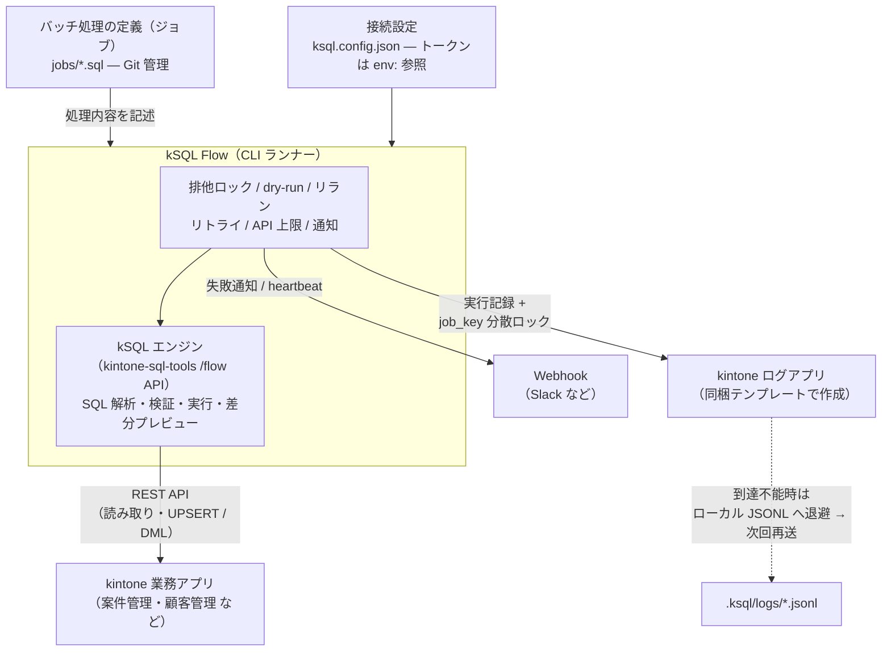
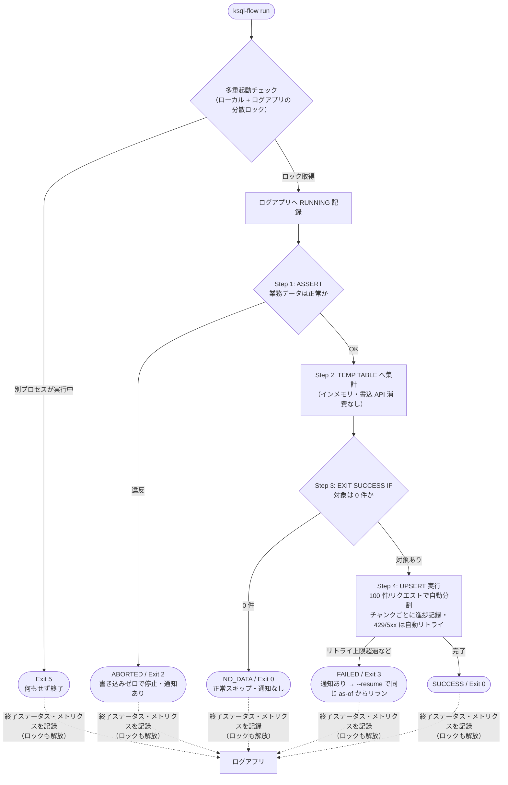

<!--
title: 【kSQL Flow #1】kintone のバッチ処理を SQL 1 本で書けるランナーの紹介
tags:
  - kintone
  - SQL
-->

> **as-is / no support**: 本ツールは MIT ライセンスで現状有姿のまま公開しており、サポート・動作保証・修正の約束はありません。本番投入は必ず `--dry-run` とステージング検証を経て、自己責任でお願いします。

- GitHub: https://github.com/rex0220/ksql-flow
- npm: `npm i -g @rex0220/ksql-flow`

## kintone のバッチ処理、どう書いていますか

kintone でアプリ間集計や定期データ更新（月次売上をマスタへ反映する、ような処理）には、いくつかの選択肢があります。

1. **クラウド型 ETL サービス** — ノーコードで即日構築でき、実行基盤の運用もお任せできる
2. **自作の JavaScript / REST API スクリプト** — 自由度が高い一方、リトライ・排他制御・失敗時のリランといった運用まわりは自分で作り込むことになる

どちらも選択肢としてある中で、kSQL Flow は「**定義は SQL 1 本・Git で管理し、実行環境と認証情報は自分の手元に置きたい**」という好みの人向けに作った、もう一つの選択肢です。「ETL サービスを契約するほどの規模ではない。かといって、リトライや排他を毎回スクリプトで作り込むのも大変」— その中間地帯を狙っています。
実行・排他・リラン・実行ログ・リトライ・通知といった「バッチの面倒な部分」はランナーが引き受けます。
実行場所は自分の環境（ローカル / 社内サーバー / GitHub Actions / Docker）で、**通信先は設定した kintone と通知 Webhook だけ**。テレメトリの類はありません（BYOC: Bring Your Own Cloud）。
その代わり、実行基盤の構築・監視・トークン管理は自分の責務になります — このトレードオフを受け入れられる開発者・情シスの方が対象です。

SQL の解析・実行エンジンは、以前紹介した [kintone-sql-tools](https://github.com/rex0220/kintone-sql-tools)（kSQL）の公式 API を使っています。つまり **MCP で AI に SQL を書かせて、同じ方言でバッチも動かせる**構成です（この話は次回）。

長めの記事なので、先に道案内を。**まず全体像だけ知りたい方**は「しくみ」から「運用の面倒な部分はランナーが持つ」までの前半で完結します。**手を動かして試したい方**は、そのまま「インストールから実行まで」へ進んでください。

## しくみ



登場人物は 4 つだけです。**kSQL Flow**（ランナー）が SQL と設定を読み、内包する **kSQL エンジン**が kintone の**業務アプリ**を読み書きします。もう 1 つの **ログアプリ**が影の主役で、実行記録・メトリクスの保存に加えて、重複禁止フィールドを使った**分散ロック**と `--resume` の**再開情報の正**を兼ねます。

## アプリ構成: kintone の「営業支援（SFA）パック」を使います

題材には、kintone に標準で用意されているサンプルアプリ **営業支援（SFA）パック**（顧客管理・案件管理・活動履歴）を使います。アプリストアから追加するだけで、この記事のジョブがそのまま試せます — 実はこの構成、本ツールの**リリース前実機検証で実際に使った構成そのもの**です。

下ごしらえは集計の受け皿として **顧客管理アプリにフィールドを 3 つ追加**するだけ:

| 追加フィールド | 型 |
| --- | --- |
| `当月案件件数` | 数値 |
| `当月売上合計` | 数値 |
| `最終集計日時` | 日時 |

UPSERT のキーに使う顧客管理の `会社名` は、検証環境では「値の重複を禁止する」が有効でした（もし無効でも、後述の `validate` が KSQL1303 で検出して教えてくれます）。

## ジョブは SQL ファイル 1 本

案件管理から「当月受注予定の案件」を顧客別に集計し、顧客管理へ反映するジョブの全文です。

```sql
-- @ksql name: monthly_deal_summary
-- @ksql timeout: 600
-- @ksql dialect: 1

-- Step 1: 業務異常があれば安全停止（アラート対象）
ASSERT (
  SELECT COUNT(*) FROM LAPP_案件管理
  WHERE 受注予定日 >= @MONTH_START() AND 受注予定日 < @NEXT_MONTH_START()
    AND 売上 < 0
) = 0, '【異常中断】マイナスの売上データが存在するため処理を停止しました';

-- Step 2: インメモリ一時テーブルへ集計（この間 kintone API は消費しない）
CREATE TEMP TABLE temp_monthly_summary AS
SELECT 会社名, COUNT(案件No_) AS 案件件数, SUM(売上) AS 売上合計
FROM LAPP_案件管理
WHERE 受注予定日 >= @MONTH_START() AND 受注予定日 < @NEXT_MONTH_START()
GROUP BY 会社名;

-- Step 3: 対象 0 件は「正常な早期終了」（アラートを鳴らさない）
EXIT SUCCESS IF (SELECT COUNT(*) FROM temp_monthly_summary) = 0,
  '集計対象となる案件データが 0 件のためスキップ';

-- Step 4: キー指定 UPSERT（何度リランしても同じ結果になる = 冪等）
UPSERT INTO LAPP_顧客管理 (会社名, 当月案件件数, 当月売上合計, 最終集計日時)
SELECT 会社名, 案件件数, 売上合計, @NOW()  -- @NOW() は実時計ではなくバッチ開始時の基準時刻（as-of）
FROM temp_monthly_summary
KEY (会社名);
```

**1 つ注意**: この UPSERT は「今回の集計に出てきた会社」だけを更新します。**今月の案件が 0 件になった会社の前月値は、そのまま残ります**（月が変わった直後も同じ）。ゼロに戻したい場合は、**顧客管理を起点にした LEFT JOIN で「0 件の会社も含む全社ぶんの結果」を作って UPSERT する**か、**集計フィールドだけを対象にした UPDATE を足す**のが安全です。書込先は顧客マスターなので、**レコードごと消す DELETE は使わないでください**（集計値をリセットしたいだけなのに顧客が消えます）。「書いた値を戻す責任は書いた側にある」という、冪等設計でいちばん見落とされる点です。

設計上こだわったポイントを 3 つだけ。

**① 「異常」と「対象なし」を言葉から分ける。** `ASSERT` は業務異常（マイナス売上）で止めてアラートを鳴らす。`EXIT SUCCESS IF` は対象 0 件の正常スキップで、アラートは鳴らさない。ここを混ぜると月初や休日のたびに誤アラートが飛び、そのうち誰もアラートを見なくなります。

**② 時刻は「バッチ開始時」に固定。** `@MONTH_START()` や `@NOW()` は実行のたびに時計を読むのではなく、バッチ開始時に確定した基準時刻（as-of）から導出します。日跨ぎの長時間実行でも Step 間で基準がズレず、`--as-of "2026-07-01T00:00:00+09:00"` と指定すれば**過去日付での再集計（バックフィル）も同じ SQL で再現**できます。

**③ 冪等が復旧戦略。** kintone にトランザクションはありません（書込の原子性は 100 レコード/リクエスト単位）。だからこそキー指定 UPSERT を標準にして、「失敗したら同じジョブをもう一度流せば正しい状態に収束する」ことを復旧の基本にしています。
（注: リランで収束するのは UPSERT が書き込むキーの範囲です。**誤ったデータで追加されてしまったレコードは、リランしても削除されません**。除去が必要な場合は、スコープを限定した DELETE 文をジョブに含めるか、手動で対処します）

## ジョブ実行の流れ

上のサンプルジョブを `run` すると、こう流れます。



「業務異常は書き込む前に止める（Exit 2）」「対象なしは静かに成功する（Exit 0・通知なし）」「途中失敗は記録を残して `--resume` で復旧する（Exit 3）」という 3 つの出口が、それぞれ別の Exit Code になっているのがポイントです。スケジューラや CI はこのコードだけで分岐できます。

## 実行は 3 段階: validate → dry-run → run

```bash
ksql-flow validate -f jobs/monthly_deal_summary.sql --profile prod   # スキーマ依存の検証まで
ksql-flow run -f jobs/monthly_deal_summary.sql --profile prod --dry-run
ksql-flow run -f jobs/monthly_deal_summary.sql --profile prod
```

`--dry-run` は「実行しないこと」ではなく「**実行したら何が起きるかを見せること**」が主眼です。書込ゼロで実レコードとの差分を出します。

```
[DRY-RUN] monthly_deal_summary.sql (as-of: 2026-08-22T00:00:00.000Z)
  読み取り        : 276 件（API 5 回）
  書き込み予定    : LAPP_顧客管理  INSERT 1 件 / UPDATE 1 件 / DELETE 0 件
  実測 API 消費   : 6 回（読取 5 + preview 照合 1）
  変更サンプル（先頭 5 件）:
    会社名=山田商事  当月売上合計: 1,200,000 → 1,450,000
    会社名=鈴木建設  (新規) 当月売上合計: 380,000
  => dry-run 完了（kintone 書き込み 0 件）
```

`ASSERT` 違反や `EXIT SUCCESS IF` の判定は dry-run でも本実行と同じに効くので、`--json` 出力を CI に流して PR コメントに貼る、という使い方ができます（Exit Code も本実行と同じ）。

## 運用の面倒な部分はランナーが持つ

| 装備 | 内容 |
| --- | --- |
| 実行ログ | kintone の「実行ログアプリ」へ毎回記録（同梱テンプレートから 1 分で作成）。メトリクス・エラー・Git リビジョンまで残る |
| 多重起動の排他 | ログアプリの重複禁止フィールドを分散ロックに使用。二重起動は Exit 5 で即停止 |
| リラン | `run-all --resume` が失敗ジョブだけを**元の as-of で**再実行 |
| リトライ | 429 / 5xx を指数バックオフ + Retry-After で自動再試行（認証エラーは即停止） |
| API 上限 | 読み書き・ログ・ロック・リトライまで含む単一カウンタで `maxApiCalls` を強制。暴走でアプリの API 枠を食い潰さない |
| 通知 | 失敗時 Webhook（対象 0 件では鳴らさない）+ 完走 heartbeat |
| Exit Code | 0=成功 / 1=検証 / 2=業務異常 / 3=実行時 / 4=部分成功 / 5=多重起動 — スケジューラや CI で分岐可能 |

設定は JSON 1 枚で、トークンは `env:` 参照（ファイルに平文を書かない）。存在しないキーや typo したフラグは**実行前に Exit 1** で止まる fail-closed 設計です。

## インストールから実行まで

```bash
npm i -g @rex0220/ksql-flow   # Node.js 18+
```

作業ディレクトリは最終的にこの構成になります。**手で作るのは 2 ファイルだけ**（設定 JSON とジョブ SQL）で、`.ksql/` 以下は実行時に自動生成されます:

```text
batch/                            # 作業ディレクトリ（場所・名前は任意）
├── ksql.config.json              # 接続設定（手順 2 で作成）
├── jobs/
│   └── monthly_deal_summary.sql  # ジョブ SQL（冒頭のサンプル。手順 4 で保存）
└── .ksql/                        # 実行時に自動生成（手動作成は不要）
    ├── lock-prod.json            # ローカル排他ロック（実行中のみ存在）
    └── logs/
        └── <batch_id>.jsonl      # ローカル実行ログ（ログアプリに書けない時の控えにも）
```

### 1. ログアプリの作成（初回のみ・約 3 分）

「しくみ」の図に出てきた実行ログアプリは、**同梱のアプリテンプレートから作ります**。フィールド定義（分散ロック用の重複禁止設定まで）とレイアウト・一覧が設定済みです。

1. [テンプレート zip](https://github.com/rex0220/ksql-flow/raw/main/template/ksql-flow-log-template1.zip) をダウンロード

   ダウンロード不要で手元のものを使う場合は、インストール済みパッケージ内のテンプレートフォルダを直接開けます:

   ```powershell
   # Windows (PowerShell)
   explorer "$(npm root -g)\@rex0220\ksql-flow\template"
   ```

   （macOS / Linux は `$(npm root -g)/@rex0220/ksql-flow/template` にあります）
2. kintone のアプリ作成画面で「**テンプレートファイルを読み込む**」を選び、zip を直接指定して作成（システム管理への登録は不要です）
3. 作成したアプリで API トークン（閲覧 + 追加 + 編集）を発行

業務アプリ側（案件管理・顧客管理）にも、閲覧 + 編集（INSERT するなら追加も）のトークンを用意しておきます。

### 2. 設定ファイル（`ksql.config.json`）

作業ディレクトリに保存します。**`id` は自環境のアプリ ID に置き換えてください**。トークン値はファイルに書かず、環境変数を参照します:

```json
{
  "defaultProfile": "prod",
  "profiles": {
    "prod": {
      "baseUrl": "https://example.cybozu.com",
      "timezone": "Asia/Tokyo",
      "auth": { "type": "apiToken" },
      "apps": {
        "案件管理": { "id": 100, "tokens": ["env:KSQL_TOKEN_DEALS"] },
        "顧客管理": { "id": 200, "tokens": ["env:KSQL_TOKEN_CUSTOMERS"] },
        "実行ログ": { "id": 999, "tokens": ["env:KSQL_TOKEN_LOGS"] }
      },
      "logApp": "実行ログ"
    }
  }
}
```

`apps` の論理名（`案件管理` など）が、ジョブ SQL の `LAPP_案件管理` に対応します。

### 3. トークンを環境変数に設定

```powershell
# Windows (PowerShell)
$env:KSQL_TOKEN_DEALS = "<案件管理のトークン>"
$env:KSQL_TOKEN_CUSTOMERS = "<顧客管理のトークン>"
$env:KSQL_TOKEN_LOGS = "<ログアプリのトークン>"
```

```bash
# macOS / Linux (bash)
export KSQL_TOKEN_DEALS="<案件管理のトークン>"
export KSQL_TOKEN_CUSTOMERS="<顧客管理のトークン>"
export KSQL_TOKEN_LOGS="<ログアプリのトークン>"
```

未設定のまま実行しても、`env:` の解決失敗として実行前に Exit 1 で止まります。

### 4. 実行

冒頭のサンプルジョブを `jobs/monthly_deal_summary.sql` として保存したら、あとは前述の 3 段階です:

```bash
ksql-flow validate --check-logapp --profile prod    # ログアプリの定義検査（初回のみ）
ksql-flow validate -f jobs/monthly_deal_summary.sql --profile prod
ksql-flow run -f jobs/monthly_deal_summary.sql --profile prod --dry-run
ksql-flow run -f jobs/monthly_deal_summary.sql --profile prod
```
`--check-logapp` はフィールド・型・重複禁止・選択肢まで機械検査するので、ログアプリ作成時に手作業のズレがあってもここで捕まります。実行が終わったら、kintone のログアプリを開いてみてください — 実行結果・処理件数・API 消費が 1 レコードとして残っているはずです。

- VSCode ターミナルでの実行例


- 実行ログ例


### 定期実行はお好みの場所で

これから環境を用意するなら **GitHub Actions**（小規模な定期実行なら無料枠で運用可能）か **VPS + cron / Docker**（最小クラスのプランで十分）が手軽です。なお Actions の schedule はベストエフォートで、混雑時間帯（特に毎時 0 分）は数分〜数十分遅れることがあります。夜間の集計バッチなら実用上問題ありませんが、**時刻厳守のジョブは cron やタスクスケジューラ向き**です。すでに社内に Windows サーバーが動いているなら、**タスクスケジューラ**に載せれば追加コストゼロ — 失敗通知・実行記録・多重起動防止はランナー側が持つので、スケジューラは「決まった時刻に 1 コマンド叩く装置」で足ります。それぞれのセットアップ例はリポジトリの [examples/](https://github.com/rex0220/ksql-flow/tree/main/examples) にあります。

詳細な仕様（実行モデル・ロック・リラン・ログ設計）は[公開仕様書](https://github.com/rex0220/ksql-flow/blob/main/docs/ksql_flow_spec.md)にまとめてあります。ちなみに開発は実装 AI と レビュー AI の 2 体制で行い、レビュー往復や実機検証の記録も[そのまま公開](https://github.com/rex0220/ksql-flow/tree/main/docs/internal)しています（この話もいつか書くかもしれません）。

## この連載の読み方

8 本になったので、目的別の入口を置いておきます。

- **順に読む本線**: #1 作る → #2 AI に書かせる → #3 量で鍛える → #4 毎朝動かす → #5 API を削る → #6 Git で運用する → #7 壊れたら戻す → #8 判断を配置する
- **すぐ動かしたい**: #1（本記事）→ #2（テンプレートから環境構築）
- **実行環境を選びたい**: #4（社内 Windows サーバー）/ #6（サーバーなし・GitHub Actions）
- **運用設計を知りたい**: #7（失敗時のランブック）/ #8（自動・AI・人間の役割分担）
- **性能とスケールが気になる**: #3（10 万件の実測）/ #5（API 消費の削減）

環境別の記事（#4・#6）は #2 で作るテンプレート構成を前提に書いています — 先に #2 を読んでおくと迷いません。

## 今後の連載予定

1. **#1（本記事）**: 紹介とコンセプト
2. **#2 [AI エージェントに kintone のバッチジョブを書かせる — MCP + Claude Code](https://qiita.com/rex0220/items/3a1213a596a8c49b67aa)**: スキーマを MCP から取得して SQL を生成 → validate 二段構え → dry-run を人間の最終レビューにする
3. **#3 [毎朝の無人実行の前に — kintone バッチを 200 → 20,000 → 100,000 件で鍛える](https://qiita.com/rex0220/items/62e950ab1ccc5b54ff69)**: 実測・強制切断・API 枯渇まで意図的に踏み抜く検証編
4. **#4 [タスクスケジューラで毎朝動かす — PowerShell が 0.1 秒で無言死する罠つき](https://qiita.com/rex0220/items/d0a66c133edd42ff91c4)**: 鍛えたジョブを Windows で実運用へ
5. **#5 [kintone バッチの API 消費を 4 割減らすまで — 「束ねれば速い」が実測で覆った話](https://qiita.com/rex0220/items/9cbc1e0e9b5ab292e6a1)**: bulkRequest A/B と native upsert の実測記
6. **#6**: [GitHub Actions で kintone バッチをサーバーレス運用 — PR を開くと「書込差分」が自動で貼られる](https://qiita.com/rex0220/items/a522f7880a5960f033b3)
7. **#7**: [kintone バッチが失敗した朝にやること — Exit Code・部分適用・再実行しても壊れない設計](https://qiita.com/rex0220/items/39821af2a79b88de0ed2)
8. **#8**: [バッチの失敗は 4 種類ある — 自動リラン・AI 診断・人間の判断の切り分け](https://qiita.com/rex0220/items/30cac8d8b52ec8ac782a)
9. **#9**: [月 1,000 円の VPS で kintone バッチを毎朝動かす — cron の遅延は 1 秒だった](https://qiita.com/rex0220/items/dd8ec668b8966e346d48)
10. **#10**: [スマホのチェック 1 つで VPS のバッチをリランする — 新しいポートを 1 つも開けずに](https://qiita.com/rex0220/items/b841921afe86083f14a0)
11. **#11**: [kintone がロックサーバーになる — 重複禁止フィールドで作る分散ロックと、検索索引ラグの実測](https://qiita.com/rex0220/items/44cf9f6d23c264d14dca)
12. 以降、Google Cloud（Cloud Run Jobs）などを予定

