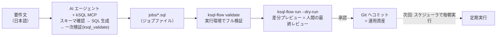

<!--
title: 【kSQL Flow #2】AI エージェントに kintone のバッチジョブを書かせる — MCP + Claude Code
tags:
  - kintone
  - SQL
  - MCP
  - AIエージェント
-->

<!-- TODO: 第1話の公開後、以下のリンクを実 URL に差し替え -->

> **as-is / no support**: 本ツールは MIT ライセンスで現状有姿のまま公開しており、サポート・動作保証・修正の約束はありません。本番投入は必ず `--dry-run` とステージング検証を経て、自己責任でお願いします。

- GitHub: https://github.com/rex0220/ksql-flow （ランナー） / https://github.com/rex0220/kintone-sql-tools （エンジン + MCP） / https://github.com/rex0220/ksql-flow-template （本記事のテンプレート）
- 前回: 【kSQL Flow #1】kintone のバッチ処理を SQL 1 本で書けるランナーの紹介

## 前回のおさらいと、今回やること

第1話では、kintone のバッチ処理（案件管理 → 顧客管理の月次集計）を SQL ファイル 1 本で定義し、kSQL Flow が排他・ログ・リラン・リトライを引き受ける構成を紹介しました。

今回はそのジョブ SQL を、**要件文から AI エージェントに書かせます**。

ポイントは役割分担です。

| 役割 | 担当 |
| --- | --- |
| 生成（スキーマ確認・SQL 作成・手直し） | AI エージェント + kSQL MCP |
| 検証（構文・スキーマ・安全ルール） | 機械（validate の二段構え） |
| 最終判断（この差分を本番に流してよいか） | 人間（dry-run レビュー） |

「AI が書いたコードを信用できるか」という問いに、**信用しなくて済む仕組みで答える**構成です。AI の善意や賢さではなく、実行系の検査で守ります。



## なぜ AI との共通言語が SQL なのか（30 秒版）

エンジン側の記事「[AIエージェントにkintoneを操作させるにはSQLが最適解である](https://qiita.com/rex0220/items/fbed33b11251cdf7e31e)」で詳しく書いた話の要点だけ:

1. **SQL は LLM が最も得意なデータ操作言語。** JOIN・GROUP BY の説明は不要
2. **1 文 = 1 意図。** 生成物を実行前に人間が読んでレビューできる
3. **実行はサーバー側で完結。** 生レコードが AI のコンテキストを通らない

そして第1話で紹介したジョブの構文 — `ASSERT`（業務異常で停止）、`EXIT SUCCESS IF`（対象なしは正常スキップ）、キー指定 `UPSERT`（冪等）— は、**AI が書いても安全側に倒れるための言語ガード**でもあります。ガードが言語に入っていれば、AI がガードを「書き忘れた」ことも機械検査で分かります。

## 準備: VSCode + Claude Code + kSQL MCP

前提は第1話の環境そのまま（営業支援パック + 追加 3 フィールド + ログアプリ + `ksql.config.json`）です。本記事では、第1話の作業ディレクトリを **VSCode で開き、Claude Code を使う**構成で進めます。理由は 3 つ:

- ジョブ SQL・ランナー config・MCP 設定が **1 つのリポジトリに揃い、そのまま Git 管理**できる
- エージェントが **MCP（スキーマ確認・下見クエリ）とターミナル（`ksql-flow validate` / `--dry-run`）の両方**を使える
- 生成 → 検証 → 差分レビュー → コミットが 1 画面で完結する

（Claude Desktop や他の MCP 対応エージェントでも考え方は同じです。その場合の MCP 登録手順はエンジン側リポジトリの `docs/ksql_mcpb_claude_desktop_install.md` を参照してください）

この構成一式は**テンプレートリポジトリ**として公開しています。GitHub の「Use this template」で自分のリポジトリを作って clone すれば、以下が揃った状態から始められます。

- https://github.com/rex0220/ksql-flow-template

```text
├── CLAUDE.md                 # AI 向けの作業規約（後述 — この構成の核）
├── .mcp.json                 # Claude Code の MCP 登録（開くだけで kSQL MCP がつながる）
├── ksql.config.json          # ランナー用の接続設定 — トークンは env: 参照
├── ksql.mcp.config.json      # MCP 用の接続設定 — 閲覧のみトークン
└── jobs/
    └── monthly_deal_summary.sql   # 検証済みサンプルジョブ
```

やることは、ツールのインストールと接続設定の書き換えだけです。

```bash
npm i -g @rex0220/ksql-flow @rex0220/kintone-sql-tools
```

`ksql.config.json`（ランナー用）と `ksql.mcp.config.json`（MCP 用）の `baseUrl` とアプリ `id` を自環境に合わせます。ここで 1 つだけ設計上のポイントがあります — テンプレートでは **MCP 側の `logicalApps` の論理名を、ランナー config の `apps` と同じ名前にしてあります**。こうすると、AI が対話中に書く `LAPP_案件管理` という表記が、**MCP での下見クエリと kSQL Flow のジョブでそのまま同じ意味になります**。生成した SQL を書き換えずにジョブファイルへ移せる、というのがこの構成の要です。

### AI に kSQL Flow の知識を与える — CLAUDE.md と ksql_docs

ここが今回の構成でいちばん重要な部分です。kSQL Flow は公開して間もない OSS なので、**LLM は学習データとしてほとんど知りません**。何もしなければ、エージェントは「それらしい構文」を発明します。この穴は 2 つの仕組みで塞ぎます。

1. **方言仕様の一次資料は MCP の `ksql_docs`。** kSQL の言語リファレンスには Flow 拡張構文（dialect 1: ディレクティブ・`ASSERT`・`EXIT SUCCESS IF`・`@` 付き時刻関数）の章とレシピがあり、エージェントが章単位で取得できます。構文は覚えているものを書くのではなく、**その場で引かせます**
2. **作業規約はリポジトリの `CLAUDE.md`。** Claude Code はリポジトリ直下の `CLAUDE.md` を毎セッション自動で読み込みます。テンプレートには、作成手順（スキーマ確認 → `ksql_docs` で方言確認 → 下見 → 生成 → 二段の validate → dry-run）、ジョブ規約（`@` 付き時刻関数・`ASSERT` と `EXIT SUCCESS IF` の使い分け・キー指定 UPSERT）、してはいけないこと（**本実行しない・構文を推測で書かない**）を記した [CLAUDE.md](https://github.com/rex0220/ksql-flow-template/blob/main/CLAUDE.md) が入っています

つまり「AI が kSQL Flow を知らない」ことは前提であって、**知識は Git 管理された規約ファイルと MCP のドキュメントツールで毎回与える**設計です。規約を直せば AI の振る舞いも変わり、その変更履歴も Git に残ります。

### トークンは「閲覧のみ」と「書込可」を分ける

この構成の安全性はトークンの分離で担保します。kintone の各アプリで**閲覧のみのトークン**と**書込可のトークン**を別々に発行し、置き場所を分けます。

| 置き場所 | トークン | できること |
| --- | --- | --- |
| MCP 設定 + Claude Code セッションの環境変数 | 閲覧のみ（`_RO`） | スキーマ確認・下見クエリ・`validate`・`--dry-run` |
| 人間のターミナルの環境変数 | 閲覧 + 編集（+ 追加） | `ksql-flow run`（本実行） |

つまり **AI は validate と dry-run まで自走できますが、物理的に kintone へ書き込めません**。書き込みが起きる経路は「人間が自分のターミナルで `ksql-flow run` を叩く」だけです。運用ルールではなく構成で守ります。

## 要件文からジョブを作らせる

エージェントへの依頼は、業務要件をそのまま日本語で書きます。

> 案件管理アプリから「当月受注予定」の案件を会社別に集計して、顧客管理アプリの `当月案件件数`・`当月売上合計`・`最終集計日時` を更新する kSQL Flow のジョブ（dialect 1）を書いてください。
>
> - マイナスの売上データがあれば異常として何も書かずに停止
> - 対象が 0 件の月は正常スキップ（アラートを鳴らさない）
> - 何度実行しても同じ結果になること（冪等）
> - スキーマは思い込みで書かず、MCP で実際に確認してから書くこと

最後の 1 行が実務上いちばん効きます。エージェントはまず `ksql_describe_app` でフィールドコードと型を取得し（ここで `受注予定日` が DATE、`売上` が NUMBER だと確定します）、`ksql_query` で件数確認の下見 SELECT を流し、それからジョブを書きます。仕様が曖昧な構文は `ksql_docs` で言語リファレンスを引かせれば、構文の発明も防げます。

こうして生成・検証を通ったジョブの全文がこちらです。第1話で紹介したものと同じジョブに到達します（テンプレートに同梱してあるサンプルジョブもこれです — 初回は生成させずにサンプルで流れを確認する、でも構いません）。

```sql
-- @ksql name: monthly_deal_summary
-- @ksql timeout: 600
-- @ksql dialect: 1

-- Step 1: 業務異常があれば安全停止（アラート対象）
ASSERT (
  SELECT COUNT(*) FROM LAPP_案件管理
  WHERE 受注予定日 >= @MONTH_START() AND 受注予定日 < @NEXT_MONTH_START()
    AND 売上 < 0
) = 0, '【異常中断】マイナスの売上データが存在するため処理を停止しました';

-- Step 2: インメモリ一時テーブルへ集計（この間 kintone API は消費しない）
CREATE TEMP TABLE temp_monthly_summary AS
SELECT 会社名, COUNT(案件No_) AS 案件件数, SUM(売上) AS 売上合計
FROM LAPP_案件管理
WHERE 受注予定日 >= @MONTH_START() AND 受注予定日 < @NEXT_MONTH_START()
GROUP BY 会社名;

-- Step 3: 対象 0 件は「正常な早期終了」（アラートを鳴らさない）
EXIT SUCCESS IF (SELECT COUNT(*) FROM temp_monthly_summary) = 0,
  '集計対象となる案件データが 0 件のためスキップ';

-- Step 4: キー指定 UPSERT（何度リランしても同じ結果になる = 冪等）
UPSERT INTO LAPP_顧客管理 (会社名, 当月案件件数, 当月売上合計, 最終集計日時)
SELECT 会社名, 案件件数, 売上合計, @NOW()  -- @NOW() は実時計ではなくバッチ開始時の基準時刻（as-of）
FROM temp_monthly_summary
KEY (会社名);
```

これを `jobs/monthly_deal_summary.sql` に保存します。

## 機械の検査が AI のミスを捕まえる（実例）

「AI は間違える」前提で、どの間違いがどこで捕まるかを実際に試した結果です。

**時刻関数の `@` を付け忘れた場合** — `@MONTH_START()` の代わりに `THIS_MONTH()` と書くと、`ksql-flow validate` が警告します。

```
monthly_deal_summary.sql: OK (警告 2 件)
  monthly_deal_summary.sql:6:1 warning KSQL1306 bare の時刻依存関数は kintone サーバー評価の
  ため as-of の対象外です。再現性が必要なら @ 付き関数を使用してください。
```

これは第1話の設計ポイント②（時刻はバッチ開始時に固定）を機械が守らせている、ということです。

**UPSERT のキーを間違えた場合** — 顧客管理に存在しない `顧客名` をキーに書くと、エラーで止まります。

```
monthly_deal_summary.sql: NG (エラー 1 件 / 警告 0 件)
  monthly_deal_summary.sql:24:1 error KSQL1302 UPSERT / MERGE のキー「顧客名」が
  APP200 のフォームに存在しません。重複禁止を設定した文字列（1行）または
  数値フィールドをキーにしてください。
```

キーに重複禁止が設定されていない場合も、同系統の検査（KSQL1303）で止まります。冪等リランの前提が崩れる書き込みは、実行前に拒否されます。

**WHERE のフィールド名を間違えた場合** — `受注予定日` を `受注日` と書いた場合、これは validate では捕まりません（絞り込み条件は kintone 側で評価されるため）。ただし放置されるわけではなく、二重の網があります。まず AI に「MCP で確認してから書く」手順を踏ませていれば、`ksql_describe_app` と下見クエリの時点で露見します。それでもすり抜けた場合は、**dry-run の読み取り段階で kintone への問い合わせが解決できず、書き込みゼロのまま停止**します。

```
エラー内容: ArgumentError: WHERE predicate is unsupported
  (field=受注日, operator=>=, reason=WHERE_FIELD_UNRESOLVED).
```

「どの検査が何を守るか」を知っておくと、AI への指示も検証の運用も設計できます。

## 検証は二段構え

生成した場所（AI との対話）と実行する場所（バッチの実行環境）は別物です。だから検証も二段にします。

| 段階 | コマンド / ツール | 見るもの | いつ |
| --- | --- | --- | --- |
| 一次 | MCP `ksql_validate` | 構文・dialect 1 のルール・MCP 設定でのスキーマ | AI との対話中（即時） |
| 二次 | `ksql-flow validate -f jobs/...` | **実行環境の** config・トークン・実スキーマ（UPSERT キーの実在と重複禁止まで） | ジョブファイル保存後 |

一次検証は MCP 経由で対話の中で終わります。二次検証は「実行環境でも同じ結論になるか」の確認で、VSCode + Claude Code 構成なら**これも AI がターミナルで実行し、結果を読んで自分で直すところまで自走**できます。MCP の設定と実行環境の config が食い違っていた（アプリ ID が違う等）というズレは、ここで出ます。

```bash
ksql-flow validate -f jobs/monthly_deal_summary.sql --profile prod
```

## dry-run が人間の最終レビュー

最後の関門は機械ではなく人間です。ただしレビュー対象は SQL の字面ではなく、**「実行したら実際に何が起きるか」の差分**です。dry-run は閲覧トークンで動くので、ここまでは AI が実行して結果を会話に貼るところまで自走できます。

```bash
ksql-flow run -f jobs/monthly_deal_summary.sql --profile prod --dry-run
```

```
[DRY-RUN] monthly_deal_summary.sql (as-of: 2026-08-22T00:00:00.000Z)
  読み取り        : 276 件（API 5 回）
  書き込み予定    : LAPP_顧客管理  INSERT 1 件 / UPDATE 1 件 / DELETE 0 件
  変更サンプル（先頭 5 件）:
    会社名=山田商事  当月売上合計: 1,200,000 → 1,450,000
    会社名=鈴木建設  (新規) 当月売上合計: 380,000
  => dry-run 完了（kintone 書き込み 0 件）
```

「山田商事が 145 万に更新され、鈴木建設が新規で入る。件数は 2 件」— この粒度なら、SQL を読めない人でも承認判断ができます。`ASSERT` や `EXIT SUCCESS IF` の判定は dry-run でも本実行と同じに効くので、業務異常があればこの段階で Exit 2 で止まります。

問題なければ、人間が**自分のターミナル**（書込可トークンが設定してある側）で `run` を実行します。AI に本実行させないのは運用ルールではなく構成です — AI 側の環境には書き込めるトークンがありません。

## ジョブは Git へ — AI の成果物を運用資産にする

出来上がった `jobs/monthly_deal_summary.sql` はただのテキストファイルなので、そのままコミットして PR でレビューできます。VSCode + Claude Code 構成なら、ジョブも config も MCP 接続設定（`.mcp.json`）も同じリポジトリにあるので、**「AI がジョブを書いた」という出来事の全体が Git の履歴に残ります**。会話ログと違って、**AI 抜きで再実行・再検証できる資産**です。`validate` と `dry-run` は CI にも組み込めます（PR に dry-run の `--json` 出力を貼るレシピは GitHub Actions 編で扱う予定です）。

まとめると、この構成の信頼モデルはこうなります。

- AI は**閲覧のみトークン**でジョブを作り、validate・dry-run まで自走する（書込トークンを持たない）
- 機械は**二段の validate** で構文・スキーマ・安全ルールを検査する
- 人間は **dry-run の差分**という「読める形」で最終判断し、本実行だけを自分の手で行う

## 次回

このジョブを **Windows タスクスケジューラで毎朝動かします**。実機検証で踏んだ「PowerShell が 0.1 秒で無言死する罠」を含む運用編です。

## 今後の連載予定

1. **#1**: kintone のバッチ処理を SQL 1 本で書けるランナーの紹介
2. **#2（本記事）**: AI エージェントにジョブを書かせる（MCP + 二段 validate + dry-run レビュー）
3. **#3**: タスクスケジューラで毎朝動かす — 実機で踏んだ罠 2 連発つき
4. 以降、GitHub Actions / cron・Docker / AWS / Azure / GCP の環境別と、排他・冪等リランの設計深掘りを予定
