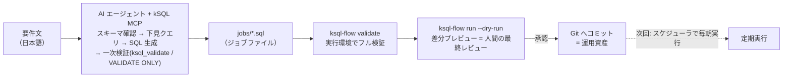

<!--
title: 【kSQL Flow #2】AI エージェントに kintone のバッチジョブを書かせる — MCP + Claude Code
tags:
  - kintone
  - SQL
  - MCP
  - AIエージェント
-->

> **as-is / no support**: 本ツールは MIT ライセンスで現状有姿のまま公開しており、サポート・動作保証・修正の約束はありません。本番投入は必ず `--dry-run` とステージング検証を経て、自己責任でお願いします。

- GitHub: https://github.com/rex0220/ksql-flow （ランナー） / https://github.com/rex0220/kintone-sql-tools （エンジン + MCP） / https://github.com/rex0220/ksql-flow-template （本記事のテンプレート）
- 前回: [【kSQL Flow #1】kintone のバッチ処理を SQL 1 本で書けるランナーの紹介](https://qiita.com/rex0220/items/893ab4016a5aaf595642)

**AI が書く、機械が検査する、人間が承認する** — kintone の月次バッチをこの分担で作り、検査がブロッカーを見つけて AI が人間に対応を要求してくるところまで、実機の失敗ログ込みで一巡させた記録です。

## 前回のおさらいと、今回やること

[第1話](https://qiita.com/rex0220/items/893ab4016a5aaf595642)では、kintone のバッチ処理（案件管理 → 顧客管理の月次集計）を SQL ファイル 1 本で定義し、kSQL Flow が排他・ログ・リラン・リトライを引き受ける構成を紹介しました。

今回はそのジョブ SQL を、**要件文から AI エージェントに書かせます**。

ポイントは役割分担です。

| 役割 | 担当 |
| --- | --- |
| 生成（スキーマ確認・SQL 作成・手直し） | AI エージェント + kSQL MCP |
| 検証（構文・スキーマ・安全ルール） | 機械（validate の二段構え） |
| 最終判断（この差分を本番に流してよいか） | 人間（dry-run レビュー） |

「AI が書いたコードを信用できるか」という問いに、**信用しなくて済む仕組みで答える**構成です。AI の善意や賢さではなく、実行系の検査で守ります。一言でいえば — **AI が書く、機械が検査する、人間が承認する**。



## なぜ AI との共通言語が SQL なのか（30 秒版）

エンジン側の記事「[AIエージェントにkintoneを操作させるにはSQLが最適解である](https://qiita.com/rex0220/items/fbed33b11251cdf7e31e)」で詳しく書いた話の要点だけ:

1. **SQL は LLM が最も得意なデータ操作言語。** JOIN・GROUP BY の説明は不要
2. **1 文 = 1 意図。** 生成物を実行前に人間が読んでレビューできる
3. **集計はサーバー側で完結。** 全件データを AI へ渡す必要がなく、集計や絞り込みは kintone 側で処理される（ただし **MCP ツールが返した検索結果やエラー内容は AI のコンテキストに入ります** — 個人情報・機密情報の扱いは、利用する AI サービスの規約と社内ポリシーに従ってください）

そして第1話で紹介したジョブの構文 — `ASSERT`（業務異常で停止）、`EXIT SUCCESS IF`（対象なしは正常スキップ）、キー指定 `UPSERT`（冪等）— は、**AI が書いても安全側に倒れるための言語ガード**でもあります。ガードが言語に入っていれば、AI がガードを「書き忘れた」ことも機械検査で分かります。

## 準備: VSCode + Claude Code + kSQL MCP

第1話から引き継ぐのは **kintone 側の構成だけ**です（営業支援パック + 追加 3 フィールド + 実行ログアプリ + 各アプリの API トークン）。作業ディレクトリは第1話のものを使い回さず、**AI 協働用のテンプレートリポジトリから新しく作り**、VSCode で開いて Claude Code を使います。第1話が「手元で最小構成を動かす」ためのセットアップだったのに対し、こちらは Git 管理と AI 協働を前提にした構成です。この構成にする理由は 3 つ:

- ジョブ SQL・ランナー config・MCP 設定が **1 つのリポジトリに揃い、そのまま Git 管理**できる
- エージェントが **MCP（スキーマ確認・下見クエリ）とターミナル（`ksql-flow validate` / `--dry-run`）の両方**を使える
- 生成 → 検証 → 差分レビュー → コミットが 1 画面で完結する

（Claude Desktop や他の MCP 対応エージェントでも考え方は同じです。その場合の MCP 登録手順はエンジン側リポジトリの `docs/ksql_mcpb_claude_desktop_install.md` を参照してください）

この構成一式は**テンプレートリポジトリ**として公開しています。GitHub の「Use this template」で自分のリポジトリを作って clone すれば、以下が揃った状態から始められます。

- https://github.com/rex0220/ksql-flow-template

```text
├── CLAUDE.md                 # AI 向けの作業規約（後述 — この構成の核）
├── .mcp.json                 # Claude Code の MCP 登録（開くだけで kSQL MCP がつながる）
├── package.json              # 依存（ランナー + エンジン/MCP）と npm scripts
├── ksql.config.json          # ランナー用の接続設定 — トークンは env: 参照
├── ksql.mcp.config.json      # MCP 用の接続設定 — 閲覧のみトークン
├── .env.example              # トークンの置き場所の雛形（.env は .gitignore 済み）
├── jobs/
│   └── monthly_deal_summary.sql   # 検証済みサンプルジョブ
└── dev/                      # 開発用（後述 — テストデータの投入と片付け）
    ├── seed_test_deals.sql
    └── cleanup_test_deals.sql
```

### 環境構築（初回 15 分）

前提: Node.js 20.6+ / VSCode + Claude Code / 第1話のアプリ構成（営業支援パック + 追加 3 フィールド + 実行ログアプリ）。グローバルインストールは不要で、ランナーも MCP サーバーもリポジトリ内に入ります。

**1. テンプレートから自分のリポジトリを作る** — テンプレートページ右上の「Use this template → Create a new repository」。設定にアプリ ID や業務用語が入るので **Private で作成**します（visibility は Public が初期値なので注意）。GitHub CLI なら 1 行:

```bash
gh repo create my-ksql-jobs --template rex0220/ksql-flow-template --private --clone
```

**2. 依存を入れる** — ランナーとエンジン + MCP サーバーが入ります。これだけです。

```bash
cd my-ksql-jobs && npm install
```

**3. 実行ログアプリを作る** — 第1話で作成済みならそのまま。未作成なら kSQL Flow 同梱の[アプリテンプレート](https://github.com/rex0220/ksql-flow/tree/main/template)から約 3 分です。

**4. 接続設定を書き換える** — `ksql.config.json`（ランナー用）と `ksql.mcp.config.json`（MCP 用）の `baseUrl` とアプリ `id` を自環境に合わせます。トークン値はこの 2 ファイルには書きません。

**5. トークンを置く** — `.env.example` をコピーして `.env` を作り、**閲覧のみトークン**を貼ります（分離の設計は後述）。

**6. VSCode で開いて Claude Code を起動** — 初回に kSQL MCP サーバーの使用可否を聞かれるので許可します（登録内容は `.mcp.json`）。

**7. 疎通確認** — Claude Code に「`ksql_describe_app` で `LAPP_案件管理` のフィールド一覧を見せて」と指示し、フィールドコードと型が返ってくれば準備完了。


ターミナル側は `npm run check-logapp -- --profile prod` でログアプリの定義検査まで通ります。

```
my-ksql-jobs  [main ≡ +0 ~2 -1 !] > npm run check-logapp -- --profile prod

> ksql-flow-template@1.0.0 check-logapp
> node --env-file=.env node_modules/@rex0220/ksql-flow/dist/cli.js validate --check-logapp --profile prod

OK: ログアプリ (ID 4249) は 8.2 のフィールド定義を満たしています
```

設計上のポイントを 1 つだけ — テンプレートでは **MCP 側の `logicalApps` の論理名を、ランナー config の `apps` と同じ名前にしてあります**。こうすると、AI が対話中に書く `LAPP_案件管理` という表記が、**MCP での下見クエリと kSQL Flow のジョブでそのまま同じ意味になります**。生成した SQL を書き換えずにジョブファイルへ移せる、というのがこの構成の要です。

### AI に kSQL Flow の知識を与える — CLAUDE.md と ksql_docs

ここが今回の構成でいちばん重要な部分です。kSQL Flow は公開して間もない OSS なので、**LLM は学習データとしてほとんど知りません**。何もしなければ、エージェントは「それらしい構文」を発明します。この穴は 2 つの仕組みで塞ぎます。

1. **方言仕様の一次資料は MCP の `ksql_docs`。** kSQL の言語リファレンスには Flow 拡張構文（dialect 1: ディレクティブ・`ASSERT`・`EXIT SUCCESS IF`・`@` 付き時刻関数）の章とレシピがあり、エージェントが章単位で取得できます。構文は覚えているものを書くのではなく、**その場で引かせます**
2. **作業規約はリポジトリの `CLAUDE.md`。** Claude Code はリポジトリ直下の `CLAUDE.md` を毎セッション自動で読み込みます。テンプレートには、作成手順（スキーマ確認 → `ksql_docs` で方言確認 → 下見 → 生成 → 二段の validate → dry-run）、ジョブ規約（`@` 付き時刻関数・`ASSERT` と `EXIT SUCCESS IF` の使い分け・キー指定 UPSERT）、してはいけないこと（**本実行しない・構文を推測で書かない**）を記した [CLAUDE.md](https://github.com/rex0220/ksql-flow-template/blob/main/CLAUDE.md) が入っています

つまり「AI が kSQL Flow を知らない」ことは前提であって、**知識は Git 管理された規約ファイルと MCP のドキュメントツールで毎回与える**設計です。規約を直せば AI の振る舞いも変わり、その変更履歴も Git に残ります。

### トークンは「閲覧のみ」と「書込可」を分ける

この構成の安全性はトークンの分離で担保します。kintone の各アプリで**閲覧のみのトークン**と**書込可のトークン**を別々に発行し、置き場所を分けます。

| 置き場所 | トークン | できること |
| --- | --- | --- |
| `.env`（`.env.example` をコピーして作成・Git 管理外） | 閲覧のみ | MCP のスキーマ確認・下見クエリ、`npm run validate` / `npm run dry-run` |
| 本実行する人間のターミナル（**VSCode の外**）の**セッション限定**環境変数 | 閲覧 + 編集（+ 追加） | `npm run job`（本実行） |

MCP サーバーも npm scripts も Node の `--env-file=.env` 経由で動き、**プロセスの環境変数は `.env` より優先**されます。人間は本実行のときだけ、VSCode の外の自分のターミナルでセッション限定の環境変数として書込可トークンを設定します:

```powershell
# PowerShell（このウィンドウ限り。閉じれば消える）
$env:KSQL_TOKEN_DEALS = "<書込可トークン>"
$env:KSQL_TOKEN_CUSTOMERS = "<書込可トークン>"
$env:KSQL_TOKEN_LOGS = "<書込可トークン>"
npm run job -- -f jobs/monthly_deal_summary.sql --profile prod
```

`setx` などの**恒久的なユーザー環境変数にはしないでください** — ユーザー環境変数は以後に起動する全プロセス（VSCode と Claude Code のターミナルを含む）へ配られるため、AI 側にも書込トークンが渡ってしまい、この分離が崩れます。セッション限定に留めることで、**AI は validate と dry-run まで自走できるが、AI のプロセス環境には書込トークンが存在しない**という状態を、運用ルールではなく構成で保てます。

## 要件文からジョブを作らせる

エージェントへの依頼は、業務要件をそのまま日本語で書きます。

> 案件管理アプリから「当月受注予定」の案件を会社別に集計して、顧客管理アプリの `当月案件件数`・`当月売上合計`・`最終集計日時` を更新する kSQL Flow のジョブ（dialect 1）を書いてください。
>
> - マイナスの売上データがあれば異常として何も書かずに停止
> - 対象が 0 件の月は正常スキップ（アラートを鳴らさない）
> - 何度実行しても同じ結果になること（冪等）
> - スキーマは思い込みで書かず、MCP で実際に確認してから書くこと

最後の 1 行が実務上いちばん効きます。エージェントはまず `ksql_describe_app` でフィールドコードと型を取得し（ここで `受注予定日` が DATE、`売上` が NUMBER だと確定します）、`ksql_query` で件数確認の下見 SELECT を流し、それからジョブを書きます。仕様が曖昧な構文は `ksql_docs` で言語リファレンスを引かせれば、構文の発明も防げます。

こうして実際に生成されたジョブの全文がこちらです。第1話で紹介したジョブと同じ構成（ASSERT → 集計 → EXIT SUCCESS IF → キー指定 UPSERT）に到達しました。一時テーブル名や列の別名といった細部は生成のたびに揺れますが、そこは検証とレビューで守られる範囲です（テンプレート同梱のサンプルジョブは、この実走版に更新してあります — 初回は生成させずにサンプルで流れを確認する、でも構いません）。

```sql
-- @ksql name: monthly_deal_summary
-- @ksql timeout: 600
-- @ksql dialect: 1

-- 当月受注予定（受注予定日が当月内）の案件を会社別に集計し、
-- 顧客管理の 当月案件件数・当月売上合計・最終集計日時 を更新する。
-- as-of 注入（/flow の asOf）で過去月のバックフィルも同一スクリプトで再現可能。

-- 1) 業務異常ゲート: マイナス売上があれば何も書かずに中断（アラート対象）
ASSERT (
  SELECT COUNT(*) FROM LAPP_案件管理
  WHERE 受注予定日 >= @MONTH_START() AND 受注予定日 < @NEXT_MONTH_START()
    AND 売上 < 0
) = 0, '【異常中断】当月受注予定の案件にマイナスの売上データが存在します';

-- 2) 会社別に集計（インメモリ・書込 API 消費なし）
CREATE TEMP TABLE summary AS
SELECT 会社名,
       COUNT(*) AS 当月案件件数,
       SUM(売上) AS 当月売上合計
FROM LAPP_案件管理
WHERE 受注予定日 >= @MONTH_START() AND 受注予定日 < @NEXT_MONTH_START()
GROUP BY 会社名;

-- 3) 対象 0 件の月は正常スキップ（アラートなし）
EXIT SUCCESS IF (SELECT COUNT(*) FROM summary) = 0,
  '当月受注予定の案件が 0 件のためスキップ';

-- 4) 冪等な書き込み: 会社名（重複禁止）をキーに UPSERT
UPSERT INTO LAPP_顧客管理 (会社名, 当月案件件数, 当月売上合計, 最終集計日時)
SELECT 会社名, 当月案件件数, 当月売上合計, @NOW()
FROM summary
KEY (会社名);
```

これを `jobs/monthly_deal_summary.sql` に保存し、検証まで自走させたときの **Claude Code の結果報告（実物・体裁のみ整形）** がこちらです。アプリ ID 4246/4247 は検証環境の実 ID です（記事中の config 例では 100/200 に置き換えています）。

### Claude Code の結果報告（実物）

**スキーマ実測（`ksql_describe_app`）**

- 案件管理（4247・26 フィールド）: `受注予定日` DATE / `売上` NUMBER / `会社名` SINGLE_LINE_TEXT（ルックアップ）を確認
- 顧客管理（4246・24 フィールド）: `会社名` が重複禁止 → UPSERT キーに採用

**データ下見（`ksql_query`）**

| 項目 | 値 |
| --- | --- |
| 案件管理 総件数 | 276 件 |
| 受注予定日 入力あり | 16 件（最新 2025-12-26） |
| 当月（2026-08）対象 | **0 件** |
| マイナス売上 | 0 件 |
| 当月対象の会社名空値 | 0 件 |

**検証**

| 段階 | 結果 |
| --- | --- |
| 一次検証 `ksql_validate` | OK（診断なし） |
| 二次検証 `npm run validate -- -f jobs/monthly_deal_summary.sql --profile prod` | OK |
| dry-run `npm run dry-run -- ... --profile prod` | 当月 0 件のため `EXIT SUCCESS`（NO_DATA・exit 0）。読取 API 4 回・書込 0 件 |
| 書き込み経路の `VALIDATE ONLY`（2025-12 条件・書込 API 消費なし） | **失敗** — `DML target field 当月案件件数 does not exist` |

**要対応（ブロッカー）** — 顧客管理アプリに書き込み先フィールドが存在しない。以下を**フィールドコードをこの名前どおり**に追加すること:

| フィールドコード | タイプ |
| --- | --- |
| 当月案件件数 | 数値 |
| 当月売上合計 | 数値 |
| 最終集計日時 | 日時 |

> **設計判断ポイント: 0 件月の前月値はゼロクリアされない。** このジョブは対象 0 件の月をスキップするため、月が変わっても前月の集計値は残り、当月に案件のない会社の値も前回のままです。「毎回全顧客を 0 リセットしたい」要件なら、マスタ起点の LEFT JOIN 方式への変更で対応できます。実業務に載せる前に必ず決めておきたい仕様です（AI の報告が「既知の挙動」として自発的に指摘してきた点でもあります）。

### 検査がブロッカーを見つけ、AI が「人間への要求」を出した

実はこの時点で、検証環境の顧客管理には書き込み先の 3 フィールドをまだ追加していませんでした。注目してほしいのは**検出のされ方**です。

- ランナーの validate は**通っています**（UPSERT の書込先「列」の存在は validate の守備範囲外 — キーの検査とは別）
- 当月対象が 0 件のため、通常の dry-run も `EXIT SUCCESS IF` で正常終了し、**書込経路まで届きません**
- そこで AI は、下見で見つけた過去月（2025-12）の条件で **`VALIDATE ONLY`**（1 件も書き込まずに全行検証するエンジン機能）を流して書込経路そのものを検査し、フィールド不存在を検出しました

そして AI にできるのはここまでです。**kSQL はデータの読み書き専用で、アプリのフォーム変更はできません。** だから報告の結論は「要対応: この 3 フィールドを追加すること」という**人間への要求**になります。ジョブは書けるがアプリ構造には手が届かない — この分離も、閲覧のみトークンと同じく構成で決まっている境界です。


## フィールドを追加して、本実行まで

要求どおり 3 フィールドを kintone のフォームに追加し（人間の作業・約 1 分）、Claude Code に再検証させました。報告の要点:

- **スキーマ実測**: 顧客管理に `当月案件件数`（NUMBER）・`当月売上合計`（NUMBER）・`最終集計日時`（DATETIME）が正しいフィールドコードで追加されたことを `ksql_describe_app` で確認
- **書き込み経路の `VALIDATE ONLY`**（データのある 2025-12 条件・書込 API 消費なし）: 前回失敗していた箇所が**エラー 0 で通過**
- **二次検証** `npm run validate -- --profile prod`: OK
- **dry-run**: 当月（2026-08）は対象 0 件のため NO_DATA（exit 0）で正常スキップ・書込 0 件

締めの報告はこうでした（実物）:

> 再検証はすべて OK です。ブロッカーは解消され、ジョブは本実行可能な状態になりました。あとは本実行のみで、こちらはご自身のターミナルでお願いします。今月は 0 件スキップ（exit 0）になる想定です。

最後の一文まで含めて役割分担どおりです。人間のターミナル（VSCode 外・書込可トークンをセッション限定の環境変数に設定した側）で本実行:

```
my-ksql-jobs  [main ≡ +0 ~2 -1 !] > npm run job -- -f jobs/monthly_deal_summary.sql --profile prod

> ksql-flow-template@1.0.0 job
> node --env-file=.env node_modules/@rex0220/ksql-flow/dist/cli.js run -f jobs/monthly_deal_summary.sql --profile prod

[RUN] monthly_deal_summary.sql (profile: prod, as-of: 2026-08-22T13:08:22.143Z)
  => NO_DATA (exit 0) 読取 0 件 / 書込 0 件 / API 5 回
```

AI の宣言どおり NO_DATA（exit 0）で着地しました。アラートは鳴らず、実行ログアプリには NO_DATA の 1 レコードが残ります。「対象がない月は静かに成功する」（第1話の設計ポイント①）が、AI の書いたジョブでもそのまま機能した形です。

## 当月データを投入して、書込経路まで検証する

ただし、当月対象が 0 件のままでは UPSERT の**書込経路**を実データで確認できていません。そこで、テストデータ投入・片付けのジョブを用意して書込経路まで一巡させました（テンプレートの `dev/` に同梱してあります）。

- `dev/seed_test_deals.sql` — テスト顧客 2 社を冪等 UPSERT → **当月日付**（`@TODAY()` / `@MONTH_START()`）のテスト案件 3 件を INSERT。再実行しても増殖しません
- `dev/cleanup_test_deals.sql` — テスト会社名の完全一致で案件・顧客の両方を削除（件数ガードつき）

会社名・案件名は `KSQL-FLOW-TEST-` プレフィックスなので、後から漏れなく片付けられます。日付が as-of 基準の関数なので、**いつ実行しても「その月の当月データ」になる**のがポイントです。

### 実機だけが教えてくれた罠 — ルックアップ

このシード、モックの E2E は一発で通りましたが、実機では 2 回失敗しました。どちらも SFA パックの案件管理の `会社名` が**ルックアップフィールド**（参照元 = 顧客管理）であることに起因します。

```
  => FAILED (exit 3) 読取 0 件 / 書込 0 件 / API 6 回
  エラー内容: A value KSQL-FLOW-TEST-山田商事 in the field 会社名 does not exist
  in the datasource app for lookup, or you do not have permission to view the app or the field.
```

1. **参照先にデータが必要。** ルックアップの値は参照先アプリに存在しないと書けません → シードの先頭で参照先（顧客管理）へテスト顧客を先に UPSERT する順序に修正
2. **参照先トークンの併送が必要。** 修正後も同じエラー文で失敗。kintone はルックアップ付きレコードの書込時に、**参照先アプリの閲覧権限を同じリクエストのトークンで検証**します。config の案件管理に顧客管理のトークンも並べて解決:

```json
"案件管理": { "id": 100, "tokens": ["env:KSQL_TOKEN_DEALS", "env:KSQL_TOKEN_CUSTOMERS"] }
```

エラー文は同じでも原因が 2 つある、という設計です（メッセージ末尾の「or you do not have permission ...」が 2 つ目のヒント）。どちらも kintone の実挙動であって、モックでは原理的に見つかりません。**最後の検証は必ず実機で** — これもこの構成の手順に組み込んでおくべき教訓でした（テンプレートは両方反映済みです）。

### 投入 → 本実行 — 書込経路も設計どおり

```
[RUN] seed_test_deals.sql (profile: prod, as-of: 2026-08-22T14:39:44.572Z)
  => SUCCESS (exit 0) 読取 2 件 / 書込 5 件 / API 13 回
```

書込 5 件 = テスト顧客 2 社 + 当月案件 3 件。dry-run では「UPDATE 2 件」（テスト 2 社の集計欄が埋まる差分）が出ます。そして本実行:

```
[RUN] monthly_deal_summary.sql (profile: prod, as-of: 2026-08-22T14:40:41.096Z)
  => SUCCESS (exit 0) 読取 5 件 / 書込 2 件 / API 9 回
```

顧客管理に「KSQL-FLOW-TEST-山田商事: 2 件 / 150,000」「KSQL-FLOW-TEST-鈴木建設: 1 件 / 380,000」が書き込まれ、NO_DATA 経路だけでなく **ASSERT → 集計 → UPSERT の書込経路まで実機で一巡**しました。

- 山田商事の集計例


検証が済んだら片付けます:

```bash
npm run job -- -f dev/cleanup_test_deals.sql --profile prod
```

### ここまでで分かったこと

長くなってきたので、主線を 3 行で整理します。

- **AI は「kSQL Flow を知らない」前提で書ける** — スキーマは `ksql_describe_app`、方言仕様は `ksql_docs`、作業規約は `CLAUDE.md` から毎回取得する
- **機械検査が生成物を段階的に絞り込む** — 一次 validate → 二次 validate → `VALIDATE ONLY` / dry-run。不整合は書き込む前に止まり、AI の手に負えないもの（アプリのフォーム変更）は人間への要求としてエスカレーションされる
- **人間の仕事は 2 つだけ** — dry-run の差分を見て承認すること、本実行の引き金を引くこと

ここからは、この検査の網を要素ごとに見ていきます。

## 機械の検査が AI のミスを捕まえる（実例）

「AI は間違える」前提で、どの間違いがどこで捕まるかを実際に試した結果です。

**時刻関数の `@` を付け忘れた場合** — `@MONTH_START()` の代わりに `THIS_MONTH()` と書くと、`ksql-flow validate` が警告します。

```
monthly_deal_summary.sql: OK (警告 2 件)
  monthly_deal_summary.sql:10:1 warning KSQL1306 bare の時刻依存関数は kintone サーバー評価の
  ため as-of の対象外です。再現性が必要なら @ 付き関数を使用してください。
  monthly_deal_summary.sql:17:1 warning KSQL1306 （同上）
```

これは第1話の設計ポイント②（時刻はバッチ開始時に固定）を機械が守らせている、ということです。

**UPSERT のキーを間違えた場合** — 顧客管理に存在しない `顧客名` をキーに書くと、エラーで止まります。

```
monthly_deal_summary.sql: NG (エラー 1 件 / 警告 0 件)
  monthly_deal_summary.sql:30:1 error KSQL1302 UPSERT / MERGE のキー「顧客名」が
  APP200 のフォームに存在しません。重複禁止を設定した文字列（1行）または
  数値フィールドをキーにしてください。
```

キーに重複禁止が設定されていない場合も、同系統の検査（KSQL1303）で止まります。冪等リランの前提が崩れる書き込みは、実行前に拒否されます。

**WHERE のフィールド名を間違えた場合** — `受注予定日` を `受注日` と書いた場合、これは validate では捕まりません（絞り込み条件は kintone 側で評価されるため）。ただし放置されるわけではなく、二重の網があります。まず AI に「MCP で確認してから書く」手順を踏ませていれば、`ksql_describe_app` と下見クエリの時点で露見します。それでもすり抜けた場合は、**dry-run の読み取り段階で kintone への問い合わせが解決できず、書き込みゼロのまま停止**します。

```
エラー内容: ArgumentError: WHERE predicate is unsupported
  (field=受注日, operator=>=, reason=WHERE_FIELD_UNRESOLVED).
```

「どの検査が何を守るか」を知っておくと、AI への指示も検証の運用も設計できます。

## 検証は二段構え

生成した場所（AI との対話）と実行する場所（バッチの実行環境）は別物です。だから**静的検証**を二段にします（その先に、実行経路の検証として `VALIDATE ONLY` と dry-run が続きます — 「二段 + 実行経路」の構えです）。

| 段階 | コマンド / ツール | 見るもの | いつ |
| --- | --- | --- | --- |
| 一次 | MCP `ksql_validate` | 構文・dialect 1 のルール・MCP 設定でのスキーマ | AI との対話中（即時） |
| 二次 | `npm run validate`（ランナーの validate） | **実行環境の** config・トークン・実スキーマ（UPSERT キーの実在と重複禁止まで） | ジョブファイル保存後 |

一次検証は MCP 経由で対話の中で終わります。二次検証は「実行環境でも同じ結論になるか」の確認で、VSCode + Claude Code 構成なら**これも AI がターミナルで実行し、結果を読んで自分で直すところまで自走**できます。MCP の設定と実行環境の config が食い違っていた（アプリ ID が違う等）というズレは、ここで出ます。

```bash
npm run validate -- -f jobs/monthly_deal_summary.sql --profile prod
```

## dry-run が人間の最終レビュー

最後の関門は機械ではなく人間です。ただしレビュー対象は SQL の字面ではなく、**「実行したら実際に何が起きるか」の差分**です。dry-run は閲覧トークンで動くので、ここまでは AI が実行して結果を会話に貼るところまで自走できます。

```bash
npm run dry-run -- -f jobs/monthly_deal_summary.sql --profile prod
```

シードでテストデータを入れた状態（前節）で流すと、こんな差分が出ます（抜粋）:

```
[DRY-RUN] monthly_deal_summary.sql (as-of: 2026-08-22T00:00:00.000Z)
  書き込み予定    : LAPP_顧客管理  INSERT 0 件 / UPDATE 2 件 / DELETE 0 件
  変更サンプル（先頭 5 件）:
    LAPP_顧客管理  会社名=KSQL-FLOW-TEST-山田商事  当月案件件数:  → 2 / 当月売上合計:  → 150000
    LAPP_顧客管理  会社名=KSQL-FLOW-TEST-鈴木建設  当月案件件数:  → 1 / 当月売上合計:  → 380000
  => dry-run 完了（kintone 書き込み 0 件）
```

「山田商事の集計欄が 2 件 / 150,000 で埋まり、鈴木建設が 1 件 / 380,000。更新は 2 件だけ」— この粒度なら、SQL を読めない人でも承認判断ができます。`ASSERT` や `EXIT SUCCESS IF` の判定は dry-run でも本実行と同じに効くので、業務異常があればこの段階で Exit 2 で止まります。

問題なければ、人間が**自分のターミナル**（VSCode 外・書込可トークンをセッション限定の環境変数に設定した側）で本実行します。AI に本実行させないのは運用ルールではなく構成です — AI 側のプロセス環境には書き込めるトークンがありません。

```bash
npm run job -- -f jobs/monthly_deal_summary.sql --profile prod
```

本実行後の顧客管理が dry-run の予告どおり（集計欄が 2 件 / 150,000、案件一覧に投入したテスト案件 2 件）になっていることは、前掲のスクリーンショットのとおりです。

## ジョブは Git へ — AI の成果物を運用資産にする

出来上がった `jobs/monthly_deal_summary.sql` はただのテキストファイルなので、そのままコミットして PR でレビューできます。VSCode + Claude Code 構成なら、ジョブも config も MCP 接続設定（`.mcp.json`）も同じリポジトリにあるので、**「AI がジョブを書いた」という出来事の全体が Git の履歴に残ります**。会話ログと違って、**AI 抜きで再実行・再検証できる資産**です。`validate` と `dry-run` は CI にも組み込めます（PR に dry-run の `--json` 出力を貼るレシピは GitHub Actions 編で扱う予定です）。

まとめると、この構成の信頼モデルはこうなります。

- AI は**閲覧のみトークン**でジョブを作り、validate・dry-run まで自走する（書込トークンを持たない）
- 機械は**二段の validate** で構文・スキーマ・安全ルールを検査する
- 人間は **dry-run の差分**という「読める形」で最終判断し、本実行だけを自分の手で行う

## 次回

このジョブを **Windows タスクスケジューラで毎朝動かします**。実機検証で踏んだ「PowerShell が 0.1 秒で無言死する罠」を含む運用編です → [【kSQL Flow #4】タスクスケジューラで毎朝動かす](https://qiita.com/rex0220/items/d0a66c133edd42ff91c4)。

## 今後の連載予定

1. **#1**: [kintone のバッチ処理を SQL 1 本で書けるランナーの紹介](https://qiita.com/rex0220/items/893ab4016a5aaf595642)
2. **#2（本記事）**: AI エージェントにジョブを書かせる（MCP + 二段 validate + dry-run レビュー）
3. **#3**: [毎朝の無人実行の前に — kintone バッチを 200 → 20,000 → 100,000 件で鍛える](https://qiita.com/rex0220/items/62e950ab1ccc5b54ff69)
4. **#4**: [タスクスケジューラで毎朝動かす — PowerShell が 0.1 秒で無言死する罠つき](https://qiita.com/rex0220/items/d0a66c133edd42ff91c4)
5. **#5**: [kintone バッチの API 消費を 4 割減らすまで — 「束ねれば速い」が実測で覆った話](https://qiita.com/rex0220/items/9cbc1e0e9b5ab292e6a1)
6. **#6**: [GitHub Actions で kintone バッチをサーバーレス運用 — PR を開くと「書込差分」が自動で貼られる](https://qiita.com/rex0220/items/a522f7880a5960f033b3)
7. **#7**: [kintone バッチが失敗した朝にやること — Exit Code・部分適用・再実行しても壊れない設計](https://qiita.com/rex0220/items/39821af2a79b88de0ed2)
8. **#8**: [バッチの失敗は 4 種類ある — 自動リラン・AI 診断・人間の判断の切り分け](https://qiita.com/rex0220/items/30cac8d8b52ec8ac782a)
9. **#9**: [月 1,000 円の VPS で kintone バッチを毎朝動かす — cron の遅延は 1 秒だった](https://qiita.com/rex0220/items/dd8ec668b8966e346d48)
10. **#10**: [スマホのチェック 1 つで VPS のバッチをリランする — 新しいポートを 1 つも開けずに](https://qiita.com/rex0220/items/b841921afe86083f14a0)
11. **#11**: [kintone がロックサーバーになる — 重複禁止フィールドで作る分散ロックと、検索索引ラグの実測](https://qiita.com/rex0220/items/44cf9f6d23c264d14dca)
12. **#12**: [kintone バッチを Cloud Run Jobs へ — 使い捨てコンテナでも resume と分散ロックは動くか](https://qiita.com/rex0220/items/3c3d49419f91e582d1ab)
13. 以降、リラン指示のサーバーレス化と v0.6 の話などを予定
