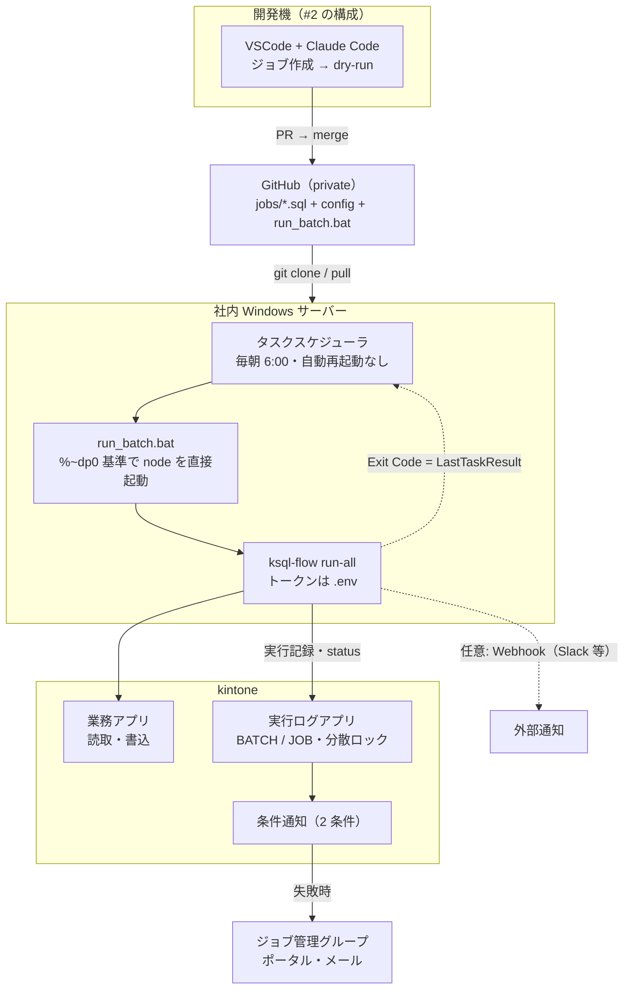

<!--
title: 【kSQL Flow #4】タスクスケジューラで毎朝動かす — PowerShell が 0.1 秒で無言死する罠つき
tags:
  - kintone
  - SQL
  - PowerShell
  - タスクスケジューラ
-->

> **as-is / no support**: 本ツールは MIT ライセンスで現状有姿のまま公開しており、サポート・動作保証・修正の約束はありません。本番投入は必ず `--dry-run` とステージング検証を経て、自己責任でお願いします。

- GitHub: https://github.com/rex0220/ksql-flow （[タスクスケジューラの実例](https://github.com/rex0220/ksql-flow/tree/main/examples/windows-task-scheduler)）
- 前回: [【kSQL Flow #3】毎朝の無人実行の前に — kintone バッチを 200 → 20,000 → 100,000 件で鍛える](https://qiita.com/rex0220/items/62e950ab1ccc5b54ff69)

[#3](https://qiita.com/rex0220/items/62e950ab1ccc5b54ff69) で 10 万件・強制切断・API 枯渇まで鍛えた kintone バッチを、いよいよ**毎朝の無人実行**に載せます。実行環境は Windows タスクスケジューラ。リリース前の実機検証でここを通したとき、**私は 2 回失敗しました** — その失敗ログごとお見せします。

## 最初に正直な位置づけを

タスクスケジューラは、**単体では本番バッチ基盤の水準にありません**。失敗通知はなく、無言で死んでも `LastTaskResult` を見に行くまで気づけず、サーバー 1 台の SPOF です。これから環境を用意できるなら、GitHub Actions（無料枠）や月 1,000 円前後の VPS + cron を先に検討してください（[#1 の整理](https://qiita.com/rex0220/items/893ab4016a5aaf595642)）。

それでも本記事を書くのは、**ファイルサーバーや業務システムで社内 Windows サーバーがすでに動いている環境なら、追加のサーバー費用なしで載せられる現実解**だからです。そして弱点の大半は、ランナー側が引き受けられます。

| 足りないもの | 誰が持つか |
| --- | --- |
| 失敗通知 | **kintone 標準の条件通知**（ログアプリに 2 条件・後述）+ 任意で Webhook |
| 実行記録 | kintone のログアプリ（スケジューラのログを見なくても kintone 側で確認） |
| 多重起動の防止 | ローカルロック + ログアプリの分散ロック（Exit 5） |
| 失敗からの復旧 | 冪等リラン `--resume`（#3 で強制切断から収束を実証済み） |
| **そもそも起動しなかった事故** | **ランナーでは拾えない** — heartbeat の「不在」を人間か外部監視が見るしかない（本記事の最後に再掲） |

つまりスケジューラの役割は「**決まった時刻に 1 コマンド叩く装置**」だけに絞ります。

## 前提と構成 — 動かすのは「#2 で作ったあのリポジトリ」

載せるのは新しい何かではありません。[#2](https://qiita.com/rex0220/items/3a1213a596a8c49b67aa) でテンプレートから作り、AI がジョブを書き、[#3](https://qiita.com/rex0220/items/62e950ab1ccc5b54ff69) で 10 万件まで鍛えた**あなたのジョブリポジトリそのもの**です。ジョブ SQL・config・npm 依存（ランナー本体も `node_modules` 内）が 1 リポジトリに揃っているので、**サーバーへの初回配置は `git clone` + `npm install`、以降のジョブ更新は基本 `git pull`** — サーバー固有の手作業コピーは不要です。

```
C:\ksql\my-ksql-jobs\        ← ジョブリポジトリを clone（private）
├── run_batch.bat            ← 起動バッチ（テンプレートに同梱 — 追加作業なし）
├── ksql.config.json
├── .env                     ← このサーバー用の書込可トークン（.gitignore 済み）
├── jobs\
│   └── monthly_deal_summary.sql
└── node_modules\@rex0220\ksql-flow\   ← npm install で入るランナー
```

しくみの全体像は 1 枚にするとこうです（失敗通知と変更フローの詳細は後述）:



### サーバー構築（約 15 分・タスク登録前まで）

1. サーバーに Node.js 20.6+ を導入
2. ジョブリポジトリを clone して依存を入れる（private のため要認証。GitHub CLI なら）:

   ```powershell
   gh repo clone <あなたのアカウント>/my-ksql-jobs C:\ksql\my-ksql-jobs
   cd C:\ksql\my-ksql-jobs
   npm install
   ```

3. `.env.example` をコピーして `.env` を作り、このサーバー用の**書込可トークン**を貼る（理由は次節）
4. 疎通確認 → **起動バッチを手動で 1 回**流して、タスクに載せる前にコマンド自体を検証:

   ```powershell
   node --env-file=.env node_modules\@rex0220\ksql-flow\dist\cli.js validate --check-logapp --profile prod
   .\run_batch.bat
   $LASTEXITCODE   # 0 = 成功（対象 0 件の NO_DATA を含む）
   ```

無人化の前提となる 3 点 — 二重起動が Exit 5 で止まる・通知が届く・非対話シェルで動く — は #3 の無人運用ゲートで確認済みという状態から始めます。

> **再現検証済み**: 本記事の手順は、**素の Windows 11 Pro**（M1 Mac 上の Parallels Desktop 仮想マシン）で VSCode・Git・GitHub CLI・Node のインストールから通しで実施し、ログアプリに BATCH / JOB が記録されるところまで確認しています。スナップショットで「何も入っていない Windows」に戻して検証できるため、開発機に何かが入っている前提の手順抜けはありません。

起動バッチは**テンプレートに同梱**されています（[run_batch.bat](https://github.com/rex0220/ksql-flow-template/blob/main/run_batch.bat)）:

```bat
@echo off
cd /d %~dp0
node --env-file=.env node_modules\@rex0220\ksql-flow\dist\cli.js run-all .\jobs --profile prod
exit /b %ERRORLEVEL%
```

こだわりが 3 つ入っています。**.ps1 でなく ASCII だけの .bat** なのは後述の罠②を構造的に回避するため。**`cd /d %~dp0`（バッチ自身のあるディレクトリへ移動）**なのは、clone 先がどこでも書き換えなしで動かすため — 罠①（パス依存）もこれで半減します。**`npm run` を挟まず node を直接叩く**のは、ランナーの Exit Code をそのまま `LastTaskResult` に届けるため（npm のラッパーを経由させると終了コードの対応が崩れる余地が生まれます）。

### 無人実行のトークン設計 — サーバーでは `.env` に一本化

[#2](https://qiita.com/rex0220/items/3a1213a596a8c49b67aa) では「書込トークンはセッション限定・恒久的な環境変数にしない」としました。あれは**AI が同居する開発機**の分離設計です。無人サーバーでは前提が変わります — このマシンに AI のセッションはなく、人間のセッションすらありません。そこで**リポジトリ内の `.env`（.gitignore 済み）に書込可トークンを置き**、起動バッチの `--env-file=.env` に読ませます。

- トークンの露出面が「このサーバーの、このディレクトリ」に閉じ、実行アカウントのユーザー環境変数にも残りません（ログオン種別による環境変数の読み込みの癖からも自由になります）
- 共用サーバーでは、リポジトリのフォルダーに NTFS のアクセス権を設定し、**実行アカウントと管理者以外の一般ユーザーが `.env` を読めないように**しておきます
- 開発機と運用サーバーを兼ねる場合（今回の検証環境がそうです）だけは #2 の分離が課題に戻ります — AI ツールを使うユーザーと、タスクの実行アカウント + `.env` を分けてください

## タスク登録（動作確認済み）

登録も PowerShell 1 発です（[examples/windows-task-scheduler/register_task.ps1](https://github.com/rex0220/ksql-flow/blob/main/examples/windows-task-scheduler/register_task.ps1)）:

```powershell
$batchPath = "C:\ksql\my-ksql-jobs\run_batch.bat"   # 絶対パスで（後述の罠①）
$taskName  = "kSQL Flow daily batch"

$action    = New-ScheduledTaskAction -Execute $batchPath -WorkingDirectory (Split-Path $batchPath)
$trigger   = New-ScheduledTaskTrigger -Daily -At 6:00
$settings  = New-ScheduledTaskSettingsSet -StartWhenAvailable -ExecutionTimeLimit (New-TimeSpan -Hours 2)
$principal = New-ScheduledTaskPrincipal -UserId "$env:USERDOMAIN\$env:USERNAME" -LogonType Interactive -RunLevel Limited

Register-ScheduledTask -TaskName $taskName -Action $action -Trigger $trigger -Settings $settings -Principal $principal -Force
```

ポイントは 2 つ。**「実行に失敗したとき再起動する」は設定しない**（理由は後述）。そして上の `-LogonType Interactive` は**ログオン中しか動かない検証向けの設定**です — ログオフ中も動かす本番運用では、専用アカウントの「ユーザーがログオンしているかどうかにかかわらず実行」（または gMSA）に切り替えます。

実行後の確認はこの 2 つを突き合わせます:

```powershell
Get-ScheduledTaskInfo -TaskName "kSQL Flow daily batch" | Format-List LastRunTime,LastTaskResult
```

`LastTaskResult` は **kSQL Flow の Exit Code がそのまま入ります**（0 = 成功 / 2 = 業務異常 / 3 = 実行時エラー / 5 = 多重起動）。そして詳細は kintone のログアプリ側 — 何件読んで何件書いたか・エラー全文・実行時刻は、サーバーに入らなくても kintone を開けば見えます。

### スケジュール起動そのものを確認してから本番時刻へ

`Start-ScheduledTask` による手動実行はコマンドの検証にはなりますが、**「時刻トリガーで発火する」経路の検証にはなりません**（罠①はまさに、手動では通るのにスケジュール起動で死ぬ型の事故です）。そこで初回は **数分後の時刻で登録して自然発火を待ち**、確認できてから本番時刻に切り替えます:

```powershell
# 1. 登録時のトリガーだけ数分後にしておく（上のスクリプトのこの行を差し替え）
$trigger = New-ScheduledTaskTrigger -Daily -At (Get-Date).AddMinutes(5)

# 2. 発火後、LastRunTime が今の時刻・LastTaskResult = 0 を確認（+ ログアプリに BATCH レコード）

# 3. トリガーを本番時刻へ変更（登録し直し不要）
Set-ScheduledTask -TaskName "kSQL Flow daily batch" -Trigger (New-ScheduledTaskTrigger -Daily -At 6:00)
```

2 回目の実行がジョブの冪等性（UPSERT / NO_DATA スキップ）で安全なのは #3 で検証済みなので、確認発火 → 翌朝の本番発火と 2 回動いても問題ありません。

## 罠 ①: `LastTaskResult = 4294770688`

リリース前検証での 1 回目の失敗です。登録した覚えのない値が返ってきました。

```
LastRunTime    : 2026/08/22 10:21:XX
LastTaskResult : 4294770688
```

4294770688 = **0xFFFD0000** = PowerShell が `-File` の対象を発見できずに即終了したときの値です。原因は登録スクリプトがパスを `(Resolve-Path .)` で組んでいたこと — **登録した時のカレントディレクトリに依存**し、別の場所から登録した瞬間に存在しないパスがタスクに焼き付きました。

このとき効いた切り分けが「**ログアプリに該当時刻の BATCH レコードが無い**」ことです。ランナーは起動すれば必ず実行記録を残すので、記録が無い = CLI まで到達していない = タスク側の問題、と一発で確定します。対策は単純で、**タスクに入れるパスはすべて絶対指定**（上の登録スクリプトは修正済みの形です）。

## 罠 ②: 0.1 秒で無言死する PowerShell

2 回目。パスを直したのに、今度は **0.1 秒で終了・出力ゼロ**。ログファイルは空、しかし `LastTaskResult` は正常系に見える — 一番嫌なタイプの死に方です。

PowerShell 5.1 で直接実行して再現させた結果、原因はエンコーディングでした。

- 起動スクリプト（日本語コメント入り .ps1）が **BOM なし UTF-8** だった
- **タスクから起動していたのは Windows PowerShell 5.1（`powershell.exe`）**。5.1 は BOM なし UTF-8 を **ANSI として読む**ため、日本語リテラルが化けてパースエラー → 何も出力せず即死
- 手元の確認で通っていたのは **pwsh 7**（UTF-8 既定）だったから。「手で動くのにタスクだと死ぬ」の正体がこれ

対策は 3 択です: **①日本語を含む .ps1 は UTF-8 BOM 付きで保存**する、②起動スクリプトを **ASCII だけの .bat** にする（本記事の構成。エンコーディング問題が構造的に消えます）、③タスクの実行プログラムを pwsh 7 に明示する。ちなみに examples の登録スクリプトのコメントを英語にしてあるのは、この罠を仕組みで避けるためです。

修正後の 3 回目で完走しました:

```
LastRunTime    : 2026/08/22 10:36:41
LastTaskResult : 0
```

（PSVersion 5.1.26100.9168。ログアプリには実行時刻の BATCH 1 件 + JOB 3 件 — SUCCESS / SUCCESS / NO_DATA — が残り、コンソールログと完全一致）

## 「失敗したら再起動」を使わない理由

タスクスケジューラには「実行に失敗したとき再起動する」設定がありますが、**使いません**。理由は 2 つ。

1. **多重起動ロックと衝突します。** ランナーが異常な死に方をした直後はロック（ログアプリの RUNNING レコード）が残っていることがあり、スケジューラが機械的に再起動しても Exit 5 で弾かれるだけです — それは正しい防御であって、再起動で解決する状況ではありません
2. **失敗の種類を見ずに再実行するのは危険です。** Exit 2（業務異常）は「データを直すまで何度流しても止まるべき」失敗であり、自動再起動は無意味です。復旧はランナー側の冪等リラン `--resume` に一本化します — 部分書込からの収束は #3 で強制切断込みで実証済みで、翌朝の定時実行または人間の 1 コマンドで正しい状態に戻ります

これは他の環境でも同じで、GitHub Actions や EventBridge でも「スケジューラ側リトライは 0」が本連載の原則です。

## 失敗通知は kintone 標準機能で組める

実行記録がログアプリ（kintone）に残る構成の副産物として、**失敗通知に追加インフラが一切要りません**。ログアプリの「設定 → 通知 → レコードの条件通知」に 2 つ設定するだけです。

1. `record_type = BATCH` かつ status が `FAILED` / `ABORTED` / `TIMEOUT` のいずれか — run-all の失敗を **1 通に集約**
2. `record_type = JOB` かつ `parent_batch_id` が**空** かつ status が同上 — **単発 run の失敗**を拾う

ランナーは終了時にレコードの status を書き換えるので、失敗の瞬間に kintone がポータル・メール・モバイルアプリへ通知します。

宛先は個人ではなく、**「ジョブ管理」グループを作ってグループ宛**にするのがおすすめです。通知は 2 条件それぞれに宛先を持つため、個人指定だと担当変更のたびに通知設定を全部直すことになりますが、グループ宛ならアプリ側は一度設定したら触らず、**担当メンバーの入れ替えは cybozu.com 共通管理のグループだけ**で済みます（グループ宛でも通知はメンバー個々に届きます。グループの作成には共通管理の権限が必要な点だけ注意）。

Webhook（Slack 等）は「ログアプリに書けないほどの失敗でも飛ぶ」「heartbeat が打てる」という一段深い保険として、必要な環境だけ追加すれば十分です。

## 変更フロー — AI が書き、Git が運び、朝が実行する

運用が回り始めたあとのジョブ変更も、#2 で作った流れがそのまま使えます。

1. 開発機で AI にジョブの修正・新規作成を依頼（スキーマ確認 → 生成 → 二段 validate → dry-run まで AI が自走）
2. dry-run の差分を人間がレビューして PR → merge
3. サーバーで `git pull`（ランナーや依存の更新があれば `npm install` も）
4. **翌朝から新しいジョブが動く**

サーバーには手作業のコピーも設定変更も発生しません。ジョブは Git 履歴に、実行結果は kintone のログアプリに残るので、「いつ誰が何を変え、いつどう動いたか」が両側から追えます。AI が書いた SQL が、レビューと Git を通って毎朝の実運用に届く — 連載でやってきたことの終着点がこの 4 手です。

## 残る穴 — 「起動しなかった」だけは拾えない

最後にもう一度正直に。ランナーがどれだけ装備を持っても、**スケジューラがそもそも起動しなかった事故**（サーバー停止・Windows Update 再起動・タスク無効化）はランナーには観測できません。手当ては heartbeat です — 成功時にも Webhook を打つ設定にしておき、「**毎朝来るはずの通知が来ない**」ことを検知の頼りにします。通知チャネル側の仕組み（Slack のリマインダーや外部監視）で「不在」を拾えるならなお良し。ここを自動化しきれないことが、タスクスケジューラ運用の受け入れるべき限界です。

## まとめ

- スケジューラは「定時に 1 コマンド叩く装置」に格下げし、通知・記録・排他・リランはランナーが持つ — この分担なら現実解として成立する
- 動かすのは #2 のテンプレートから作ったジョブリポジトリそのもの。**初回配置 = `git clone` + `npm install` / 通常更新 = `git pull`**。ジョブの変更は「AI に依頼 → dry-run レビュー → PR → pull → 翌朝反映」の 4 手で回る
- 罠は 2 つ実機で踏んだ: **絶対パス以外は登録するな**（0xFFFD0000）、**日本語 .ps1 は BOM 付きで**（5.1 の ANSI 解釈で 0.1 秒無言死）。ASCII の .bat 起動が最も構造的に安全
- `LastTaskResult` = Exit Code の一次判定、詳細は kintone のログアプリ。**「ログアプリに記録が無い = CLI 未到達」**が切り分けの武器になる
- 自動再起動は使わず、復旧は冪等リラン `--resume` に一本化
- 「起動しなかった」だけは heartbeat の不在検知で人間が拾う

## 連載

1. **#1**: [kintone のバッチ処理を SQL 1 本で書けるランナーの紹介](https://qiita.com/rex0220/items/893ab4016a5aaf595642)
2. **#2**: [AI エージェントに kintone のバッチジョブを書かせる — MCP + Claude Code](https://qiita.com/rex0220/items/3a1213a596a8c49b67aa)
3. **#3**: [毎朝の無人実行の前に — kintone バッチを 200 → 20,000 → 100,000 件で鍛える](https://qiita.com/rex0220/items/62e950ab1ccc5b54ff69)
4. **#4（本記事）**: タスクスケジューラで毎朝動かす
5. 以降、GitHub Actions / cron・Docker / AWS / Azure / GCP の環境別と、排他・冪等リランの設計深掘りを予定
