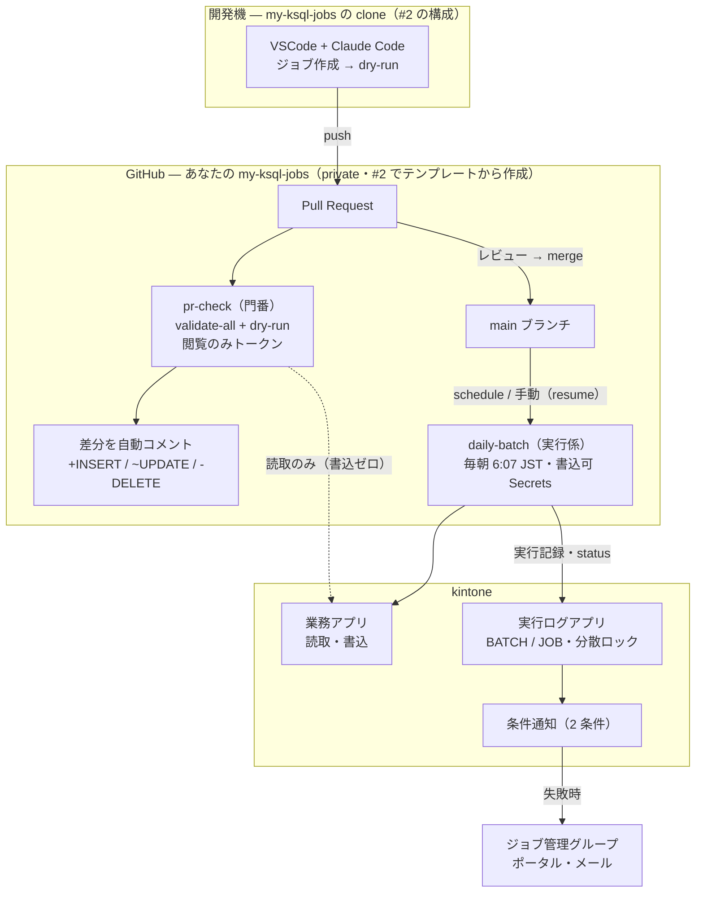

<!--
title: 【kSQL Flow #6】GitHub Actions で kintone バッチをサーバーレス運用 — PR を開くと「書込差分」が自動で貼られる
tags:
  - kintone
  - SQL
  - GitHubActions
  - CICD
-->

> **as-is / no support**: 本ツールは MIT ライセンスで現状有姿のまま公開しており、サポート・動作保証・修正の約束はありません。本番投入は必ず `--dry-run` とステージング検証を経て、自己責任でお願いします。

- GitHub: https://github.com/rex0220/ksql-flow / テンプレート: https://github.com/rex0220/ksql-flow-template
- 前回: [【kSQL Flow #5】kintone バッチの API 消費を 4 割減らすまで — 「束ねれば速い」が実測で覆った話](https://qiita.com/rex0220/items/9cbc1e0e9b5ab292e6a1)

[#4](https://qiita.com/rex0220/items/d0a66c133edd42ff91c4) は「すでに社内 Windows サーバーがある」層の現実解でした。本記事はその対 — **サーバーを 1 台も持たずに** kintone バッチを毎朝動かします。実行環境は GitHub Actions。[#2](https://qiita.com/rex0220/items/3a1213a596a8c49b67aa) でテンプレートから作ったジョブリポジトリに、ワークフローが 2 本**最初から同梱**されています。

この構成の見どころは定期実行そのものより、**PR を開くと kintone への書込差分が自動でコメントされる**ことです。ジョブ SQL のレビューが「SQL を読んで影響を想像する」から「**差分の表を見る**」に変わります。

実機の PR がこれです — コメント 1 行だけの変更 PR に、bot が「このジョブが毎朝何件書くか」を貼ってきます:


## 前提知識 — GitHub Actions とは（1 分で）

[GitHub Actions](https://docs.github.com/ja/actions) は、**GitHub に内蔵された自動実行サービス**です。リポジトリ内の設定ファイル（ワークフロー）に「いつ・何を実行するか」を書いておくと、GitHub が自分のサーバー上でそれを実行してくれます。CI/CD（テストやデプロイの自動化）の道具として使われるのが定番ですが、本記事では「**毎朝コマンドを 1 本叩く**」「**PR が開いたら検証を回す**」という使い方をします。

用語は 5 つ知っていれば読めます:

| 用語 | 意味 | 本記事での実体 |
| --- | --- | --- |
| **ワークフロー** | 自動実行の定義（YAML ファイル） | `.github/workflows/` の 2 ファイル |
| **トリガー** | 実行のきっかけ | `schedule`（毎朝）・`pull_request`（PR）・`workflow_dispatch`（手動ボタン） |
| **ランナー** | 実行される場所。GitHub が用意する**使い捨ての Linux VM**（実行のたびに新品） | `ubuntu-latest`（Node を入れて kSQL Flow を動かす） |
| **ステップ** | ランナー上で順に実行されるコマンド | checkout → `npm ci` → `ksql-flow run-all` |
| **Secrets / Variables** | リポジトリに保存する秘密値 / 設定値 | kintone トークン / 有効化フラグ（後述） |

実行履歴と各回のログは、リポジトリの **Actions タブ**にすべて残ります。

料金は、**private リポジトリでも無料枠が月 2,000 分**（GitHub Free・執筆時点。課金はジョブごとに 1 分単位へ切り上げ — 実測 17〜21 秒の run も 1 分と数えます）。毎朝の daily-batch だけなら**月約 30 分**、月 20 本の PR を確認しても**合計約 50 分 = 無料枠の数 %** です。サーバー代どころか Actions 代も実質ゼロで収まります。

## 同梱ワークフローは 2 本

置き場所はリポジトリ直下の **`.github/workflows/`** です（[テンプレートの実物](https://github.com/rex0220/ksql-flow-template/tree/main/.github/workflows)）。ドット始まりのフォルダーなので、GitHub のファイル一覧では `dev/` や `jobs/` より**上の最上部**に表示されます — 探すときはそこか、リポジトリの **Actions タブ**（登録済みワークフローとして 2 本並びます）を見てください。

この YAML は GitHub Actions の**ワークフロー定義ファイル**で、「いつ（トリガー）・どんな環境で・何を実行するか」を宣言する**実行の指示書**です。GitHub がこのフォルダーを自動で読み取り、条件が満たされると GitHub のサーバー上（Ubuntu の使い捨て VM）で実行します。[#4](https://qiita.com/rex0220/items/d0a66c133edd42ff91c4) との対比で言えば、**タスクスケジューラの「タスク登録」に相当するものをファイルとして Git 管理している**形です。中身は kSQL Flow の CLI を呼ぶだけの薄い包みで、どちらも数十行で全体が追えます。

| workflow | 役割 | トリガー | 内容 |
| --- | --- | --- | --- |
| `pr-check.yml` | **マージ前の門番** | PR（jobs/・config の変更時） | `validate-all` → `run-all --dry-run --json` → **差分プレビューを PR に自動コメント** |
| `daily-batch.yml` | **マージ後の実行係** | 毎朝 6:07 JST + 手動 | checkout → `npm ci` → `run-all ./jobs`。手動実行時は `--resume` チェックボックス付き |

しくみの全体像は 1 枚にするとこうです。登場するリポジトリは 1 つだけ — #2 でテンプレートから作った **あなたの `my-ksql-jobs`**（private）で、開発機はその clone、GitHub Actions はその上で動きます（トークンの分離と失敗時の流れは後述）:



この 2 本のワークフローは、どちらも**既定では無効**です。リポジトリ変数 `KSQL_ACTIONS_ENABLED = true` を置いたときだけ動きます。

なぜオプトインにしたか — テンプレートから作った直後のリポジトリは Secrets 未設定で、そのまま schedule が発火すると**毎晩失敗して失敗メールが届き続ける**からです。ガードは job レベルの `if` 1 行:

```yaml
jobs:
  run:
    if: ${{ vars.KSQL_ACTIONS_ENABLED == 'true' }}
```

変数未設定のまま発火させると run は `skipped`（緑）で終わります — 実機確認済みです。

## セキュリティ設計 — PR には閲覧のみトークンしか渡さない

CI にトークンを渡すとき、いちばん考えるべきは **「PR 上の SQL はレビュー前のコード」** だということです。AI が生成したジョブも、人間が書いたジョブも、マージ前は信用できません。そこで 2 本のワークフローでトークンを分けます。

| workflow | 渡すトークン | できること |
| --- | --- | --- |
| pr-check | **閲覧のみ**（`*_RO` を同じ環境変数名に注入） | validate と dry-run（書込ゼロの差分プレビュー）だけ |
| daily-batch | 書込可 | main にマージ済みのジョブの本実行 |

```yaml
# pr-check.yml — 同じ変数名に閲覧のみの値を入れる
env:
  KSQL_TOKEN_DEALS: ${{ secrets.KSQL_TOKEN_DEALS_RO }}
  KSQL_TOKEN_CUSTOMERS: ${{ secrets.KSQL_TOKEN_CUSTOMERS_RO }}
  KSQL_TOKEN_LOGS: ${{ secrets.KSQL_TOKEN_LOGS_RO }}
```

[#2](https://qiita.com/rex0220/items/3a1213a596a8c49b67aa) の開発機の分離（AI には閲覧のみ・本実行だけ人間の書込トークン）と同じ思想を、CI では「**マージ前 = 閲覧のみ・マージ後 = 書込可**」に写した形です。dry-run は書込ゼロで読取 API しか使わないので、閲覧のみトークンで完結します。

この分離が守るのは**書込事故**までです。閲覧のみトークンでも実データの読取はできるため、悪意ある PR によるデータ持ち出しリスクはゼロになりません。本構成は **private リポジトリ + 信頼できる共同開発者**を前提とした設計で、この前提を超える環境（外部委託・多人数）では、ステージング環境のトークンを pr-check に渡す構成を検討してください。

なお **通常、fork からの PR には Secrets は渡されません**（閲覧のみトークンであっても）。private リポジトリでは管理設定で fork PR への Secrets 提供を変えられますが、本構成では「外部のレビュー前コードへ Secrets を渡さない」運用を前提にします。テンプレート推奨どおり private + 同一リポジトリ内ブランチの PR なら影響はなく、public で外部コントリビューションを受ける形にした場合は fork PR の pr-check が失敗またはスキップになります — これは欠陥ではなく、本節と同じ思想の GitHub 側の既定の防御です。

## PR に貼られる差分コメント

pr-check の最終ステップが `run-all --dry-run --json` の出力を整形して PR にコメントします（actions/github-script・追加サービス不要）。ここで登場するトークンは kintone のものではなく **GitHub の `GITHUB_TOKEN`** です — この workflow では最小権限を明示しています:

```yaml
permissions:
  contents: read        # checkout 用
  pull-requests: write  # PR コメント用
```

kintone API トークン（RO/RW）と GitHub 側のトークンは別物なので混同に注意してください。組織設定で `GITHUB_TOKEN` の既定権限を絞っている環境では、この `permissions` 宣言がないとコメント投稿が 403 になる場合があります。必要な権限を workflow 側で明示しておくことで、リポジトリの既定権限への依存を減らせます。コメントの中身:

実機の PR に投稿された実物（Markdown 転記）:

```
## kSQL Flow dry-run 差分プレビュー（書込ゼロ）

| ジョブ | 結果 | 読取件数 | 書込差分 (+INSERT / ~UPDATE / -DELETE) | API 消費 |
| --- | --- | --- | --- | --- |
| monthly_deal_summary.sql | SUCCESS | 2,000 | LAPP_顧客管理: +0 / ~200 / -0 | 14 |
```

レビュアーが見るのは「この PR をマージして毎朝動くと、**どのアプリに何件書くのか**」です。SQL の意図はコードレビューで、**影響規模の一次確認**はこの表で、と分担できます。注意点も正直に: この表が示すのは**件数**であって、「どの 200 件か・どのフィールドがどう変わるか」までは分かりません。レコード単位の before/after を見たいときは、開発機で `dry-run --sample`（[#2](https://qiita.com/rex0220/items/3a1213a596a8c49b67aa) の手順）を使ってください — PR コメントは門番、精査は手元、という役割分担です。

## schedule の正直な制約 — cron が「6:07」である理由

GitHub Actions の schedule は**ベストエフォート**です。実行時刻は保証されず、混雑時は遅延し、まれにスキップもあり得ます。そして実測を重ねた結論として、**遅れることを例外ではなく通常として扱ってください** — 本記事の 3 回の実測は +30〜45 分、[以前の日次バッチ記事](https://qiita.com/rex0220/items/ca32e608f5ac3a09714b)では **+99 分（1 時間半超）** を観測しています。ワークフローの cron が `7 21 * * *`（= 6:07 JST）と半端なのは、**毎時 0 分付近が混雑して遅延しやすい**ためのずらしですが、ずらしても数十分〜2 時間近い遅延は起こります。

運用設計はこの前提から逆算します: 「毎朝 6:07 に動く」ではなく「**始業（例: 9:00）までに終わっていればよいジョブを、余裕をもって早朝に置く**」と考えてください。本構成の 6:07 設定は「9 時までに 3 時間の余裕を持たせた早朝枠」という意味であって、6 時台に動く約束ではありません。

それでも kSQL Flow のジョブが壊れないのは、集計基準が**開始時刻ではなく as-of**（バッチ開始時に固定される基準時刻）だからです。6:07 に動いても 6:40 に動いても「今月分の集計」は同じ結果になります。時刻厳守が要件なら、schedule ではなく [#4 のタスクスケジューラ](https://qiita.com/rex0220/items/d0a66c133edd42ff91c4)や cron を選んでください。

そのほかの注意:

- この workflow は timezone を指定していないため cron は **UTC 基準**です（JST - 9 時間。6:07 JST = 21:07 UTC）。なお GitHub Actions は現在、schedule への IANA timezone 指定にも対応しています — 本記事の YAML は連載の検証値との整合を優先して UTC のまま
- 遅延の実測（3 回分）: **6:07 設定 → 6:38 / 6:37（2 日連続で約 +30 分）、22:37 設定 → 23:22（+45 分）**。今回の 3 回がこの幅だったという観測で、GitHub Actions 全体の代表値ではありませんが、分単位の正確さを期待しない根拠には十分です
- cron の変更は反映されるが、これも急がない — 発火 19 分前に変更した回は、**変更後の時刻から 45 分遅れて**実行されました
- **public リポジトリは 60 日間更新がないと schedule が自動無効化**されます（テンプレートの推奨どおり private なら対象外）
- まれな二重発火は、ログアプリの分散ロック（Exit 5）が吸収します — スケジューラが何であっても運用装備は同じ、が連載の主張です

## 失敗したら — 通知は kintone、リランは workflow_dispatch

失敗通知に Actions 側の仕掛けは**不要**です。[#4 で組んだ kintone 標準の条件通知](https://qiita.com/rex0220/items/d0a66c133edd42ff91c4)（ログアプリに 2 条件）は、**実行環境がどこであっても同じように働きます** — ランナーがログアプリに FAILED 系レコードを書いた瞬間に通知が飛ぶ仕組みだからです。スケジューラを乗り換えても通知・記録・排他・復旧が変わらない、これが「運用装備はランナーが持つ」設計の配当です。

復旧は Actions の画面から: daily-batch の「Run workflow」に **resume チェックボックス**を付けてあります。ON で実行すると `run-all --resume` になり、前回失敗分だけを**元の as-of を引き継いで**再実行します（自動リトライを仕掛けない理由は #4 と同じ — 業務異常は再実行しても直りません）。

チェックボックスの実装はこれだけです — `workflow_dispatch` の boolean input を、式で CLI 引数に展開します:

```yaml
on:
  schedule:
    - cron: '7 21 * * *'   # 21:07 UTC = 翌朝 6:07 JST（0 分を避ける）
  workflow_dispatch:
    inputs:
      resume:
        description: "前回失敗分のみ再実行（--resume・元の as-of を引き継ぐ）"
        type: boolean
        default: false
# ...
      - name: run-all
        run: npx --no-install ksql-flow run-all ./jobs --profile prod ${{ inputs.resume == true && '--resume' || '' }}
```

schedule 起動時には `resume` が指定されないため、この構成では通常実行になります。

## 実機検証の記録（2026-08-26）

すべて my-ksql-jobs（テンプレートから作った実リポジトリ）+ kintone 開発環境・KSQL-FLOW-TEST 専有データで実施。

| 検証 | 結果 |
| --- | --- |
| daily-batch 手動発火（本実行） | SUCCESS — 読取 2,000 / 書込 200 / API 13 回。発火から完了まで約 17 秒（npm ci 含む）。ログアプリに BATCH/JOB 記録 |
| テスト PR（コメント 1 行の変更） | pr-check 21 秒で success。差分コメント自動投稿: `LAPP_顧客管理: +0 / ~200 / -0`・Exit Code 0 |
| 失敗系 PR（ASSERT 違反ジョブ入り） | pr-check **failure（赤）**。コメントに ABORTED 行 + 「Exit Code: 2（0 以外 — マージ前に要確認）」— マージ前に止まる |
| resume 実行（チェックボックス ON） | `--resume` が付与され「元セッションの as-of を引き継ぎます」→ 失敗なしのため「再実行が必要なジョブはありません」で正常終了 |
| schedule 自然発火 | 3 回の実測で遅延 **+30 分・+31 分・+45 分**（6:07 設定 ×2・22:37 設定 ×1）。有効化後の回は本実行が走り **NO_DATA（exit 0）** をログアプリに記録 — 「ベストエフォート」の生きた実例で、as-of 基準の集計なので遅れても結果は同じ |
| schedule の変更反映 | 発火 19 分前の cron 変更でも**変更どおりの時刻の回が実行された**（ただし +45 分遅れ）。変更の効き目をその場で確認しようとせず、気長に待つこと |

失敗系 PR の実際の画面です。コミットに赤い ✕（pr-check failure）が付き、コメントの表に `ABORTED` と「Exit Code: 2（0 以外 — マージ前に要確認）」が並びます:


検証後の PR 一覧が門番の運用結果をそのまま示しています — ✕ の失敗系はマージせず閉じ、✓ はレビューを経てマージ済み:


## 有効化手順（テンプレート利用者向け・3 分）

### Secrets と Variables とは

**Secrets** は、リポジトリに**暗号化して保存する秘密値の置き場**です。ワークフロー実行時だけ `${{ secrets.名前 }}` で参照でき、実行ログに値が出そうになると自動でマスクされます（`***` 表示）。一度保存した Secret の値は **GitHub の画面から再表示できず**、変更するときは新しい値で上書きします。本構成では kintone の API トークンをここに置きます — [#4](https://qiita.com/rex0220/items/d0a66c133edd42ff91c4) でサーバーの `.env` に置いたものの、GitHub 版の置き場だと考えてください（YAML やコードにトークンを書かないための仕組み）。

**Variables** は同じ場所にある**平文の設定値**です。マスクされないので秘密には使えませんが、`KSQL_ACTIONS_ENABLED` のような ON/OFF フラグに向いています。

### 設定するもの

リポジトリの Settings → Secrets and variables → Actions で:

1. **Variables**: `KSQL_ACTIONS_ENABLED` = `true`
2. **Secrets**: 書込可 3 つ（`KSQL_TOKEN_DEALS` / `KSQL_TOKEN_CUSTOMERS` / `KSQL_TOKEN_LOGS`）+ 閲覧のみ 3 つ（`*_RO`）

このうち **`KSQL_TOKEN_LOGS_RO` だけは本記事で初登場**です。[#2](https://qiita.com/rex0220/items/3a1213a596a8c49b67aa) までの構成で発行済みの閲覧のみトークンは案件管理・顧客管理の 2 つ（MCP 用 — MCP はログアプリを参照しないため）でした。pr-check はログアプリを含む config 全体を閲覧のみで解決する必要があるので、**ログアプリでも「レコード閲覧」のみのトークンを追加発行**してください（1 分。テンプレートの `.env.example` にも追記済みです）。

### 設定のやり方は 2 通り

**A. Web UI** — Settings → Secrets and variables → Actions を開き:

1. **Variables タブ** → New repository variable → Name `KSQL_ACTIONS_ENABLED`・Value `true` → Add
2. **Secrets タブ** → New repository secret → Name（例 `KSQL_TOKEN_DEALS`）と Value（トークン値を貼り付け）→ Add。これを 6 つ分繰り返す

**B. GitHub CLI（gh）** — まとめて設定するならこちらが速いです:

```bash
gh variable set KSQL_ACTIONS_ENABLED --body "true"
gh secret set KSQL_TOKEN_DEALS          # 書込可（案件管理）— 実行すると値の入力を促される（画面に表示されない）
gh secret set KSQL_TOKEN_CUSTOMERS      # 書込可（顧客管理）
gh secret set KSQL_TOKEN_LOGS           # 書込可（実行ログ）
gh secret set KSQL_TOKEN_DEALS_RO       # 閲覧のみ（案件管理）
gh secret set KSQL_TOKEN_CUSTOMERS_RO   # 閲覧のみ（顧客管理）
gh secret set KSQL_TOKEN_LOGS_RO        # 閲覧のみ（実行ログ — 本記事で追加発行したもの）
```

`gh secret set 名前` は値を対話プロンプトで受け取るので、コマンド履歴やターミナル画面にトークンが残りません（`--body "値"` で渡すと履歴に平文で残るため避けてください）。

トークン値は書込可を含むので、扱いは #4 のサーバー `.env` と同格です。GitHub の Secrets は暗号化保存・ログ自動マスクですが、**リポジトリの管理権限を持つ人はワークフローを書き換えて実行内容を変えられる**点は意識してください（保護ブランチ + 必須レビューで main へのマージを守るのがセットです）。

## まとめ

- テンプレートに同梱の 2 ワークフローで、**サーバーゼロ**の毎朝実行と **PR への差分自動コメント**が手に入る
- トークンは「マージ前 = 閲覧のみ / マージ後 = 書込可」で分離 — レビュー前の SQL に書込権限を渡さない
- schedule はベストエフォート。**as-of 基準の集計だから遅延に強い**（時刻厳守なら #4 へ）
- 通知・記録・排他・復旧はランナー + kintone 側の装備がそのまま効く — スケジューラは今回も「決まった時刻に 1 コマンド叩く装置」
- 既定無効のオプトイン設計（未設定なら skipped で緑 — 実機確認済み）

## 連載

1. **#1**: [kintone のバッチ処理を SQL 1 本で書けるランナーの紹介](https://qiita.com/rex0220/items/893ab4016a5aaf595642)
2. **#2**: [AI エージェントに kintone のバッチジョブを書かせる — MCP + Claude Code](https://qiita.com/rex0220/items/3a1213a596a8c49b67aa)
3. **#3**: [毎朝の無人実行の前に — kintone バッチを 200 → 20,000 → 100,000 件で鍛える](https://qiita.com/rex0220/items/62e950ab1ccc5b54ff69)
4. **#4**: [タスクスケジューラで毎朝動かす — PowerShell が 0.1 秒で無言死する罠つき](https://qiita.com/rex0220/items/d0a66c133edd42ff91c4)
5. **#5**: [kintone バッチの API 消費を 4 割減らすまで — 「束ねれば速い」が実測で覆った話](https://qiita.com/rex0220/items/9cbc1e0e9b5ab292e6a1)
6. **#6（本記事）**: GitHub Actions で kintone バッチをサーバーレス運用
7. **#7**: [kintone バッチが失敗した朝にやること — Exit Code・部分適用・再実行しても壊れない設計](https://qiita.com/rex0220/items/39821af2a79b88de0ed2)
8. **#8**: [バッチの失敗は 4 種類ある — 自動リラン・AI 診断・人間の判断の切り分け](https://qiita.com/rex0220/items/30cac8d8b52ec8ac782a)
9. 以降、cron・Docker / レンタルサーバー / Google Cloud の環境別と、設計深掘りの続きを予定
