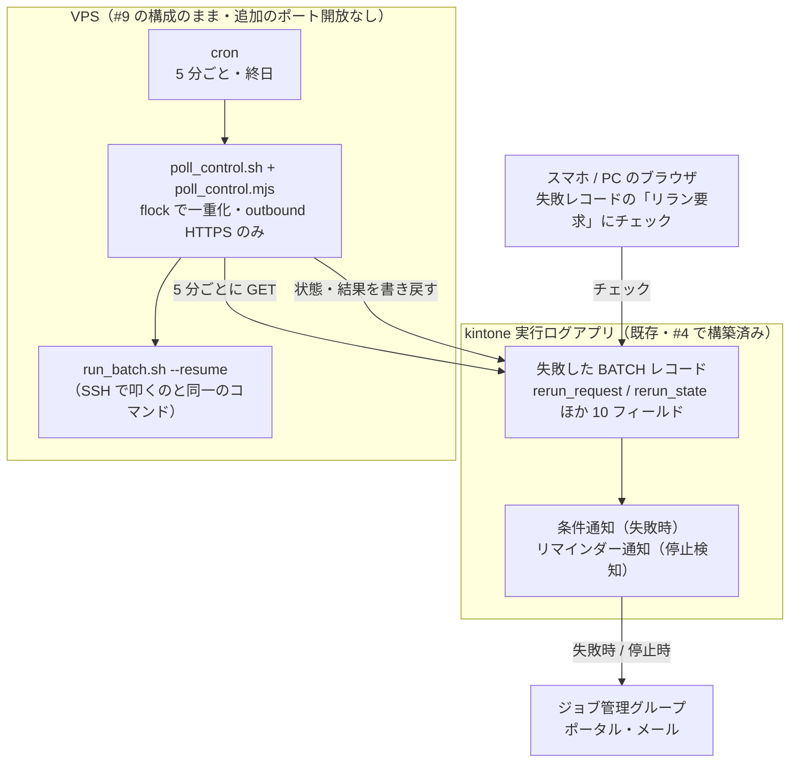

<!--
title: 【kSQL Flow #10】スマホのチェック 1 つで VPS のバッチをリランする — 新しいポートを 1 つも開けずに
tags:
  - kintone
  - SQL
  - 運用
  - VPS
  - バッチ処理
-->

> **as-is / no support**: 本ツールは MIT ライセンスで現状有姿のまま公開しており、サポート・動作保証・修正の約束はありません。本番投入は必ず `--dry-run` とステージング検証を経て、自己責任でお願いします。

- GitHub: https://github.com/rex0220/ksql-flow / テンプレート: https://github.com/rex0220/ksql-flow-template
- 前回: [【kSQL Flow #9】月 1,000 円の VPS で kintone バッチを毎朝動かす — cron の遅延は 1 秒だった](https://qiita.com/rex0220/items/dd8ec668b8966e346d48)

[#9](https://qiita.com/rex0220/items/dd8ec668b8966e346d48) で VPS + cron の構成を組んだとき、弱点を 1 つ正直に書きました。

> **障害通知は kintone の条件通知でスマホにも届きますが、届いてから復旧するには SSH 鍵を持った端末が要ります。** 休日や外出先で「通知は見えるが直せない」状況が起こり得ます。

本記事はその回収編です。結論から書くと、**kintone の失敗レコードにあるチェックボックスへ印を 1 つ付けるだけ**で、5 分以内に VPS 側が `--resume`（冪等リラン）を実行し、結果が同じレコードに返ってくるようにしました。SSH 鍵は不要。スマホのブラウザ（kintone アプリ）で完結します。そして**この仕組みのために新しく開けた受信ポートはゼロ**です（#9 の SSH は運用用にそのまま残っています — 増やしていない、が正確な主張です）。

実際に運用して、チェックから復旧完了まで **4 分**でした。仕組みの設計判断・実装の勘所・実機で踏んだ罠 3 つを、実測ごとお見せします。

## 何が問題だったか — 気づけるのに直せない

kSQL Flow の復旧はコマンド 1 つです（[#7](https://qiita.com/rex0220/items/39821af2a79b88de0ed2)）:

```bash
./run_batch.sh --resume   # 失敗したジョブだけを、元の基準時刻(as-of)で再実行
```

問題は**このコマンドをどこから叩くか**です。環境別に並べるとこうなります。

| 環境 | リランの操作 | 出先で押せるか |
| --- | --- | --- |
| [#4](https://qiita.com/rex0220/items/d0a66c133edd42ff91c4) Windows サーバー | サーバーに入って 1 コマンド | 社内網に入れれば |
| [#6](https://qiita.com/rex0220/items/a522f7880a5960f033b3) GitHub Actions | ブラウザで Run workflow | **押せる**（スマホ可） |
| [#9](https://qiita.com/rex0220/items/dd8ec668b8966e346d48) VPS + cron | SSH で 1 コマンド | **SSH 鍵を持つ端末が要る** |

通知はどの構成でもスマホまで届くのに、VPS だけ**気づけるのに直せない**。この非対称を埋めます。

## 選択肢の比較 — なぜ「kintone をポーリング」なのか

検討した選択肢を先に全部並べます。

| 案 | 出先操作 | 書込トークンの露出面 | 追加のポート開放 | 判定 |
| --- | --- | --- | --- | --- |
| GitHub Actions を復旧専用に残す | ブラウザ | **増える**（GitHub Secrets にも書込可トークンを置く） | 不要 | 妥協案 |
| kintone Webhook を VPS で受ける | kintone | 増えない | **要る**（+TLS 証明書の保守） | 見送り |
| スマホに SSH 秘密鍵を入れる | ターミナルアプリ | 鍵の露出面が増える | 不要 | 補助のみ |
| クラウドの管理プレーンから実行 | コンソール | 増えない | 不要 | **該当環境なら最適** |
| **kintone をポーリング（採用）** | **kintone** | **増えない** | **不要** | **本命** |

補足を 3 つ。

- **クラウドなら管理プレーンが答えです。** Cloud Run Jobs は Google Cloud Console から実行でき、EC2 なら Systems Manager Run Command で SSH なしにコマンドを送れます。本記事の仕組みが要るのは **VPS・オンプレ・管理プレーンを使わない VM** です
- **Webhook 受信を見送った理由**は保守工数です。kintone Webhook の公開仕様には受信側で検証できる送信元署名がなく、インバウンド開放・TLS 証明書・DoS 対策という保守項目が [#9 で数えた「決めごと」](https://qiita.com/rex0220/items/dd8ec668b8966e346d48)に丸ごと追加されます。ポーリングは**最大 5 分の遅延**を受け入れるだけで、これを全部回避できます
- **Actions 併用案が妥協なのは**、#9 で利点として書いた「書込可トークンは VPS の `.env` にしか存在しない」が崩れるからです。本記事の仕組みなら、**GitHub に置くのは PR 検証用の閲覧のみトークンだけ**という分離が完全に保てます

## 原則 — 起動手段だけを変え、リランの動作は変えない

設計の背骨は 1 行です。

```
SSH で入って ./run_batch.sh --resume     ┐
                                         ├→ まったく同じ動作
kintone のチェックボックスに印 → ポーラー ┘
```

この連載は一貫して「**スケジューラを変えても運用設計は変わらない**」（#9）と主張してきました。その延長で「**起動手段を変えてもリランの動作は変わらない**」を置きます。ここから自動的に決まることが 3 つあります。

- リランの選抜規則・as-of の引き継ぎ・対象バッチの決まり方は**ランナーのまま**。ポーラーは独自の判断を足さない
- **ランナー本体は無変更**。公開済みのバージョンのまま動く（実際、この仕組みの実装でランナーのコードは 1 行も変わっていません）
- ポーラーの仕事は「**指示を受け取り、決められた 1 コマンドを起動し、結果を書き戻す**」だけ

途中の設計では「指示に対象バッチ ID を持たせ、実行時の直近バッチと違えば止める」という安全装置も検討しましたが、**撤回しました**。同じ「ずれ」は手動リランにも等しく存在し（土曜の失敗を日曜に SSH でリランすれば拾われるのは日曜のバッチ — #7 で文書化済みの仕様）、しかもポーラーの遅延は最大 5 分と**人間の反応時間より短い**。手動より安全な経路に手動より厳しい制約を課すのは倒錯だからです。

## 専用の「指示アプリ」は作らない

最初の設計では、リラン指示を受け付ける専用の kintone アプリ（14 フィールド）を起こすつもりでした。これも**やめました**。

kSQL Flow は実行記録を kintone の**実行ログアプリ**に置いています（[#4](https://qiita.com/rex0220/items/d0a66c133edd42ff91c4) で構築・失敗通知もここから飛ぶ）。よく見ると、専用アプリに置こうとしていたフィールドの大半 — profile・ホスト・実行時刻・失敗内容 — は**ログアプリの失敗レコードに既にある**。専用アプリは「ログアプリが持っている文脈の再現」でしかありませんでした。

そこで**ログアプリに `rerun_` 接頭辞のフィールドを 10 個足すだけ**にしました。

- **失敗の通知が届いたそのレコードの上で要求し、結果も同じレコードに返る** — 導線が 1 本になる
- 人間が profile やホストを選び直さないので、**取り違えが構造的に起きない**
- 新規アプリの構築（フィールド定義・アクセス権・通知設定）が丸ごと消える

1 枚のレコードに「失敗 → 誰がいつ要求 → 結果 → 実行バッチへのリンク」が並びます。

## 入力はチェックボックス、状態はドロップダウン

ここが本記事でいちばん汎用的な知見です。当初は「人間がドロップダウン `rerun_state` を `REQUESTED` にする」設計でした。これを**撤回した理由**:

**kintone のフィールドアクセス権は「そのフィールドを編集できるか」しか制御できず、どの選択肢を選べるかは制御できません。** ドロップダウンを依頼者に編集させると、7 つの値すべてを書けてしまう — 実行していないのに `SUCCESS` を選べば**リランが成功したように見える記録が残ります**。

そこで人間の入力と機械の状態を分けました。

| | フィールド | 編集できるのは |
| --- | --- | --- |
| 入力 | `rerun_request`（チェックボックス・選択肢 `REQUEST` 1 つ） | **依頼者**（ジョブ管理グループ） |
| 状態 | `rerun_state`（ドロップダウン） | **ポーラーのみ**（人間は閲覧） |

チェックボックスは「入っている / いない」の 2 通りしかないため、**誤った値を書く事故が構造的に起きません**。操作もチェック 1 つで、スマホから押しやすい — この仕組みの動機そのものです。

権限設定も 1 点に集約されます。**アプリのレコード編集権は「制限なし」のまま**でよく、全フィールドを Everyone = 閲覧のみにしたうえで、`rerun_request` だけ依頼者グループに編集を許す。「チェックを入れられる人 = リランを起こせる人」という 1 対 1 対応になり、アプリ権限との二重管理が消えます（運用ルールは 1 行だけ: **今後フィールドを足すときは閲覧のみの行もセットで足す**）。

なおログの他のフィールドを閲覧のみに固めるのは見栄えの問題ではありません。`status` を人間が書き換えれば **`--resume` の選抜そのものが狂い**、`job_key` は分散ロックの実体です。ログは「ランナーが書いた事実」であり、人間が編集してよい欄は本来 1 つもない — チェックボックスはその唯一の例外として設計した入力口です。

## しくみの全体像



VPS からの outbound HTTPS だけで完結します。#9 で組んだ ufw・fail2ban・SSH の設定には**一切手を触れていません**。

## チェックの不変条件 — 状態機械を 1 行に畳む

ポーラーの状態管理は、不変条件 1 つに集約しました。

> **チェックが入っている = まだ終端に至っていない要求。** ポーラーは終端にするとき必ずチェックを外す。

`rerun_state` の値は既存の `status`（`SUCCESS` / `FAILED` …）と同じ大文字 ASCII で揃えています: `REQUESTED` / `CLAIMED` / `SUCCESS` / `FAILED` / `UNKNOWN` / `EXPIRED` / `CANCELED`。

| Exit Code | 結果 | チェック |
| --- | --- | --- |
| 0 | `SUCCESS` | **外す** |
| 1〜4 | `FAILED`（固定文言で理由を返す） | **外す** |
| **5（別のバッチが実行中）** | `REQUESTED` に戻す | **残す** — 次のポーリングでまた試す |
| 期限切れ・誤操作 | `EXPIRED` / `CANCELED` | **外す** |

この不変条件のおかげで:

- **候補クエリが「チェックが入っている」1 条件**で済む（実行中も stale も同じ 1 回の GET に含まれる）
- **再要求はチェックを入れ直すだけ**。終端値のままチェックが入っていれば、ポーラーは前回結果をクリアして新規要求として扱う
- Exit 5（通常バッチと分散ロックが衝突）は**失敗ではなく「待つ」** として自然に表現できる — 通常バッチが終われば次の 5 分で自動的に再試行される

## ポーラー自身の死をどう検知するか — リマインダー通知

この仕組みの弱点は明確で、**ポーラーが止まっていれば何も起きない**ことです。[#4 から続く「起動しなかった事故は検知できない」](https://qiita.com/rex0220/items/d0a66c133edd42ff91c4)と同型の問題ですが、今回は kintone 側だけで検知を組めました。

最初に条件通知（レコードの条件通知）で作ろうとして失敗しています。条件通知は**条件を満たした瞬間に発報する**ので、チェックを入れるたびに「ポーラー停止の可能性」が飛ぶ — 正常時に毎回誤報する監視は、[#7 で書いたとおり](https://qiita.com/rex0220/items/39821af2a79b88de0ed2)通知が無視されるようになって死にます。

答えは **リマインダーの条件通知**でした。公式仕様（[通知の種類](https://jp.kintone.help/k/ja/notifications/usage/notification_type)）はこうです:

> 10分間隔で条件に合致するレコードをチェックしてリマインダー通知を送信します。送信者は常にAdministratorとなります。

つまり**発報時点で条件を再評価する**。これを使って:

- タイミング: **`更新日時` の 1 時間後**
- 条件: `rerun_request` に REQUEST を含む **かつ** `rerun_state` が**未選択**

ポーラーが正常なら 5 分以内に `CLAIMED` へ進むため、1 時間後の再評価では条件を満たさず**発報しません**。死んでいれば未選択のままなので届く。実測でも、正常時は無音・停止状態を作ったときだけ 1 通届くことを確認しました（10 分間隔の巡回なので着信は最大 +10 分ずれます）。

条件を「未選択」に絞るのがポイントです。Exit 5 で待機中の `REQUESTED` まで含めると、通常バッチが 1 時間を超えて走っているだけで誤報します。**発報は 1 回きり**（基準の更新日時が変わらない限り再送しない）なので鳴り続けもしません — 見逃しても要求はチェックが入ったまま残るため、ポーラーを復旧させればそのまま処理されます。

## 実装の勘所 — 「厳密にしない」ことを厳密にやる

ポーラー本体は Node.js 約 500 行 + 17 行の flock ランチャーで、npm 依存はゼロです（Node 22 の標準 API のみ）。設計上の要点は「**何を保証しないか**」にあります。

**exactly-once は保証しない。そして at-least-once も、無理には保証しない。** 場所によって受け入れるものを分けています。

- **重複実行は受け入れる。** リランは冪等（[#7](https://qiita.com/rex0220/items/39821af2a79b88de0ed2)）で、同じ指示が 2 回実行されても最終状態は同じ。万一の同時実行もランナーの分散ロックが Exit 5 で止めます。だから再試行系（Exit 5 の差し戻し・claim の競合負け）は雑に何度でも回してよい
- **不確定状態では自動化を止める。** 確保（`CLAIMED`）の後にポーラーが死ぬと、「コマンドを実行する前だったのか、実行した後だったのか」を外部から判定できません。この不確定区間だけは自動再実行せず、確保期限切れの後に `UNKNOWN` + チェック解除へ倒して、**再要求の判断を人間に返します**（ログアプリを見れば、その後に実行バッチが生まれているかどうかで実行済みか判別できます）

つまり保証の設計は「**冪等性が守ってくれる場所では重複を受け入れ、冪等性でも判断できない不確定区間では自動化を止めて人間に委ねる**」という 2 段構えです。重い状態機械が要らないのはこの割り切りのおかげで、**下の層（冪等リラン + 分散ロック）が強いほど、上の層は単純にできる**。この仕組みが VPS 側スクリプト 1 本で済んだ理由です。

その上で、次だけは厳密にやります。

- **すべての更新に revision 条件（楽観ロック）**。候補 GET の revision で claim し、claim 応答の revision で結果を書く。競合したら再 GET して条件を確認し、**1 回だけ**再適用。無条件 PUT・無制限リトライ・子プロセスの再起動はしない
- **レコードの値をコマンドに使わない**。起動するのは設定ファイルに固定した絶対パスの `run_batch.sh --resume` だけで、`spawn(command, args, {shell: false})` の argv 配列起動。`sh -c` も文字列連結も使わない — これを破ると、kintone のチェックボックスがサーバーの任意コマンド実行になります
- **子プロセスの stdout を kintone に書かない**。書き戻すのは Exit Code ごとの固定文言だけ。ランナーのログにはマスキング（[仕様 §8.4](https://github.com/rex0220/ksql-flow/blob/main/docs/ksql_flow_spec.md)）がありますが、生の stdout を転記するとそれを迂回する漏洩経路になります
- **cron は前回の終了を待たない**ので、ポーラー自身は `flock` で一重化

API 消費は、待機ポーリングが 5 分間隔 × 24 時間 = **288 回/日**。日次上限（スタンダードコース 10,000 回/アプリ）の約 3% で、リラン 1 回あたりの変動費は 3〜4 回です。しかも載るのはログアプリの枠だけで、**業務アプリの枠は待機中まったく消費しません**。

## 実機で踏んだ罠 3 つ

例によって、机上の設計は実機に 3 回殴られました。

### 罠① kintone の DATETIME は分単位に切り捨てられる

リラン結果には「resume が発行した新しいバッチの ID」を記録します。照合条件は「claim した時刻より後に始まった BATCH レコード」— 素直に書くとこうです:

```
started_at > "2026-08-27T12:37:45Z"   ← claim 時刻（秒付き）
```

これが**ほぼ毎回空振りします**。kintone の DATETIME フィールドは**秒指定が無視され、分単位で保存されます**（[REST API 共通仕様](https://cybozu.dev/ja/kintone/docs/rest-api/overview/kintone-rest-api-overview/)に明記）。claim と同じ分に始まった resume の `started_at` は `12:37:00Z` になり、「12:37:45 より後」を満たせません。基準時刻を分頭に floor して `>=` で比較する形に直しました。ローカルテストのモックは形式まで再現しないので、**実機ドリルで初めて出る**類のバグです（公式フォーマットは秒まで — `Date#toISOString()` のミリ秒付き文字列をそのまま渡さない点にも注意）。

### 罠② API トークンは Administrator 相当 — 「誰が要求したか」が消える

kintone の **API トークンはフィールドアクセス権の対象外**で、操作の `更新者` は Administrator になります。つまりポーラーが結果を書き戻した瞬間、「人間がチェックを入れた」という `更新者` の記録は**上書きされて消えます**。

対策として、ポーラーは**最初にレコードを確保する時点**（自分がまだ何も書いていない、人間の操作が `更新者` に残っている唯一のタイミング）で、`更新日時` と `更新者` を専用フィールド `rerun_requested_at` / `rerun_requested_by` へ退避します。この 2 つが恒久的な証跡で、リラン要求の有効期限（既定 6 時間）の基準にもこの退避値を使います — `更新日時` を直接基準にすると、Exit 5 で差し戻すたびにポーラー自身の書込で期限が延び続けるからです。

実運用の初回リランでは、`rerun_requested_by = rex0220` と実ユーザーのコードがきちんと残りました。

### 罠③ 人間は「ジョブ名の見える行」をクリックする

これは**運用初日に人間の質問から見つかった**穴で、14 本の実機ドリルでは出ませんでした。

ログアプリには実行 1 回の親レコード（BATCH）と、中のジョブごとの子レコード（JOB）があります。チェックを入れるべきは BATCH。ところが一覧で目に入るのは**ジョブ名が書いてある JOB 行**のほうです。当初の実装は候補クエリを `record_type = BATCH` で絞っていたため、JOB にチェックを入れると: ポーラーは永遠に拾わない → チェックが残り続ける → **1 時間後にリマインダーが「ポーラー停止」と誤報**。

修正は「クエリで絞らず、取得してから判定して**理由つきで取り消す**」。JOB へのチェックは次のポーリングで `CANCELED` になり、「対象がバッチレコードではないため取り消しました。レコード種別 BATCH（親レコード）にチェックしてください。」が返ります。間違えても 5 分で教えてくれる — **誤操作をクエリで黙って落とすと、滞留と誤報に化ける**。成功済みバッチへの誤チェックも同じ方式で理由を返します。

## 実測 — チェックから 4 分で復旧

実運用の初回、実際の流れです（時刻は実測）:

| 時刻 | 出来事 |
| --- | --- |
| 23:41 | スマホ相当の操作で失敗レコードの「リラン要求」にチェック |
| 23:45:01 | 次の cron 発火。ポーラーが確保（`CLAIMED`・要求者 `rex0220` を退避） |
| 23:45:03〜 | `run_batch.sh --resume` 実行 — 元セッションの as-of を引き継ぎ、失敗ジョブのみ再実行 |
| 23:45 台 | `SUCCESS`・チェック自動解除・実行バッチ ID 記録。**所要 約 4 分（うち待ちが大半・実行は数秒）** |

検証は、ローカルテスト 55 本（HTTP モックで状態機械を網羅）と、**VPS 実機ドリル 14 本**で行いました。全 Exit 経路（0/2/3/5）・有効期限切れ・2 プロセス同時起動の claim 競合（確保は必ず 1 回だけ）・結果書込の revision 競合（sleep を仕込んで決定的に再現 → 再取得 + 1 回再適用の成功）・ポーラーを kill した後の stale 回収（自動再実行しないこと）・リマインダーの実発報まで、実 kintone に対して確認しています。Exit 3 のドリルでは、トークンや API エラー本文がレコード側に一切漏れないことも確認しました。

## コストと決めごと — 何が増えて何が減るか

[#9 の流儀](https://qiita.com/rex0220/items/dd8ec668b8966e346d48)で、増減を正直に数えます。

**増えるもの**

| 項目 | 量 |
| --- | --- |
| ログアプリのフィールド | +10（既存レコード・ランナーの動作に影響なし） |
| フィールドのアクセス権 | 設定一式 + 運用ルール 1 行（新フィールドには閲覧のみの行を足す） |
| リマインダー通知 | 1 本 |
| VPS 側 | スクリプト 1 本 + cron 1 行 + logrotate 対象 1 つ |
| API 消費 | ログアプリの枠に固定 288 回/日（約 3%） |

**減るもの**

- 休日・外出先の **SSH 駆けつけ**（通知 → チェックで完結）
- 復旧用に GitHub Actions を残す場合の**書込可トークンの GitHub 配置** — GitHub は PR 検証の閲覧のみトークンだけになる
- 「復旧手順を覚えている人」への依存 — チェック 1 つなので引き継ぎ資料が 1 行で済む

**壊れ方も先に書いておきます。** kintone のメンテナンス時間帯にポーリングが走っても問題ありません — 候補取得が失敗するだけで、何も書かず何も起動せず、5 分後に再試行します（claim 後にメンテへ入った稀なケースは、確保期限切れの後に `UNKNOWN` + チェック解除へ収束し、明けてから入れ直すだけ）。ポーリングを時間帯で止める設定はあえて入れていません。メンテは不定期・告知制なので、静的に彫り込むと #9 で書いた「手順書が腐る」を設定ファイルで再生産するからです。

## この実装も AI がやった

[#9 の構築](https://qiita.com/rex0220/items/dd8ec668b8966e346d48)と同じ分担です。設計の比較検討・実装・ローカルテスト・VPS への配備・実機ドリル 14 本は AI（Claude Code と Codex の 2 体制）が実施し、人間がやったのは**権限とグループの設定・リマインダーの画面設定・秘密情報の管理・そして最終のチェック操作**でした。境界は連載を通じて同じです — **秘密と権限を「決める・与える」のが人間、与えられた範囲で作って検証するのが AI**。

設計はレビューで 5 回作り直しています。専用の指示アプリ案 → ログアプリ統合、ドロップダウン入力案 → チェックボックス分離、対象バッチ固定案 → 撤回。振り返ると、**削った回数だけ運用が単純になりました**。

## まとめ

- VPS 運用の弱点「通知は届くのに直せない」は、**kintone をリラン指示の入口にする**ことで解消できる — チェック 1 つ → 5 分以内に `--resume` → 結果が同じレコードに返る（実測: 復旧まで 4 分）
- **新しいポートは 1 つも開けない**。VPS からの outbound HTTPS ポーリングのみで、#9 のセキュリティ構成（SSH・ufw・fail2ban）は無変更
- 人間の入力は**チェックボックスに限定**する — kintone のフィールドアクセス権は選択肢まで制限できないため、ドロップダウンを人間に渡すと「実行していないのに SUCCESS」が書けてしまう
- 状態管理は「**チェックあり = 未終端**」の不変条件 1 つ。終端で外す・ロック競合（Exit 5）だけ残して待つ・再要求は入れ直すだけ
- ポーラー停止の検知は**リマインダー通知**（10 分間隔の巡回・発報時再評価・1 回きり）で誤報ゼロに組める。条件通知で作ると毎回誤報する
- 実機の罠: **DATETIME の分切り捨て**・**API トークンは Administrator 相当で証跡が消える**（確保時に退避）・**人間は JOB 行をクリックする**（クエリで黙って落とさず、理由つきで取り消す）
- 保証は下の層に寄せる — 冪等リランが守る場所では**重複実行を受け入れ**、実行前後を判別できない不確定区間だけは**自動化を止めて人間に返す**。この割り切りで、上のキューは楽観ロックだけの単純な作りで足りる
- コードは[テンプレート](https://github.com/rex0220/ksql-flow-template)に同梱（ポーラー本体・設定例・テスト 55 本・導入手順書）。ログアプリの 10 フィールドは [ksql-flow v0.4.1](https://github.com/rex0220/ksql-flow/releases/tag/v0.4.1) 同梱のアプリテンプレートに収録済み。ただし**運用実績はまだ浅い**扱いです — 導入は `--check`（フィールド契約検査）と手動 1 回から

## 連載

1. **#1**: [kintone のバッチ処理を SQL 1 本で書けるランナーの紹介](https://qiita.com/rex0220/items/893ab4016a5aaf595642)
2. **#2**: [AI エージェントに kintone のバッチジョブを書かせる — MCP + Claude Code](https://qiita.com/rex0220/items/3a1213a596a8c49b67aa)
3. **#3**: [毎朝の無人実行の前に — kintone バッチを 200 → 20,000 → 100,000 件で鍛える](https://qiita.com/rex0220/items/62e950ab1ccc5b54ff69)
4. **#4**: [タスクスケジューラで毎朝動かす — PowerShell が 0.1 秒で無言死する罠つき](https://qiita.com/rex0220/items/d0a66c133edd42ff91c4)
5. **#5**: [kintone バッチの API 消費を 4 割減らすまで — 「束ねれば速い」が実測で覆った話](https://qiita.com/rex0220/items/9cbc1e0e9b5ab292e6a1)
6. **#6**: [GitHub Actions で kintone バッチをサーバーレス運用 — PR を開くと「書込差分」が自動で貼られる](https://qiita.com/rex0220/items/a522f7880a5960f033b3)
7. **#7**: [kintone バッチが失敗した朝にやること — Exit Code・部分適用・再実行しても壊れない設計](https://qiita.com/rex0220/items/39821af2a79b88de0ed2)
8. **#8**: [バッチの失敗は 4 種類ある — 自動リラン・AI 診断・人間の判断の切り分け](https://qiita.com/rex0220/items/30cac8d8b52ec8ac782a)
9. **#9**: [月 1,000 円の VPS で kintone バッチを毎朝動かす — cron の遅延は 1 秒だった](https://qiita.com/rex0220/items/dd8ec668b8966e346d48)
10. **#10（本記事）**: スマホのチェック 1 つで VPS のバッチをリランする
11. 以降、Google Cloud（Cloud Run Jobs）と、設計深掘りの続き（分散ロックの内部・全文検索索引の書込ラグ実測）を予定
