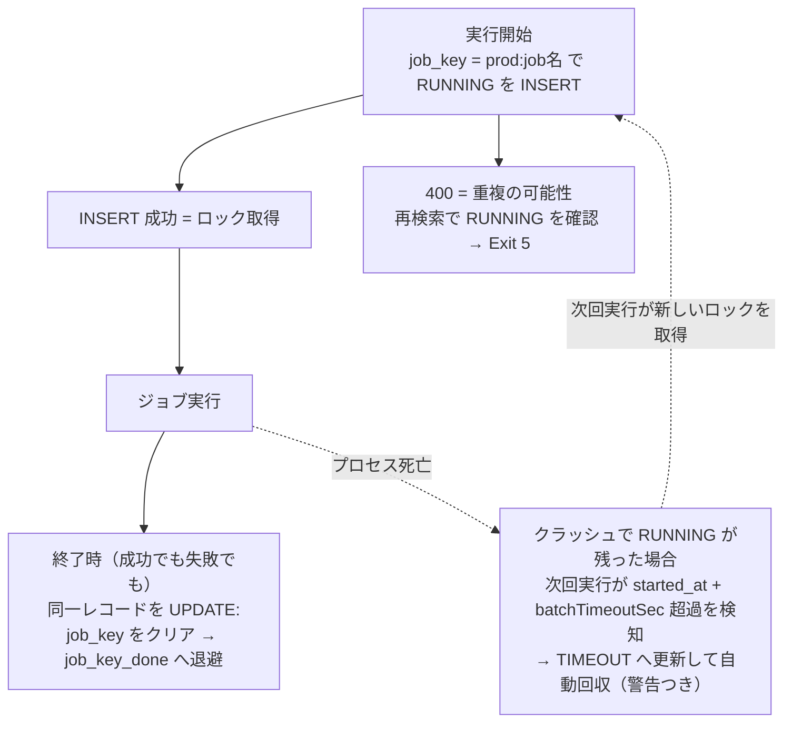

<!--
title: 【kSQL Flow #11】kintone がロックサーバーになる — 重複禁止フィールドで作る分散ロックと、検索索引ラグの実測
tags:
  - kintone
  - SQL
  - バッチ処理
  - 排他制御
  - 運用
-->

> **as-is / no support**: 本ツールは MIT ライセンスで現状有姿のまま公開しており、サポート・動作保証・修正の約束はありません。本番投入は必ず `--dry-run` とステージング検証を経て、自己責任でお願いします。

- GitHub: https://github.com/rex0220/ksql-flow （[公開仕様書 §5.5](https://github.com/rex0220/ksql-flow/blob/main/docs/ksql_flow_spec.md)）
- 前回: [【kSQL Flow #10】スマホのチェック 1 つで VPS のバッチをリランする — 新しいポートを 1 つも開けずに](https://qiita.com/rex0220/items/b841921afe86083f14a0)

この連載には **Exit 5（多重起動検知）** が何度も登場してきました。[#7](https://qiita.com/rex0220/items/39821af2a79b88de0ed2) では失敗分類の 1 つとして、[#10](https://qiita.com/rex0220/items/b841921afe86083f14a0) ではポーラーと通常バッチの衝突を安全に「待ち」へ変える仕組みとして。その土台が**分散ロック**です。

今回はその内部を開けます。結論から書くと、kSQL Flow の分散ロックは **DB もロックサービス（Redis 等）も使いません**。ロックサーバーは **kintone アプリそのもの** — 正確には、実行ログアプリの**重複禁止フィールドへの INSERT** です。

「そんなもので本当に競合に耐えるのか」を、連載で積んだ実測（強制切断・後発衝突・stale 回収）で答えます — **測れていない範囲も含めて正直に**。後半では、この設計の裏で見つかった **kintone 全文検索の索引反映ラグ**の実測（エンジン開発側の観測記録・引用許諾済み）も紹介します — 「ロックの照合に `like` を使ってはいけない」の実データです。

## なぜロックが要るのか — 多重起動はバッチの典型事故

バッチ運用の典型的な事故の 1 つが、派手な障害ではなく**多重起動**です。

- 前回分がハングしたまま、翌日の定期実行が重なる
- 手動リランと定期実行がぶつかる
- CI やテスト実行が本番スケジュールと重なる

しかも連載を通じて、起動経路は増え続けました。いまや同じ `run_batch.sh` を **cron・SSH 手動・GitHub Actions・そして #10 のポーラー**の 4 経路が叩き得ます。経路を増やしても安全でいられたのは、**どの経路で起動しても同じロックの傘の下に入る**からです。

kintone には、今回の排他にそのまま使える行ロックやロック API はありません（トランザクションの範囲と限界は [#7](https://qiita.com/rex0220/items/39821af2a79b88de0ed2) で扱いました）。では何を使うか。

## 鍵は「重複禁止フィールドへの INSERT」

kintone のフィールド設定には「**値の重複を禁止する**」があります。重複する値を書き込もうとすると、API は **400 エラー**を返します。この検査は kintone 側で行われるため、同じ `job_key` を持つレコードを複数成立させることはできません。

kSQL Flow はこれを **create-if-absent（無ければ作る）相当の排他プリミティブ**として利用しています。公式に明記されているのは「複数レコードに同じ値を登録できない」ことまでで、**並行時の振る舞いが CAS として保証されているわけではありません**。実測で確認できているのは**既存ロックへの後発衝突が確実に弾かれる**ことまでで、バリア同期した同時 INSERT の競合は未実測です（後述）。これがロックの正体です。

kSQL Flow は実行開始時、ログアプリへ `status = RUNNING` のレコードを**先行 INSERT** します。このとき重複禁止フィールド `job_key` に入れる値が:

```
ジョブレコード:   {profile}:{ジョブ名}     例) prod:monthly_deal_summary
バッチレコード:   {profile}:__batch__      例) prod:__batch__
```

- INSERT が通れば**ロック取得** — そのまま実行に進む
- 400 が返れば**重複の可能性** — `job_key` を再検索し、RUNNING レコードが確認できた場合だけ Exit 5（`LOCKED`）で終了

ポイントは **`job_key` に日付を含めない**ことです。「同一プロファイル・同一ジョブは常時 1 実行だけ」という排他の意味論を、キーの設計そのもので表現しています。実行記録とロックが**同じレコード**なので、ロック専用のアプリもテーブルも要りません — [#4](https://qiita.com/rex0220/items/d0a66c133edd42ff91c4) で作ったログアプリが、実行履歴・resume の正・**ロックサーバー**の三役を兼ねます。

なお、この設計には**入力側の前提**があります。ジョブ名に `__batch__`（バッチロックの予約語）や `:` は使えず、キー全体は **64 文字以内**です — 重複禁止フィールドの上限で、実測では 65 文字で拒否されました（このとき確認できたのは、**kintone の文字数の数え方が UTF-16 コード単位 = JavaScript の `.length` と一致する**こと。サロゲートペアの絵文字は 1 文字で 2 とカウントされます）。[v0.5.0](https://github.com/rex0220/ksql-flow/releases/tag/v0.5.0) からはこれらを起動前に検査して Exit 1 で止めます — 以前は `__batch__` と名付けると**毎回ロック競合に見える**という、誤解を招く壊れ方をしていました。

## 二層構造 — ローカルロックと分散ロック

実際には、分散ロックの手前にもう 1 枚あります。

| 層 | 実体 | 守備範囲 | stale 判定 |
| --- | --- | --- | --- |
| ローカルロック | `.ksql/lock-<profile>.json`（作業ディレクトリ直下・Git 管理外。`O_EXCL` で作成・PID/ホスト/開始時刻を記録） | **同一マシン内**の多重起動 | プロセス生存確認 + タイムアウト |
| 分散ロック | ログアプリの `job_key`（重複禁止）への INSERT | **マシンをまたぐ**多重起動 | `started_at` + `batchTimeoutSec` 超過 |

ローカルロックは API を 1 回も呼ばずに同一マシンの衝突を落とせる高速な門番で、プロセスの生存確認ができるぶん stale 判定が正確です。ただし**生存確認は同一ホスト内でしか効きません** — 別マシンのプロセスが生きているかはファイルからは分からない。だからマシンをまたぐ判定は分散ロック側の時間ベース規則（後述）に委ねます。役割が違うので、二層は冗長ではありません。

### このロックは「リース」— 保証範囲を先に正直に

正確に言うと、これは無条件の相互排他ではなく**リース（時限付き占有）** です。`batchTimeoutSec` の超過は**死亡確認ではない** — 長い GC・VM のサスペンド・ネットワーク分断では、**生きている保持者が stale と判定・回収され、復帰後に書き戻す窓**が残ります。この窓では新旧 2 つの実行が**異なる as-of** で同一キーに書くため、業務データの古戻りや複数文の混在があり得ます。

面白いのは、**この窓が「別の起動元からの回収」でしか開かない**ことです。ローカルロックは同一ホストで PID が生きている限り、経過時間に関係なく奪いません — つまり**単一 VPS だけで運用しているなら、生きているプロセスからロックを奪う経路が構造的に存在しない**（次回実行は Exit 5 で静かにスキップし続けるだけ）。窓が現実になるのは、Actions や別サーバーなど**複数の起動元**を併用したときです。一見不便な「生存中は回収しない」というローカルロックの仕様が、実は窓への防壁になっています。

だから保証はこう限定されます: **タイムアウト内に完了する実行について、同一キーの実行は同時に 1 つ**。窓の残余リスクは、ジョブを「全量再計算・キー付き UPSERT・冪等」に寄せる設計（[#7](https://qiita.com/rex0220/items/39821af2a79b88de0ed2)）と、**復旧手順の明確化**で管理します — TIMEOUT を見たら「リランすれば直る」ではなく、**スケジュールを止め、旧プロセスの停止を確認してから**リラン・バックフィル・突合で復旧します（手順の全文は[公開仕様書 §5.5](https://github.com/rex0220/ksql-flow/blob/main/docs/ksql_flow_spec.md)）。機構で窓を消しにいくより、単純なリースを保ちリカバリーを明確にする — 検討の末この設計に落としました。

## ライフサイクル — 「ロックの解放」を UPDATE で表現する

重複禁止フィールドをロックに使うとき、いちばん設計が要るのは**解放**です。素朴にやると、翌日の実行が前日のレコードと重複制約でぶつかります。

kSQL Flow の規則はこうです:



- **`job_key` は `RUNNING` の間だけ値を持ちます。** 終了時（`SUCCESS` でも `FAILED` でも）に同一レコードの UPDATE で値をクリアし、**`job_key_done`（重複禁止なしの通常フィールド）へ退避**します。実機では、**重複禁止を設定した `job_key` でも空値（文字列 1 行フィールドに `""` を PUT した状態）は複数レコードで保持できる**ことを確認しています。クリアすれば翌日の INSERT は通り — 前回が失敗で終わっていても、リランや翌日の定期実行が重複制約を踏むことはありません
- **クラッシュで `RUNNING` が残ったら**（= stale ロック）、次回の実行が `started_at + batchTimeoutSec` の超過を検知して**警告つきで自動回収**します（status を `TIMEOUT` に更新 — FAILED 系なので[条件通知](https://qiita.com/rex0220/items/d0a66c133edd42ff91c4)も飛びます）。人手の解除は `ksql-flow unlock` — 同一プロファイルの**全 RUNNING レコード**を対象に、jobKey・開始時刻の一覧を表示してから `job_key` をクリア（`job_key_done` へ退避・status は `TIMEOUT`）します。解除の事実もログに残ります
- **ロックを確立できないときは fail-closed。** 開始時にログアプリへ到達できなければ、実行せず Exit 3 で止まります。実行**中**のログ書込失敗はローカル JSONL への退避で救済しますが、**開始時のロック確立には適用しません** — ここを混同すると排他保証が静かに消えるため、経路を分けています

もう 1 つ、実装の細部に競合の教科書があります。INSERT が 400 で失敗したとき、即座に Exit 5 にはしません。**再度 `job_key` を検索して RUNNING レコードの存在を確認できた場合だけ** `LOCKED` と判定します（400 には重複以外の原因もあり得るため）。確認自体に失敗したら fail-closed です。

## 競合の実測 — 本当に 1 つしか通らないのか

「同じ値は 1 件しか成立しない」までは公式仕様ですが、**並行して INSERT が殺到したときの振る舞いは公式には書かれていません**。だから連載の流儀どおり実測で確かめます。3 つの実験を重ねてきました。

**① 書込チャンクの途中で強制切断（[#3](https://qiita.com/rex0220/items/62e950ab1ccc5b54ff69)）** — 数万件の書込中にプロセスを kill。`RUNNING` が残る → 次回実行が stale を検知して自動回収 → 同一 as-of のリランで突合一致まで収束。**ロックの回収と冪等リランの合わせ技**が復旧の正であることをここで確認しました。

**② stale 回収と依存の伝播（[#7 の障害ドリル](https://qiita.com/rex0220/items/39821af2a79b88de0ed2)）** — 回収時に status が `TIMEOUT` になり通知が飛ぶこと、`batchTimeoutSec` 内の高頻度実行では Exit 5 が安全側のスキップとして働くことを実機で確認。

**③ 競合の実測（[#10 の実機ドリル](https://qiita.com/rex0220/items/b841921afe86083f14a0)）** — 通常バッチの実行中にリランを起動すると、後発は必ず Exit 5 で弾かれました（**既存ロックへの後発衝突**の実測。ポーラー経路は要求を保持して次回再試行 = 実質「待ち」、単発実行は「スキップ・次回起動で再試行」）。なお #10 で行った 2 プロセス同時のポーラー実験は **revision 条件付き PUT の競合**（楽観ロック側）の実測であって、`job_key` の**バリア同期した同時 INSERT の競合は未実測**です — ここは正直に書いておきます。重複禁止フィールドは公式に CAS として保証された API ではないので、「同時に殺到しても必ず 1 件」は現時点で観測にも仕様にも支えられていません。

## 検索索引ラグ — ロックの照合に `like` を使ってはいけない

ここからが後半の主題です。ロックの検索（`job_key` の照合）は**完全一致（`=` / `IN`）** で行っています。当たり前に見えますが、そうしなければならない**実測上の理由**があります。

kSQL エンジン（[kintone-sql-tools](https://github.com/rex0220/kintone-sql-tools)）の開発側で、**書込直後の全文検索（`like`）が不安定になる**現象が観測・記録されました（内部管理番号 B175）。以下はその実測の引用です（許諾済み）。

**測定条件を先に明記します**: 開発環境の 1 ドメイン・検証用に新規作成した 3 フィールドの軽量アプリ・1〜2 件の書込直後に検索・2026-08-25 の 1 日の観測・各 8 回試行。**本番規模・高負荷環境での再現性は測っていません。**

| 書込直後に引いたもの | 取りこぼし |
| --- | --- |
| `like`（新規レコードの値） | **8 回中 6 回** |
| `like`（更新後の新しい値） | **8 回中 6 回** |
| `like`（更新前の**古い**値） | **8 回中 4 回でヒットしてしまう** |
| `like`（対象でないフィールドを更新した直後） | 0 回 |
| `like`（`DELETE` 済みレコード） | 0 回（即時に消える） |
| **`=` / `IN` / `$id`** | **0 回（即時に一致）** |

要点は 3 つです。

1. **ラグは全文検索索引に固有**で、レコード本体の可視性は遅れない — `=` / `IN` / `$id` は書込直後でも即時に一致する
2. 取りこぼすだけでなく、**更新前の古い値に当たる**ことがある
3. 索引に載る内容が変わったときだけ起きる（対象外フィールドの更新や `DELETE` では観測されず）

数秒待つと安定することが観測されていますが、**これは観測であって上限ではありません**。「N 秒待てばよい」という待機時間を実装しないでください。また、この索引の非同期反映は **kintone の公式ドキュメントに記載がありません** — サイボウズ社が仕様として保証しているものではなく、将来同期化される可能性もある「**観測された挙動**」です。

ロック設計への含意は明確です。「いま RUNNING のレコードがあるか」を `like` で照合していたら — **今回の測定条件では、8 回中 6 回すり抜けました**。排他が確率的に破れるということです。ロック・排他・直後リードの照合は、必ず完全一致（`=` / `IN`）か `$id` で行う。kSQL Flow のロック照合が最初から `=` だったのは幸運もありますが、以後は規約になりました。

おまけとして、一致規則も観測されています（索引が落ち着いた状態で）: 全文検索の一致は**語単位**で、空白と**ハイフンは語を分割**しますが**アンダースコアは分割しません**。`ABCDEF` に `ABC` は当たりません。`job_key` が `prod:monthly_deal_summary` のようにアンダースコア区切りなのは、この意味でも `like` 照合に不向きです — 語に割れないので部分一致の道具がそもそも効きません。

### 対策は検査より「生成規約」

この問題への kSQL Flow 側の対応は、ランナーの検査でもエンジンの警告でもなく、**ジョブを書くときの規約**でした（当初はジョブ内 1 行 — 後の設計レビューでジョブ間・更新系の穴が指摘され、現在は 2 行です）。

> - **更新系（UPDATE / DELETE）の WHERE に KLIKE を書かない** — 古い値へのヒット（8 回中 4 回）は「もう条件を満たさない行を更新・削除する」方向の誤りで、読み取りの取りこぼしと違いデータ破壊になる。対象行は `$id IN (...)` か完全一致で選ぶ
> - **書込があるアプリを、同一バッチ実行内で KLIKE で読まない** — 「書込は最後」はジョブ内の順序規約で、ジョブ間・バッチ全体は縛れていなかった。直後に読む必要があるなら、書込レスポンスの id で `$id IN (...)` を使う

全 SQL 資産を機械検索して該当ゼロを確認したうえで、AI にジョブを書かせる際の規約（[#2](https://qiita.com/rex0220/items/3a1213a596a8c49b67aa) の CLAUDE.md）へ足しただけです。**検査より生成規約のほうが上流で安く効く** — 事後に検出する仕組みを作るより、そもそも生成されない形にするほうが、コードも保守も増えません。

## 排他ロックと楽観ロック — kintone の 2 つの競合制御

まとめとして、連載で使った 2 種類のロックを並べます。どちらも kintone の標準機能だけで成立しています。

| | 排他ロック（本記事） | 楽観ロック（[#10](https://qiita.com/rex0220/items/b841921afe86083f14a0)） |
| --- | --- | --- |
| 目的 | **実行を 1 つに絞る**（多重起動防止） | **更新の競合を検出する**（後勝ち上書き防止） |
| kintone 側の道具 | 重複禁止フィールドへの **INSERT**（同じ値は 1 件しか成立しない） | **revision 条件付き PUT**（版が違えば拒否） |
| 失敗時 | Exit 5 で**何もせず**終了（安全側スキップ） | 再取得して状態を確認、**1 回だけ**再適用 |
| 解放 | 終了時の UPDATE でキーをクリア（`job_key_done` へ退避） | 不要（保持しない） |
| stale | タイムアウト超過を次回実行が自動回収 | — |

kintone には **「重複禁止 INSERT（create-if-absent 相当）」と「revision 付き PUT（楽観的競合検出）」という 2 つの競合制御の道具**があります。バッチ基盤に必要な排他と競合検出は、この 2 つと冪等設計（[#7](https://qiita.com/rex0220/items/39821af2a79b88de0ed2)）の組み合わせで足りる — 連載を通じて Redis も RDB も追加しなかった理由です。

## まとめ

- 多重起動はバッチ運用の典型事故で、起動経路が増えるほど（cron・手動・Actions・ポーラー）ロックの価値が上がる。ただしこのロックは**リース**であり、保証は「タイムアウト内・冪等・as-of 非依存のジョブ」に限る — 窓の残余リスクは復旧手順で管理する
- kintone の**重複禁止フィールドへの INSERT を create-if-absent 相当の排他に使う** — ログアプリがそのままロックサーバーになり、実行履歴・resume の正と三役を兼ねる（並行時の挙動は実測で確認）
- 設計の要は解放側: **`job_key` は RUNNING の間だけ**・終了時に `job_key_done` へ退避（**実機で空値の複数保持を確認済み** — だから翌日の実行が通る）・stale はタイムアウトで次回実行が自動回収・確立できなければ **fail-closed**
- 競合の実測: 強制切断からの回収収束（#3）・stale 回収と通知（#7）・既存ロックへの後発衝突（#10）。**同時 INSERT の競合は未実測**で、重複禁止フィールドは公式に CAS 保証された API ではない
- **書込直後の全文検索（`like`）は不安定** — 8 回中 6 回の取りこぼし・古い値へのヒットが観測された（開発環境・軽量アプリ・1 日の観測。公式仕様ではなく観測された挙動）。**ロックや直後リードの照合は `=` / `IN` / `$id` で**
- 対策は検査より**生成規約**（「書込は最後・書込直後の全文検索を置かない」の 1 行）が上流で安く効く
- kintone の 2 つの競合制御 — **重複禁止 INSERT**（排他）と **revision 付き PUT**（楽観）— で、バッチ基盤の排他・競合検出は外部ミドルウェアなしに組める

## 連載

1. **#1**: [kintone のバッチ処理を SQL 1 本で書けるランナーの紹介](https://qiita.com/rex0220/items/893ab4016a5aaf595642)
2. **#2**: [AI エージェントに kintone のバッチジョブを書かせる — MCP + Claude Code](https://qiita.com/rex0220/items/3a1213a596a8c49b67aa)
3. **#3**: [毎朝の無人実行の前に — kintone バッチを 200 → 20,000 → 100,000 件で鍛える](https://qiita.com/rex0220/items/62e950ab1ccc5b54ff69)
4. **#4**: [タスクスケジューラで毎朝動かす — PowerShell が 0.1 秒で無言死する罠つき](https://qiita.com/rex0220/items/d0a66c133edd42ff91c4)
5. **#5**: [kintone バッチの API 消費を 4 割減らすまで — 「束ねれば速い」が実測で覆った話](https://qiita.com/rex0220/items/9cbc1e0e9b5ab292e6a1)
6. **#6**: [GitHub Actions で kintone バッチをサーバーレス運用 — PR を開くと「書込差分」が自動で貼られる](https://qiita.com/rex0220/items/a522f7880a5960f033b3)
7. **#7**: [kintone バッチが失敗した朝にやること — Exit Code・部分適用・再実行しても壊れない設計](https://qiita.com/rex0220/items/39821af2a79b88de0ed2)
8. **#8**: [バッチの失敗は 4 種類ある — 自動リラン・AI 診断・人間の判断の切り分け](https://qiita.com/rex0220/items/30cac8d8b52ec8ac782a)
9. **#9**: [月 1,000 円の VPS で kintone バッチを毎朝動かす — cron の遅延は 1 秒だった](https://qiita.com/rex0220/items/dd8ec668b8966e346d48)
10. **#10**: [スマホのチェック 1 つで VPS のバッチをリランする — 新しいポートを 1 つも開けずに](https://qiita.com/rex0220/items/b841921afe86083f14a0)
11. **#11（本記事）**: kintone がロックサーバーになる
12. 以降、Google Cloud（Cloud Run Jobs）などを予定
