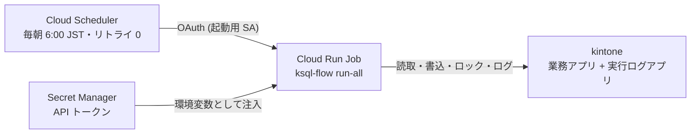

<!--
title: 【kSQL Flow #12】kintone バッチをサーバーレスで毎朝動かす — Cloud Run Jobs の起動遅延は +0.96 秒だった
tags:
  - kintone
  - GoogleCloud
  - CloudRun
  - バッチ処理
  - 運用
-->

> **as-is / no support**: 本ツールは MIT ライセンスで現状有姿のまま公開しており、サポート・動作保証・修正の約束はありません。本番投入は必ず `--dry-run` とステージング検証を経て、自己責任でお願いします。

- GitHub: https://github.com/rex0220/ksql-flow （[Cloud Run Jobs のセットアップ例](https://github.com/rex0220/ksql-flow/tree/main/examples/cloud-run-jobs)）
- 前回: [【kSQL Flow #11】kintone がロックサーバーになる — 重複禁止フィールドで作る分散ロックと、検索索引ラグの実測](https://qiita.com/rex0220/items/44cf9f6d23c264d14dca)

[#9](https://qiita.com/rex0220/items/dd8ec668b8966e346d48) では月 1,000 円の VPS に kintone バッチを載せ、cron の起動遅延が **+1 秒**であることを実測しました。今回は同じバッチを **Google Cloud Run Jobs** に載せ替えます。サーバーの保守（OS パッチ・再起動・死活監視）が消え、課金は実行した分だけ。そして定刻精度はどうなるか — 結論から書くと、Cloud Scheduler の起動遅延は **+0.96 秒**でした。cron と同水準です。

**測定条件を先に明記します**: 東京リージョン（asia-northeast1）の 1 プロジェクト・2026-08-28 の実測・スケジュール発火は 2 回（+0.96 秒 / +0.99 秒）。保証値ではなく観測値です。

## なぜ Cloud Run Jobs か

Cloud Run にはリクエストを待ち受ける「サービス」と、**コンテナを 1 回実行して終了するジョブ**の 2 形態があります。バッチにちょうどいいのは後者です。

- 常駐しない — 実行した秒数だけの課金（アイドル費用ゼロ）
- サーバーがない — #9 で設計した保守運用（unattended-upgrades・再起動月次・死活監視）が**丸ごと不要**になる
- コンテナ 1 個 — ローカルで動くものがそのまま動く

kSQL Flow は**実行環境が使い捨てでも壊れない**よう設計してきました（実行履歴・分散ロック・resume の正はすべて kintone のログアプリ — [#11](https://qiita.com/rex0220/items/44cf9f6d23c264d14dca)）。今回はその設計の最終試験でもあります。

## 構成 — 4 つの部品で完結する



- **イメージ**: `node:22-slim` に `npm i -g @rex0220/ksql-flow@0.6.0` とジョブ SQL・設定を COPY するだけの Dockerfile（[examples](https://github.com/rex0220/ksql-flow/tree/main/examples/cloud-run-jobs) 参照）。ビルドはローカル Docker 不要の Cloud Build で **45 秒**でした
- **認証情報はイメージに焼かない** — Secret Manager に登録し、`--set-secrets` で環境変数として注入。設定ファイルの `env:` 参照（[#1](https://qiita.com/rex0220/items/893ab4016a5aaf595642) から変わらない形）がそのまま生きます
- **サービスアカウントは 2 つに分離** — 実行用（Secret の読取だけ）と起動用（ジョブを蹴る `run.invoker` だけ）。最小権限の基本形です
- **予算アラート** — 消し忘れ保険に月 1,000 円で 50/90/100% 通知を設定（検証規模の実費は数十円/月の**見込み**です — 締め請求はまだなので、ここは実測と言いません）

設定の要点は 3 つだけ:

```bash
gcloud run jobs create ksql-batch \
  --image asia-northeast1-docker.pkg.dev/PROJECT_ID/ksql/ksql-flow-batch:latest \
  --tasks 1 --parallelism 1 --max-retries 0 \
  --task-timeout 4500 \
  --service-account SA_EMAIL \
  --set-secrets "KSQL_TOKEN_...=...:latest"
```

- **`--max-retries 0`** — 失敗の機械的な再実行はしない。Scheduler 側のリトライも 0。復旧は `--resume`（冪等リラン・[#7](https://qiita.com/rex0220/items/39821af2a79b88de0ed2)）に一本化する、#9 と同じ方針です
- **`--task-timeout` はランナーの `batchTimeoutSec` より長く** — 逆にすると、ロックの stale 回収より先にコンテナが打ち切られます
- **`--tasks 1 --parallelism 1`** — 分散実行はしない。多重起動の抑止はログアプリの分散ロック（[#11](https://qiita.com/rex0220/items/44cf9f6d23c264d14dca)）の仕事です

## 実測 1: Scheduler の起動遅延は +0.96 秒

Cloud Scheduler に毎朝の起動を任せて大丈夫か。15:15:00 発火のスケジュールを登録して実測すると、実行の作成時刻は **15:15:00.96** — 遅延 +0.96 秒でした。別のジョブでも +0.99 秒。#9 で実測した VPS cron の +1 秒とちょうど並びます。**「サーバーレスにすると定刻がルーズになる」ことはありませんでした**（今回の観測範囲では）。

処理全体では、コンテナ起動込みで `run-all` 完走まで **35 秒**（うちバッチ本体は数秒・残りはコンテナのプロビジョニング）。毎朝のバッチが「6:00:00 に発火して 6:00:35 に終わる」世界です。分単位の定刻運用には十分でしょう。

## 実測 2: 使い捨てコンテナでも resume が成立する

いちばん確かめたかったのはこれです。Cloud Run のファイルシステムは**実行ごとに消えます**（書込先はインメモリで、メモリ使用量に算入）。ローカルの `.ksql`（ローカルロック・state・JSONL 退避）は毎回まっさらです。

業務エラーでバッチを ABORTED にし（テストデータにマイナス売上を仕込む、[#7](https://qiita.com/rex0220/items/39821af2a79b88de0ed2) と同じドリル）、データ修正後に**新品のコンテナ**から `--resume` でリランしました:

```text
--resume: 失敗バッチの as-of を引き継いだ (2026-08-28T06:31:00.000Z)
[RUN-ALL] ./jobs (profile: prod, as-of: 2026-08-28T06:31:00.000Z, ...)
  => SUCCESS (exit 0)
```

ローカル state が何もないコンテナが、失敗バッチの as-of を正しく引き継いでリランを完走しました。**resume の正がログアプリにある**ことの、これ以上ない実証です。VPS では「同じマシンに state が残っているから動いているのでは」という疑いを完全には消せませんでしたが、使い捨て環境はその疑いごと消してくれます。

なお、実行**中**のログ書込失敗をローカル JSONL へ退避する救済（[#4](https://qiita.com/rex0220/items/d0a66c133edd42ff91c4)）だけは、コンテナ終了とともに失われます。ここは使い捨て環境の受容事項です。

## 実測 3: ロック衝突 — そして「コンソール上は失敗に見える」罠

二重起動の実測もやりました。別の起動元から読取専用ジョブでバッチロックを約 60 秒保持し、その間に Cloud Run 側の定期実行を起動すると:

```text
[RUN-ALL] ./jobs/ (profile: prod, ...)
エラー: ロックキー "prod:__batch__" は実行中です
Container called exit(5).
```

後発は Exit 5 で即座に安全側スキップ — [#11](https://qiita.com/rex0220/items/44cf9f6d23c264d14dca) の分散ロックがそのまま働き、ロック保持側は妨害されず完走、直後の再実行は成功しました。Scheduler の**二重発火は仕様として起こり得ます**（at-least-once 配信）が、この傘の下では二重書込になりません。

ここに運用上の重要な罠があります。**Exit 5（安全なスキップ）も、GCP コンソール上は「失敗した実行」に見えます**（非 0 の Exit Code のため）。コンソールの実行ステータスでアラートを組むと、安全なスキップのたびに誤報が届く。**実行結果の監視はログアプリの status と条件通知を正にする** — [#8](https://qiita.com/rex0220/items/30cac8d8b52ec8ac782a) で「誤アラートは監視を形骸化させる」と書いた原則が、基盤を替えても効いています。

## 実機で踏んだ罠集

全部その場で踏んで確認したものです。

| 罠 | 内容 |
| --- | --- |
| `--service-account` 無指定 | 既定の Compute Engine SA で動いてしまい、Secret に付けた最小権限の設計が使われない。**実質必須** |
| `--args` は CMD 全置換 | ENTRYPOINT なしイメージでは、引数上書きに**バイナリ名から**必要（`--args="ksql-flow,run-all,..."`）。`validate` だけ流す疎通確認にも使う |
| `.gcloudignore` のパターン | パス無しの `run_batch.sh` は **任意階層に一致**し、別ディレクトリの同名ファイルまでビルドコンテキストから消えて COPY が失敗した。ルート限定は `/run_batch.sh` |
| ホスト名の記録 | コンテナ実行では `os.hostname()` が `localhost` になり、実行環境を区別できない。v0.6 で環境変数 `KSQL_HOST_LABEL` を追加し、`gcp:プロジェクトID` のような表示名を記録できるようにした（この経緯は次回） |
| CLI の fail-closed | `validate` に余分な positional を渡すと即 Exit 1。イメージの引数ミスが API 到達前に止まる — 地味に効く |

## VPS とサーバーレス、どう選ぶか

どちらも実測して見えた比較です。**優劣ではなく費用と運用の構造の違い**なので、環境に合わせて選べばよいと思います。

| 観点 | VPS + cron（#9） | Cloud Run Jobs（本記事） |
| --- | --- | --- |
| 定刻精度 | +1 秒（実測） | +0.96〜0.99 秒（実測） |
| 実行開始まで | 即時 | コンテナ起動 20〜30 秒 |
| 保守 | OS パッチ・再起動・死活監視が必要（設計すれば月数分） | 不要 |
| 費用構造 | 固定（月 1,000 円前後） | 従量（実行秒数のみ。少量なら月数十円見込み + 無料枠） |
| 障害調査 | SSH で直接入れる | ログとコンソール経由 |
| 常駐処理 | 得意（cron で柔軟） | スケジュール起動の粒度に依存 |
| 前提スキル | Linux 運用 | コンテナ + クラウド設定 |

kSQL Flow 側の設計（ログアプリが正・冪等リラン・分散ロック）は**どちらでも同じものがそのまま動きます**。実際、この検証中はロックの傘を共有したまま VPS と Cloud Run を行き来しました。基盤を選び直せることそのものが、「状態をアプリ側に寄せる」設計の配当だと感じます。

## まとめ

- Cloud Run Jobs は「コンテナを 1 回実行して終わる」型で kintone バッチにちょうどいい — サーバー保守が消え、課金は実行分だけ
- **Cloud Scheduler の起動遅延は +0.96 秒（実測）** — VPS cron の +1 秒と同水準で、定刻運用に十分
- **使い捨てコンテナでも `--resume` が成立** — 実行履歴・ロック・resume の正をログアプリに置く設計の最終試験に合格
- 二重発火は仕様として起こる前提で、**リトライは両側 0 + 分散ロック + 冪等リラン**で受ける。**Exit 5 はコンソール上「失敗」に見える**ので、監視の正はログアプリに置く
- 罠は具体的に 5 つ（`--service-account` 必須・`--args` 全置換・`.gcloudignore` の任意階層一致・host 記録・fail-closed CLI）— examples に反映済み

次回は、このサーバーレス環境に [#10](https://qiita.com/rex0220/items/b841921afe86083f14a0) の「チェックボックスでリラン指示」を載せ替えた話です。最初の設計はレビューで棄却され、作り直しの過程で**既存の VPS 運用にも潜んでいた設計欠陥**が見つかり、ランナー本体の v0.6 が生まれました。レビュー駆動で設計が変わっていく記録として書きます。

## 連載

1. **#1**: [kintone のバッチ処理を SQL 1 本で書けるランナーの紹介](https://qiita.com/rex0220/items/893ab4016a5aaf595642)
2. **#2**: [AI エージェントに kintone のバッチジョブを書かせる — MCP + Claude Code](https://qiita.com/rex0220/items/3a1213a596a8c49b67aa)
3. **#3**: [毎朝の無人実行の前に — kintone バッチを 200 → 20,000 → 100,000 件で鍛える](https://qiita.com/rex0220/items/62e950ab1ccc5b54ff69)
4. **#4**: [タスクスケジューラで毎朝動かす — PowerShell が 0.1 秒で無言死する罠つき](https://qiita.com/rex0220/items/d0a66c133edd42ff91c4)
5. **#5**: [kintone バッチの API 消費を 4 割減らすまで — 「束ねれば速い」が実測で覆った話](https://qiita.com/rex0220/items/9cbc1e0e9b5ab292e6a1)
6. **#6**: [GitHub Actions で kintone バッチをサーバーレス運用 — PR を開くと「書込差分」が自動で貼られる](https://qiita.com/rex0220/items/a522f7880a5960f033b3)
7. **#7**: [kintone バッチが失敗した朝にやること — Exit Code・部分適用・再実行しても壊れない設計](https://qiita.com/rex0220/items/39821af2a79b88de0ed2)
8. **#8**: [バッチの失敗は 4 種類ある — 自動リラン・AI 診断・人間の判断の切り分け](https://qiita.com/rex0220/items/30cac8d8b52ec8ac782a)
9. **#9**: [月 1,000 円の VPS で kintone バッチを毎朝動かす — cron の遅延は 1 秒だった](https://qiita.com/rex0220/items/dd8ec668b8966e346d48)
10. **#10**: [スマホのチェック 1 つで VPS のバッチをリランする — 新しいポートを 1 つも開けずに](https://qiita.com/rex0220/items/b841921afe86083f14a0)
11. **#11**: [kintone がロックサーバーになる — 重複禁止フィールドで作る分散ロックと、検索索引ラグの実測](https://qiita.com/rex0220/items/44cf9f6d23c264d14dca)
12. **#12（本記事）**: kintone バッチをサーバーレスで毎朝動かす
13. 次回、チェックボックスリランのサーバーレス化と、レビューが生んだ v0.6 の話を予定
