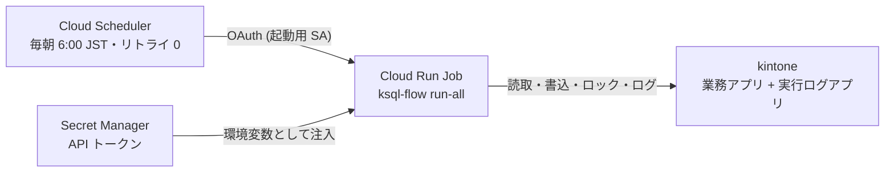
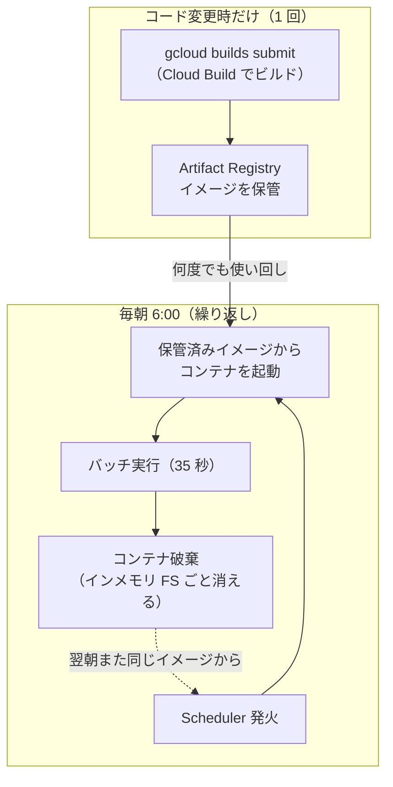

<!--
title: 【kSQL Flow #12】kintone バッチを Cloud Run Jobs へ — 使い捨てコンテナでも resume と分散ロックは動くか
tags:
  - kintone
  - GoogleCloud
  - CloudRun
  - バッチ処理
  - 運用
-->

> **as-is / no support**: 本ツールは MIT ライセンスで現状有姿のまま公開しており、サポート・動作保証・修正の約束はありません。本番投入は必ず `--dry-run` とステージング検証を経て、自己責任でお願いします。

- GitHub: https://github.com/rex0220/ksql-flow （[Cloud Run Jobs のセットアップ例](https://github.com/rex0220/ksql-flow/tree/main/examples/cloud-run-jobs)）
- 前回: [【kSQL Flow #11】kintone がロックサーバーになる — 重複禁止フィールドで作る分散ロックと、検索索引ラグの実測](https://qiita.com/rex0220/items/44cf9f6d23c264d14dca)

[#9](https://qiita.com/rex0220/items/dd8ec668b8966e346d48) では月 1,000 円の VPS に kintone バッチを載せ、cron の起動遅延が **+1 秒**であることを実測しました。今回は同じバッチを **Google Cloud Run Jobs** に載せ替えます。ホスト OS の保守（パッチ・再起動・死活監視）が消え、課金は実行時間ベースの従量制。定刻の面でも、Cloud Scheduler の予定時刻から Cloud Run 実行（Execution）の作成まで**約 +1 秒** — VPS の cron と同等でした。

ただし、この記事の本命はその数字ではありません。**ローカルの状態を毎回すべて捨てる使い捨てコンテナの上でも、これまで作ってきた運用設計 — resume・分散ロック・冪等リラン — が成立するのか**。それを実機で確かめる回です。

**測定条件を先に明記します**: 東京リージョン（asia-northeast1）の 1 プロジェクト・2026-08-28 の実測・スケジュール発火の観測は 2 回（+0.96 秒 / +0.99 秒）。測定点は「スケジュール予定時刻 → Cloud Run 実行（Execution）の作成時刻」で、#9 の cron +1 秒（プロセス開始まで）とは**測定点が異なります**。いずれも保証値ではなく観測値です。

## なぜ Cloud Run Jobs か

Cloud Run にはリクエストを待ち受ける「サービス」と、**コンテナを 1 回実行して終了するジョブ**の 2 形態があります。バッチにちょうどいいのは後者です。

- 常駐しない — 実行した分だけの従量課金（アイドル費用ゼロ。ただし **Cloud Run Jobs の課金時間は 1 実行あたり最低 1 分**）
- サーバーがない — #9 で設計した**ホスト OS の**保守運用（unattended-upgrades・再起動月次・死活監視）が**丸ごと不要**になる。残るのはコンテナのライフサイクル管理（ベースイメージ・依存の更新と再ビルド）だけ
- コンテナ 1 個 — ローカルで動くものがそのまま動く

kSQL Flow は**実行環境が使い捨てでも壊れない**よう設計してきました（実行履歴・分散ロック・resume の正はすべて kintone のログアプリ — [#11](https://qiita.com/rex0220/items/44cf9f6d23c264d14dca)）。今回はその設計の最終試験でもあります。

## 構成 — 4 つの部品で完結する



- **イメージ**: `node:22-slim` に `npm i -g @rex0220/ksql-flow@0.6.0` とジョブ SQL・設定を COPY するだけの Dockerfile（[examples](https://github.com/rex0220/ksql-flow/tree/main/examples/cloud-run-jobs) 参照）。ビルドは次項の Cloud Build で行い、**ローカルに Docker は不要**です
- **認証情報はイメージに焼かない** — Secret Manager に登録し、`--set-secrets` で環境変数として注入。設定ファイルの `env:` 参照（[#1](https://qiita.com/rex0220/items/893ab4016a5aaf595642) から変わらない形）がそのまま生きます
- **サービスアカウントは 2 つに分離** — 実行用（Secret の読取 `roles/secretmanager.secretAccessor` のみ）と起動用（ジョブを蹴る `roles/run.invoker` のみ）。最小権限の基本形です
- **予算アラート** — 消し忘れ保険に月 1,000 円で 50/90/100% 通知を設定（コストの内訳と試算は後述）

### ビルドもサーバーレス — ローカル Docker なしでイメージを作る

コンテナと聞くと「まず手元に Docker Desktop を入れて…」と身構えますが、今回は**一度も Docker を起動していません**。ビルドは Cloud Build に任せます:

```bash
gcloud builds submit \
  --tag asia-northeast1-docker.pkg.dev/PROJECT_ID/ksql/ksql-flow-batch:latest
```

この 1 コマンドの中身は 3 段階です:

1. **ソースのアップロード** — カレントディレクトリ一式を Cloud Storage へ送る。**何を送るかは `.gcloudignore` が決める**ので、`.env` などの秘密は必ず除外しておく（後述の罠集も参照）
2. **リモートビルド** — Google 側のビルドマシンが `Dockerfile` を読んでイメージをビルド
3. **push** — できたイメージを Artifact Registry（コンテナ置き場）へ登録

実測では**初回 45 秒**・2 回目以降は 35〜38 秒。開発機に必要なのは gcloud CLI だけで、Docker のインストール・デーモン起動・OS ごとの差異とは無縁です。CI からも同じコマンドで叩けるので、「手元でビルドしたイメージと CI のイメージが違う」問題も起きません。

### イメージは 1 回作って使い回す — 毎回ビルドされるわけではない

誤解しやすいので明記しておきます。**ビルドが走るのはジョブの中身を変えたときだけ**で、毎朝の定期実行のたびにビルドされるわけではありません。



使い捨てなのは**コンテナ（実行インスタンス）だけ**で、イメージは何度でも使い回されます。毎朝の 35 秒にビルドの 45 秒は含まれません。実行の履歴とログもコンソールに残ります — 消えるのはコンテナ内のローカルファイルだけです（実測 2 で見るとおり）。

逆方向の罠もあります。**ジョブはイメージのダイジェスト（実体）を固定して覚える**ため、`:latest` タグ運用でも、再ビルドしただけでは翌朝の実行に反映されません。「ジョブ SQL を直したのに動きが変わらない」ときの定番原因で、再ビルド後は `gcloud run jobs update --image ...` でジョブ側の参照を更新します。

Docker を使ったことがある人向けに対応関係をまとめると、こうなります。**「build → push → run」という Docker の流れそのものを、全部マネージドに置き換えた**構図です（手元にデーモンがないだけ）:

| 手元の Docker | 今回の GCP 側 |
| --- | --- |
| `docker build` | Cloud Build（`gcloud builds submit`） |
| Docker Hub 等のレジストリへ push | Artifact Registry |
| `docker run` | Cloud Run Jobs の実行（Execution） |

### ジョブを変更したいときの流れ

日々の変更はどう反映するのか。開発の入り口はこれまでの回と何も変わりません。

1. **ローカルで**ジョブ SQL・設定を変更し、`validate` と `--dry-run` で確認（[#1](https://qiita.com/rex0220/items/893ab4016a5aaf595642) からの手順のまま）
2. **Git で PR → レビュー → マージ**（[#6](https://qiita.com/rex0220/items/a522f7880a5960f033b3) の GitHub Actions を入れていれば、PR に書込差分が自動で貼られる）
3. マージ後、**反映の 2 コマンド**: `gcloud builds submit ...`（再ビルド）→ `gcloud run jobs update --image ...`（ジョブの参照更新）
4. 翌朝の定期実行から新しいイメージで動く

今回の検証では 3 を手動で叩きましたが、中身はコマンド 2 つなので、#6 と同じ要領で「main へのマージを起点に CI から自動実行」へ寄せられます。**SQL を書く・確認する・PR する、という日常はローカルのまま** — クラウドに行くのはマージ後の成果物だけです。

設定の要点は 3 つだけ:

```bash
gcloud run jobs create ksql-batch \
  --image asia-northeast1-docker.pkg.dev/PROJECT_ID/ksql/ksql-flow-batch:latest \
  --tasks 1 --parallelism 1 --max-retries 0 \
  --task-timeout 4500 \
  --service-account SA_EMAIL \
  --set-secrets "KSQL_TOKEN_...=...:latest"
```

- **`--max-retries 0`** — 失敗の機械的な再実行はしない。Scheduler 側のリトライも 0。復旧は `--resume`（冪等リラン・[#7](https://qiita.com/rex0220/items/39821af2a79b88de0ed2)）に一本化する、#9 と同じ方針です
- **`--task-timeout`（秒。例の 4500 = 75 分）はランナーの `batchTimeoutSec` より長く** — 逆にすると、ロックの stale 回収より先にコンテナが打ち切られます
- **`--tasks 1 --parallelism 1`** — 分散実行はしない。多重起動の抑止はログアプリの分散ロック（[#11](https://qiita.com/rex0220/items/44cf9f6d23c264d14dca)）の仕事です

## 実測 1: Execution 作成は予定時刻から約 +1 秒

Cloud Scheduler に毎朝の起動を任せて大丈夫か。15:15:00 発火のスケジュールを登録すると、Cloud Run 実行（Execution）の作成時刻は **15:15:00.96** — 今回の 2 回の観測では +0.96 秒 / +0.99 秒、まとめれば**約 +1 秒**でした。#9 の cron の約 +1 秒と並びますが、あちらはプロセス開始までの測定なので、**厳密な同列比較ではない**点は割り引いてください。それでも「サーバーレスにすると定刻の頭出しがルーズになる」兆候は、今回の観測範囲ではありませんでした。

ユーザー処理の開始はここからで、コンテナの準備に 20〜30 秒。全体では `run-all` 完走まで **35 秒**（うちバッチ本体は数秒）でした。毎朝のバッチが「6:00:00 に Execution が立ち、6:00:35 に終わる」世界です。秒を争う用途には向きませんが、分単位の定刻運用には十分でしょう。

## 実測 2: 使い捨てコンテナでも resume が成立する

**ここが今回の本命の検証です。** Cloud Run のファイルシステムは**実行ごとに消えます**（書込先はインメモリで、メモリ使用量に算入）。ローカルの `.ksql`（ローカルロック・state・JSONL 退避）は毎回まっさらです。

業務エラーでバッチを ABORTED にし（テストデータにマイナス売上を仕込む、[#7](https://qiita.com/rex0220/items/39821af2a79b88de0ed2) と同じドリル）、データ修正後に**新品のコンテナ**から `--resume` でリランしました:

```text
--resume: 失敗バッチの as-of を引き継いだ (2026-08-28T06:31:00.000Z)
[RUN-ALL] ./jobs (profile: prod, as-of: 2026-08-28T06:31:00.000Z, ...)
  => SUCCESS (exit 0)
```

ローカル state が何もないコンテナが、失敗バッチの as-of を正しく引き継いでリランを完走しました。**resume の正がログアプリにある**ことの、これ以上ない実証です。VPS では「同じマシンに state が残っているから動いているのでは」という疑いを完全には消せませんでしたが、使い捨て環境はその疑いごと消してくれます。

なお、実行**中**のログ書込失敗をローカル JSONL へ退避する救済（[#4](https://qiita.com/rex0220/items/d0a66c133edd42ff91c4)）だけは、コンテナ終了とともに失われます。つまり Cloud Run Jobs では JSONL は「実行中だけの一時退避」であり、**実行終了後の復旧媒体にはできません**。ここは使い捨て環境の受容事項です。

## 実測 3: ロック衝突 — そして「コンソール上は失敗に見える」罠

二重起動の実測もやりました。別の起動元から読取専用ジョブでバッチロックを約 60 秒保持し、その間に Cloud Run 側の定期実行を起動すると:

```text
[RUN-ALL] ./jobs/ (profile: prod, ...)
エラー: ロックキー "prod:__batch__" は実行中です
Container called exit(5).
```

後発は Exit 5 で即座に安全側スキップ — [#11](https://qiita.com/rex0220/items/44cf9f6d23c264d14dca) の分散ロックがそのまま働き、ロック保持側は妨害されず完走、直後の再実行は成功しました。Cloud Scheduler は **at-least-once 配信** — まれな重複起動を前提にすべき仕様です。しかしこの傘の下では、重複起動は二重書込ではなく安全なスキップになります。

ここに運用上の重要な罠があります。**Exit 5（安全なスキップ）も、GCP コンソール上は「失敗した実行」に見えます**（非 0 の Exit Code のため）。コンソールの実行ステータスでアラートを組むと、安全なスキップのたびに誤報が届く。**実行結果の監視はログアプリの status と条件通知を正にする** — [#8](https://qiita.com/rex0220/items/30cac8d8b52ec8ac782a) で「誤アラートは監視を形骸化させる」と書いた原則が、基盤を替えても効いています。

## 実機で踏んだ罠集

全部その場で踏んで確認したものです。

| 罠 | 内容 |
| --- | --- |
| `--service-account` 無指定 | 既定の Compute Engine SA で動いてしまい、Secret に付けた最小権限の設計が使われない。**実質必須** |
| `--args` は CMD 全置換 | `--args` はイメージの **CMD を丸ごと置換**する。今回のイメージは ENTRYPOINT を持たないため、`--args="ksql-flow,run-all,..."` のように**実行バイナリ名から**指定する必要があった。`validate` だけ流す疎通確認にも便利 |
| `.gcloudignore` のパターン | パス無しの `run_batch.sh` は **任意階層に一致**し、別ディレクトリの同名ファイルまでビルドコンテキストから消えて COPY が失敗した。ルート限定は `/run_batch.sh` |
| ホスト名の記録 | コンテナ実行では `os.hostname()` が `localhost` になり、実行環境を区別できない。v0.6 で環境変数 `KSQL_HOST_LABEL` を追加し、`gcp:プロジェクトID` のような表示名を記録できるようにした（この経緯は次回） |
| CLI の fail-closed | `validate` に余分な positional を渡すと即 Exit 1。イメージの引数ミスが API 到達前に止まる — 地味に効く |

## コスト — 毎朝 1 回のバッチなら無料枠にほぼ収まる（試算）

VPS の「月 1,000 円で明朗会計」（[#9](https://qiita.com/rex0220/items/dd8ec668b8966e346d48)）に対して、従量課金は**見通しの立てにくさ**が不安要素です。この構成で課金が発生し得る要素を並べます。無料枠の数字は執筆時点のもので、正確な単価・条件は公式の料金ページで確認してください。

| 要素 | 課金の考え方 | この構成での目安 |
| --- | --- | --- |
| Cloud Run Jobs | 実行中の vCPU・メモリの秒数（**1 実行あたり最低 1 分**） | 毎朝 1 回 × 完走 35 秒 → 課金は 1 分ぶん/日。月間の無料枠（**vCPU 24 万秒・メモリ 45 万 GiB 秒** — Jobs はサービスと無料枠が異なる）に**余裕で収まる規模** |
| Cloud Scheduler | ジョブ（スケジュール定義）の個数 | **請求先アカウントあたり 3 ジョブ/月まで無料**。今回は 1〜2 個 |
| Artifact Registry | イメージの保存容量 | 今回のイメージは数百 MB。無料枠（0.5 GB）に収まるが、**ビルドのたびに旧世代が溜まる**ので世代整理はしておく |
| Cloud Build | ビルド時間 | 1 回 45 秒。日次の無料枠内 |
| Secret Manager | バージョン保持とアクセス回数 | この規模では誤差 |

### スケジュール別の試算 — 従量制は「回数 × 処理時間」で大きく変わる

従量制の月額は、スケジュールの頻度と 1 回の処理時間の掛け算で大きく変動します。前提: 1 vCPU / 1 GiB（今回の構成）・1 実行あたり最低 1 分課金・Cloud Run Jobs の無料枠は 1 vCPU 換算で**月およそ 4,000 分**（vCPU 24 万秒）。

| スケジュール | 月間実行 | 課金時間/月（1 回 = 最低 1 分の場合） | 月額の目安 |
| --- | --- | --- | --- |
| 月次バッチ | 1 回 | 1 分 | 無料枠内（実質 0 円） |
| 日次バッチ（今回の構成） | 30 回 | 30 分 | 無料枠内 |
| 時間毎バッチ | 720 回 | 720 分 | 無料枠内（枠の約 2 割） |
| 3 つ併用（時間毎 + 日次 + 月次） | 751 回 | 751 分 | 無料枠内。Scheduler も 3 ジョブでちょうど無料枠 |
| 時間毎 × 処理 10 分/回 | 720 回 | 7,200 分 | vCPU が**無料枠を超過**（メモリはまだ枠内）— 執筆時点の単価で Cloud Run 本体は**約 $3.5/月**の試算 |

この表から見えることは 2 つあります。

- **最低 1 分課金の世界では、「回数」より「1 回の処理時間」が効く。** 35 秒のバッチなら時間毎に回しても無料枠の 2 割。処理が 10 分に伸びると、同じ時間毎でも一気に枠を超える
- **10 分/回の処理を時間毎に回しても、Cloud Run 本体はまだ VPS の月 1,000 円を下回る試算になった。** 処理時間や頻度がさらに増えるほど固定費との差は縮まっていく — 常時それ以上を回す規模になったら、固定費の読みやすさ（#9）と比べて選び直せばよい

いずれも試算です。本検証はまだ締め請求を迎えていないので、**請求実測ではありません**（初回請求が出たら追記します）。

従量課金と付き合う最初の保険が、構成の章で設定した**予算アラート**（月 1,000 円・50/90/100% 通知）です。金額の最適化より先に「想定外に増えたら気付ける」状態を作っておく — VPS の固定費が持っていた「絶対に超えない安心感」の代替です。

### 止めるという運用 — PAUSED にすれば月額 0 円で待機

従量制にはもう 1 つ、固定費にはない利点があります。**止めやすさ**です。

```bash
gcloud scheduler jobs pause ksql-batch-trigger --location asia-northeast1   # 停止
gcloud scheduler jobs resume ksql-batch-trigger --location asia-northeast1  # 再開
```

Scheduler を pause すれば実行が止まり、**Cloud Run Jobs の課金はゼロ**になります。ジョブ定義・イメージ・シークレットは残りますが、置いておくだけなら課金されない・または無料枠内の規模です（実測: 今回のイメージは 8 世代でも 121 MB — Artifact Registry の無料枠 0.5 GB 内）。再開は resume 1 コマンド — **環境の再構築なしに、止めた形のまま戻ってきます**。

VPS では「解約すれば再構築が要る・残せば月 1,000 円」の二択でした。サーバーレスは**凍結という第 3 の選択肢**を持てます。毎日は使わない検証環境・季節ものバッチ・PoC と相性が良く、実際この記事の検証環境も、検証しない期間は PAUSED のまま月額 0 円で待機させています。

## VPS とサーバーレス、どう選ぶか

どちらも実測して見えた比較です。**優劣ではなく費用と運用の構造の違い**なので、環境に合わせて選べばよいと思います。

| 観点 | VPS + cron（#9） | Cloud Run Jobs（本記事） |
| --- | --- | --- |
| スケジュール発火 | 約 +1 秒（プロセス開始まで・#9 実測） | 約 +1 秒（Execution 作成まで・今回 2 回の実測） |
| ユーザー処理開始 | 発火後ほぼ直後 | コンテナ準備に 20〜30 秒 |
| 今回の完走時間 | —（数秒〜） | 約 35 秒（コンテナ起動込み） |
| ホスト OS 保守 | パッチ・再起動・死活監視が必要（設計すれば月数分） | 不要（コンテナの更新・再ビルドは残る） |
| 費用構造 | 固定（月 1,000 円前後） | 従量（1 実行あたり最低 1 分。この規模なら無料枠内〜数十円の試算 — 前章） |
| 障害調査 | SSH で直接入れる | ログとコンソール経由 |
| 常駐処理 | 得意（cron で柔軟） | スケジュール起動の粒度に依存 |
| 前提スキル | Linux 運用 | コンテナ + クラウド設定 |

kSQL Flow 側の設計（ログアプリが正・冪等リラン・分散ロック）は**どちらでも同じものがそのまま動きます**。実際、この検証中はロックの傘を共有したまま VPS と Cloud Run を行き来しました。基盤を選び直せることそのものが、「状態をアプリ側に寄せる」設計の配当だと感じます。

## まとめ

- Cloud Run Jobs は「コンテナを 1 回実行して終わる」型で kintone バッチにちょうどいい — ホスト OS の保守が消え、課金は実行時間ベースの従量（1 実行あたり最低 1 分）
- **使い捨てコンテナでも `--resume` と分散ロックが成立** — 実行履歴・ロック・resume の正をログアプリに置く設計の最終試験に合格。これが本記事の本命
- **Execution 作成は予定時刻から約 +1 秒（2 回の実測: +0.96 / +0.99 秒）** — 測定点は違えど cron 運用と遜色ない頭出しで、分単位の定刻運用に十分
- 二重発火は仕様として起こる前提で、**リトライは両側 0 + 分散ロック + 冪等リラン**で受ける。**Exit 5 はコンソール上「失敗」に見える**ので、監視の正はログアプリに置く
- 罠は具体的に 5 つ（`--service-account` 必須・`--args` 全置換・`.gcloudignore` の任意階層一致・host 記録・fail-closed CLI）— examples に反映済み

次回は、このサーバーレス環境に [#10](https://qiita.com/rex0220/items/b841921afe86083f14a0) の「チェックボックスでリラン指示」を載せ替えた話です。最初の設計はレビューで棄却され、作り直しの過程で**既存の VPS 運用にも潜んでいた設計欠陥**が見つかり、ランナー本体の v0.6 が生まれました。レビュー駆動で設計が変わっていく記録として書きます。

## 連載

1. **#1**: [kintone のバッチ処理を SQL 1 本で書けるランナーの紹介](https://qiita.com/rex0220/items/893ab4016a5aaf595642)
2. **#2**: [AI エージェントに kintone のバッチジョブを書かせる — MCP + Claude Code](https://qiita.com/rex0220/items/3a1213a596a8c49b67aa)
3. **#3**: [毎朝の無人実行の前に — kintone バッチを 200 → 20,000 → 100,000 件で鍛える](https://qiita.com/rex0220/items/62e950ab1ccc5b54ff69)
4. **#4**: [タスクスケジューラで毎朝動かす — PowerShell が 0.1 秒で無言死する罠つき](https://qiita.com/rex0220/items/d0a66c133edd42ff91c4)
5. **#5**: [kintone バッチの API 消費を 4 割減らすまで — 「束ねれば速い」が実測で覆った話](https://qiita.com/rex0220/items/9cbc1e0e9b5ab292e6a1)
6. **#6**: [GitHub Actions で kintone バッチをサーバーレス運用 — PR を開くと「書込差分」が自動で貼られる](https://qiita.com/rex0220/items/a522f7880a5960f033b3)
7. **#7**: [kintone バッチが失敗した朝にやること — Exit Code・部分適用・再実行しても壊れない設計](https://qiita.com/rex0220/items/39821af2a79b88de0ed2)
8. **#8**: [バッチの失敗は 4 種類ある — 自動リラン・AI 診断・人間の判断の切り分け](https://qiita.com/rex0220/items/30cac8d8b52ec8ac782a)
9. **#9**: [月 1,000 円の VPS で kintone バッチを毎朝動かす — cron の遅延は 1 秒だった](https://qiita.com/rex0220/items/dd8ec668b8966e346d48)
10. **#10**: [スマホのチェック 1 つで VPS のバッチをリランする — 新しいポートを 1 つも開けずに](https://qiita.com/rex0220/items/b841921afe86083f14a0)
11. **#11**: [kintone がロックサーバーになる — 重複禁止フィールドで作る分散ロックと、検索索引ラグの実測](https://qiita.com/rex0220/items/44cf9f6d23c264d14dca)
12. **#12（本記事）**: [kintone バッチを Cloud Run Jobs へ — 使い捨てコンテナでも resume と分散ロックは動くか](https://qiita.com/rex0220/items/3c3d49419f91e582d1ab)
13. **#13**: [リラン指示のサーバーレス化で、既存の設計欠陥が見つかった — レビューに 2 度止められて v0.6 が生まれるまで](https://qiita.com/rex0220/items/258ad33ba1e542317602)
14. 以降、設計深掘りなどを予定
