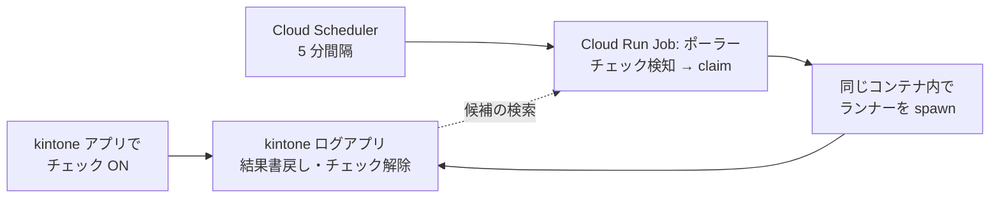

<!--
title: 【kSQL Flow #13】リラン指示のサーバーレス化で、既存の設計欠陥が見つかった — レビューに 2 度止められて v0.6 が生まれるまで
tags:
  - kintone
  - GoogleCloud
  - CloudRun
  - バッチ処理
  - 設計
-->

> **as-is / no support**: 本ツールは MIT ライセンスで現状有姿のまま公開しており、サポート・動作保証・修正の約束はありません。本番投入は必ず `--dry-run` とステージング検証を経て、自己責任でお願いします。

- GitHub: https://github.com/rex0220/ksql-flow
- 前回: [【kSQL Flow #12】kintone バッチを Cloud Run Jobs へ — 使い捨てコンテナでも resume と分散ロックは動くか](URL_TBD_12)

[#10](https://qiita.com/rex0220/items/b841921afe86083f14a0) で、kintone のチェックボックス 1 つで VPS のバッチをリランする仕組みを作りました。[#12](URL_TBD_12) でバッチ本体はサーバーレスに移りました。残る宿題は 1 つ — **リラン指示を拾うポーラーもサーバーレスにできるか**。

結論: できました。kintone アプリでチェックを付けてから**約 2 分半**で、Cloud Run 上のポーラーがリランを完走します。ただしそこまでの道は素直ではありませんでした。**最初の設計は動いたのにレビューで棄却され、2 度目のレビューは「既存の VPS 運用にも潜んでいた設計欠陥」を掘り当て、その恒久対応としてランナー本体の v0.6 が生まれました**。今回はその記録です。

この開発は、実装とレビューを別々の AI エージェントが担当し、意見が割れたら人間が裁定する体制で進めています。今回はレビューが 2 度、設計を根本から変えました。

## 方式 A: 作って、動いて、棄却された

最初の設計は「リモート起動アダプター」でした。Scheduler から起動されたポーラーが、**別の Cloud Run Job（バッチ）を API 経由で起動**し、完了を待って、結果の Exit Code を Cloud Logging のログから回収する — 実装は一通り動き、E2E テストも通りました。

レビューの判定は **NEEDS-CORRECTION**。並んだ指摘は本質的でした。

- Exit Code を**ログから推定**するため、取りこぼすと「安全なスキップ（Exit 5）」を「失敗」と誤分類し得る
- 認証トークンの寿命（1 時間）より完了待ちの上限（65 分）が長く、**長いバッチの終盤で認証切れ**
- HTTP 呼び出しに個別のタイムアウトがなく、1 本の無応答でポーラーごと固まる
- ログ API のページングを見落とすと Exit Code をさらに取りこぼす

個々に対処もできます。しかし全部の共通項は「**バッチをリモートで起動して、結果を外から観測する**」こと自体でした。分散システムの古典的な難所を、わざわざ自分で作り込んでいたわけです。

## 方式転換 — 「VPS と同様の動作でよいのでは？」

流れを変えたのはオーナー（人間）の一言でした。

> VPS と同様の動作でよいのでは？

VPS のポーラー（[#10](https://qiita.com/rex0220/items/b841921afe86083f14a0)）は、`run_batch.sh` を**同じマシンで子プロセスとして実行**します。Exit Code は spawn の返り値で直接手に入る。ログから推定する必要も、完了を外から待つ必要もない。

ならば、**ポーラー自体を Cloud Run Jobs にして、リランはそのコンテナの中で子プロセスとして実行**すればいい。5 分間隔の Cloud Scheduler がポーラーを起動し、ポーラーはチェックを検知したらコンテナ内でランナーを spawn する — VPS と同じ形をそのままサーバーレスに持ち込む構図です。



方式 A の指摘は、**対処したのではなく発生源ごと消えました**。Exit Code は返り値・完了待ちは不要・認証はコンテナ内で完結。仕組みを足して守るより、仕組みを引いて問題を消す — [#11](https://qiita.com/rex0220/items/44cf9f6d23c264d14dca) のロック設計と同じ着地です。

## 2 度目のレビューが掘り当てた「既存バグ」

方式 B の仕様をレビューに掛けると、今度は別の BLOCKER が返ってきました。そしてこれは新設計の穴ではなく、**#10 から動いている VPS 運用にも潜んでいた欠陥**でした。

ポーラーは「チェックされた失敗バッチ」をリランするつもりで `--resume` を実行します。しかし `--resume` が再開するのは「**そのプロファイルの最新バッチ**」であって、**どのレコードにチェックが付いたかは見ていません**。

つまり、チェックしたバッチより**新しいバッチが存在すると、別のバッチを再開**します。最悪のケースでは、最新バッチが成功済みのため「再実行が必要なジョブはありません」で正常終了（Exit 0）し、ポーラーは**チェックされた古い失敗レコードに `SUCCESS` を書き戻す** — 失敗が成功に化ける経路です。

VPS 単独運用では「チェックするのは直近の失敗」がほぼ常に成り立つため顕在化しませんでした。起動元が増えて「より新しいバッチ」が挟まりやすくなった途端、確率が跳ね上がる。**基盤を変えようとしたことが、既存設計のレビューになった**わけです。

## 恒久対応: ランナー本体 v0.6

対症療法ではなく、ランナー本体に 2 つの機能を追加しました（[v0.6.0](https://github.com/rex0220/ksql-flow/releases/tag/v0.6.0)）。

**① `--resume-batch <batch_id>` — 再開対象の明示指定**

```bash
ksql-flow run-all ./jobs/ --profile prod --resume-batch <チェックされたバッチの ID>
```

ポーラーは claim したレコードの `batch_id` をそのまま渡します。より新しいバッチが何本あっても、**チェックした対象とリランが構造的に結び付く**。fail-closed も徹底しました — 再開元の解決は**ログアプリのみ**（ローカル state へのフォールバック禁止）、batch_id が見つからない・複数見つかる・プロファイル不一致はすべて即エラーです。

**② `KSQL_HOST_LABEL` — 実行ホストの表示名**

コンテナ実行ではホスト名が `localhost` としか記録されず（[#12](URL_TBD_12) の罠集）、「どの環境が実行したか」を区別できません。環境変数で `gcp:ksql-flow-demo` のような短い表示名を記録できるようにしました。ポーラーは host で担当を絞るため、これで **GCP 担当ポーラーと VPS 担当ポーラーが同じログアプリ上で共存**できます。

1 つ注意深く**変えなかった**ものがあります。ローカルロックの「同一ホストで PID 生存中は奪わない」判定（[#11](https://qiita.com/rex0220/items/44cf9f6d23c264d14dca) の防壁）は実ホスト名のまま — 表示名を混ぜるとこの保証が壊れるためで、ラベルはあくまでログの表示・検索用です。

## 防御の 2 枚目: 最新性ガード

`--resume-batch` で対象は厳密になりましたが、「**古い失敗レコードへのチェック**」自体は人間の操作なので起こり得ます。そこでポーラーは実行前にもう 1 つ検証します — チェックされたバッチは、いまも**そのプロファイルの最新バッチか**。

二枚の役割は別物です。**`--resume-batch` は「指定された対象を取り違えない」ためのランナー側の構造的保証**、**最新性ガードは「そもそもその対象を今リランすべきか」を判断するポーラー側の運用ポリシー** — ランナーとしては古いバッチも指定できますが、チェックボックスの通常運用では最新の失敗だけをリラン対象にする、という整理です。

| 状況 | ポーラーの判断 |
| --- | --- |
| チェック対象が最新 | 実行する |
| より新しいバッチが**実行中** | **待つ**（チェック維持・次サイクルで再判定 — 多重起動スキップと同じ意味論） |
| より新しいバッチが**終了済み** | **取消**（CANCELED + 「最新の失敗バッチにチェックするか手動で」の案内） |
| 同時刻に複数バッチがあり最新を一意に決められない | **取消**（fail-closed） |

最後の行には理由があります。kintone の日時フィールドは**分単位に切り捨て**られる（[#10](https://qiita.com/rex0220/items/b841921afe86083f14a0) の実測）ため、同じ分に始まった 2 つのバッチはどちらが新しいか判定できません。レコード番号で順序を決める案もありますが、「作成順 = 業務上の開始順」という同一視を仕組みに増やすより、稀なケースは人間に返す方を選びました。判定できないときに推測で動かない — [#10](https://qiita.com/rex0220/items/b841921afe86083f14a0) からの原則です。

## 実測 — 同じコードが両方の基盤で動く

仕上げの実機ドリルです。ポーラーのコードは VPS 版と**完全に同一**（設定ファイルだけ差し替え）。

| シナリオ | 結果 |
| --- | --- |
| 実ユーザー操作（GCP）: アプリでチェック → 5 分間隔の実スケジュールが拾う | チェックから**約 2 分半**で SUCCESS・チェック自動解除・依頼者のアカウント名を記録 |
| 実ユーザー操作（VPS）: 同じ操作を VPS 担当のバッチで | 実 cron が拾い**約 3 分**で SUCCESS — 同一コード・同一意味論 |
| 複数ジョブバッチの途中失敗 → リラン | 失敗ジョブと依存でスキップされたジョブ**だけ**再実行。成功済みジョブは飛ばし、as-of は元バッチを引き継ぐ |
| ポーラーを 2 本同時起動 | 取り合いは kintone の revision 楽観排他で決着 — **claim は 1 回だけ・リランは 1 本だけ** |
| 古い失敗レコードにチェック（新しいバッチあり） | ガードが CANCELED + 案内文言で返す（誤 SUCCESS 経路の遮断を実機確認） |
| コンテナ強制打切りの後始末 | 期限切れの処理中レコードを次サイクルが UNKNOWN へ回収 — 「自動再実行はしていません」と明示して人間へ |

チェックボックスを押す側から見える体験は #10 と何も変わりません。変わったのは、その裏に**サーバーが 1 台もない**ことだけです。

## コスト — 高頻度ポーラーは「最低 1 分課金」に食われる

[#12](URL_TBD_12) では、長めのバッチについて「従量制は回数より 1 回の処理時間が効く」と見ました。しかし **1 回が 1 分未満の処理では事情が逆転します**。

1 サイクルの実測は数秒。しかし Cloud Run Jobs の課金は **1 実行あたり最低 1 分**なので、5 分間隔の常時運用では月 8,640 実行 = **課金 8,640 分**。無料枠（1 vCPU 換算で月約 4,000 分）を大きく超え、試算で **月 $5 前後** — バッチ本体が無料枠に収まるのに、数秒のポーラーが有料になる逆転が起きます。「数秒の処理を高頻度で回す」ワークロードは最低 1 分課金と相性が悪いのです。

現実的な選択肢を並べます:

- **時間帯を絞る（今回の推奨）** — リラン指示が出るのは実質「朝のバッチが失敗した後」です。具体例: **毎朝 6:00 のバッチ後、3 時間だけ 5 分間隔で回す** — Scheduler の cron は `*/5 6-8 * * *`（6:00〜8:55・Asia/Tokyo）。失敗通知を見て、データを直して、チェックを付ける — 人間の対応時間として 3 時間は現実的な幅です。実行は 36 回/日 = **月約 1,080 分**で、バッチ本体と合算しても無料枠内（実質 0 円）。時間帯外にチェックを付けても消えはせず、翌朝のウィンドウ先頭（6:00 のサイクル）で拾われます。1 つだけ調整が要るのは**要求の有効期限** — 既定の 6 時間のままだと「昼にチェック → 翌朝拾う」が期限切れになるため、24 時間以上へ延ばしておきます
- **間隔を広げる** — 15 分間隔なら月 2,880 分で枠内。リラン応答は最大 15 分待ちに
検討して**外した**案もあります。「ポーラーだけ VPS に残す」— 技術的にはホストラベルの担当分離で安全に共存できます（移行期の併走はまさにこの形で検証しました）が、ポーラーのためだけに VPS を維持すると、サーバーレス化で消したはずの**ホスト OS 保守が丸ごと戻ってきます**。2 環境の保守は費用差より重い。恒常運用の選択肢にはなりません。

残るのは即応性と費用のトレードオフで、正解は運用次第です。私たちの検証環境は「平常時は停止・検証時だけ再開」で運用しています。

## まとめ

- リラン指示のポーラーもサーバーレス化できた — チェックから**約 2 分半**、コードは VPS 版と同一
- 最初の「リモート起動 + 外から観測」設計は、動いたが**レビューで棄却** — 個々の対症ではなく、方式転換（ポーラー同居実行）で問題を発生源ごと消した
- 2 度目のレビューが**既存運用にも潜んでいた誤 SUCCESS 欠陥**を発見 — 恒久対応としてランナー v0.6（`--resume-batch` の対象明示・`KSQL_HOST_LABEL`）が生まれた
- 防御は二枚 — 対象の明示（構造）+ 最新性ガード（運用ミスの検出）。判定できないときは fail-closed で人間に返す
- 高頻度ポーラーは**最低 1 分課金**に食われる — 解は時間帯限定（バッチ後 3 時間だけ 5 分間隔）か間隔調整。ポーラーのためだけの VPS 維持は 2 環境保守で本末転倒

仕組みですべてのエラーを防ぐことはできない、という前提はこの連載で繰り返し書いてきました。今回それに 1 行足すなら — **設計もまた、一度で正しくはならない**。動くものを作ってから、レビューに 2 度止められて、ようやくこの形に落ちました。そして皮肉なことに、いちばん重い欠陥を見つけたのは新機能のテストではなく、「基盤を変えよう」とした移設作業でした。環境を変えることは、それ自体が設計のレビューなのだと思います。

## 連載

1. **#1**: [kintone のバッチ処理を SQL 1 本で書けるランナーの紹介](https://qiita.com/rex0220/items/893ab4016a5aaf595642)
2. **#2**: [AI エージェントに kintone のバッチジョブを書かせる — MCP + Claude Code](https://qiita.com/rex0220/items/3a1213a596a8c49b67aa)
3. **#3**: [毎朝の無人実行の前に — kintone バッチを 200 → 20,000 → 100,000 件で鍛える](https://qiita.com/rex0220/items/62e950ab1ccc5b54ff69)
4. **#4**: [タスクスケジューラで毎朝動かす — PowerShell が 0.1 秒で無言死する罠つき](https://qiita.com/rex0220/items/d0a66c133edd42ff91c4)
5. **#5**: [kintone バッチの API 消費を 4 割減らすまで — 「束ねれば速い」が実測で覆った話](https://qiita.com/rex0220/items/9cbc1e0e9b5ab292e6a1)
6. **#6**: [GitHub Actions で kintone バッチをサーバーレス運用 — PR を開くと「書込差分」が自動で貼られる](https://qiita.com/rex0220/items/a522f7880a5960f033b3)
7. **#7**: [kintone バッチが失敗した朝にやること — Exit Code・部分適用・再実行しても壊れない設計](https://qiita.com/rex0220/items/39821af2a79b88de0ed2)
8. **#8**: [バッチの失敗は 4 種類ある — 自動リラン・AI 診断・人間の判断の切り分け](https://qiita.com/rex0220/items/30cac8d8b52ec8ac782a)
9. **#9**: [月 1,000 円の VPS で kintone バッチを毎朝動かす — cron の遅延は 1 秒だった](https://qiita.com/rex0220/items/dd8ec668b8966e346d48)
10. **#10**: [スマホのチェック 1 つで VPS のバッチをリランする — 新しいポートを 1 つも開けずに](https://qiita.com/rex0220/items/b841921afe86083f14a0)
11. **#11**: [kintone がロックサーバーになる — 重複禁止フィールドで作る分散ロックと、検索索引ラグの実測](https://qiita.com/rex0220/items/44cf9f6d23c264d14dca)
12. **#12**: [kintone バッチを Cloud Run Jobs へ — 使い捨てコンテナでも resume と分散ロックは動くか](URL_TBD_12)
13. **#13（本記事）**: リラン指示のサーバーレス化で、既存の設計欠陥が見つかった
