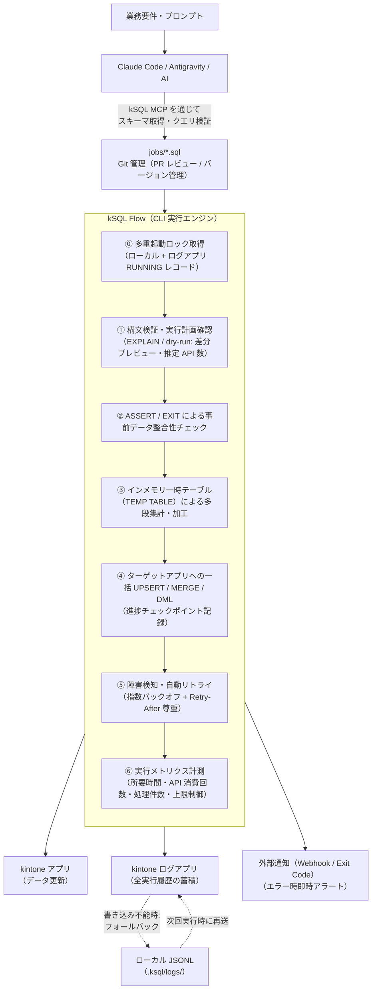

# kSQL Flow 仕様書

**対応バージョン: ksql-flow v0.1.0 ／ エンジン @rex0220/kintone-sql-tools ^3.71.0 ／ SQL 方言 dialect 1**

本書は kSQL Flow の公開仕様書です。本書単体で仕様として完結します。
（参考・非規範: 設計判断の経緯や改訂履歴は https://github.com/rex0220/ksql-flow の `docs/internal/` に公開されています）

---

## 1. 概要とコンセプト

### 1.1 背景と課題

kintone におけるアプリ間集計・定期データ更新（ETL / バッチ処理）は、従来以下の二者択一になりがちでした。

1. **クラウド型 ETL サービス**:
   * 高機能だが、ベンダー側サーバーに顧客の認証情報やデータを預ける必要があり、セキュリティ監査コストが高い。
2. **個別の JavaScript / REST API スクリプト開発**:
   * 仕様変更時のメンテナンス負荷が高く、リトライやデータ整合性チェックの実装が属人化しやすい。

### 1.2 コアコンセプト

**「kintone のための As Code / DataOps エンジン」**

* **サーバーレス（BYOC: Bring Your Own Cloud / Infrastructure）**: rex0220 側は実行基盤・顧客認証情報を一切保持しない。実行場所は利用者のローカル PC、社内サーバー、GitHub Actions、AWS、Windows タスクスケジューラ等に委ねる。
  * トレードオフとして、実行基盤の構築・監視・トークン管理は利用者側の責務となる（→ 13章で正直に整理）。
* **Pure SQL / As Code**: 独自 YAML を介さず、SQL スクリプト（`.sql`）を 1 本書くだけでデータパイプラインを完結させる。
* **AI ネイティブ (Claude Code / MCP)**: 自然言語から kSQL MCP 経由で SQL を生成・検証し、Git でバージョン管理。SQL 方言は LLM の学習データが厚い標準構文（`MERGE` 等）に寄せる（→ 3.4）。
* **Dashboard Pro との対称性**:
  * **可視化・分析**: 要件 → AI → kSQL → Dashboard JSON → **kSQL Dashboard Pro**
  * **集計・データ更新**: 要件 → AI → kSQL → Pipeline SQL → **kSQL Flow (CLI)**

---

## 2. アーキテクチャ構成



> **前提条件**: 図中の「kSQL MCP を通じてクエリ検証」は、MCP が Flow 拡張構文（dialect 1）を検証できることが前提です（→ 3.7。ランナーが要求するエンジンは **^3.71.0** — README の互換表を参照）。なお MCP の `ksql_validate` はネットワーク 0 の契約のため updateKey 等のスキーマ依存検証は含まず、フル検証はランナーの `validate`（公式 API `/flow` の `validateScript(source, { client })`）で行います。

**通信先の限定（セキュリティモデルの要点、詳細は 12 章）**: kSQL Flow が通信するのは (1) 設定された kintone 環境、(2) 利用者が設定した通知 Webhook のみ。rex0220 側サーバーへのテレメトリ送信・ライセンス照会等の外部通信は一切行わない。

---

## 3. SQL 方言仕様と単一ジョブのステップ構成

### 3.1 ジョブファイルの構成例（`monthly_sales_sync.sql`）

ヘッダメタデータ、`ASSERT` / `EXIT`、中間テーブル構文、論理アプリ参照（`LAPP_`）を組み合わせ、多段処理を 1 ファイルで完結させます。

```sql
-- @ksql name: monthly_sales_sync
-- @ksql depends_on: sync_master_customers
-- @ksql timeout: 600
-- @ksql dialect: 1
-- ========================================================
-- 月次売上集計・顧客マスタ同期パイプライン
-- ========================================================

-- Step 1: 事前データ整合性チェック（業務異常 → 中断して通知）
ASSERT (
  SELECT COUNT(*) FROM LAPP_受注
  WHERE 受注日 >= @MONTH_START() AND 受注日 < @NEXT_MONTH_START()
    AND 金額 < 0
) = 0, '【異常中断】マイナスの売上データが存在するため処理を停止しました';

-- Step 2: インメモリ一時テーブルへの集計（kintone API を消費せず高速処理）
CREATE TEMP TABLE temp_monthly_summary AS
SELECT
  顧客コード,
  COUNT(レコード番号) AS 受注件数,
  SUM(金額) AS 当月売上合計
FROM LAPP_受注
WHERE 受注日 >= @MONTH_START() AND 受注日 < @NEXT_MONTH_START()
  AND ステータス = '受注完了'
GROUP BY 顧客コード;

-- Step 3: 対象 0 件は「正常な早期終了」（通知を発報しない）
EXIT SUCCESS IF (SELECT COUNT(*) FROM temp_monthly_summary) = 0,
  '集計対象となる受注データが 0 件のためスキップ';

-- Step 4: 顧客マスタへの一括 UPSERT 反映（冪等性の担保）
UPSERT INTO LAPP_顧客マスタ (顧客コード, 当月受注件数, 当月売上実績, 最終集計日時)
SELECT
  顧客コード,
  受注件数,
  当月売上合計,
  @NOW()
FROM temp_monthly_summary
KEY (顧客コード);
```

> 日付関数（`@MONTH_START()` 等）と `@NOW()` は、実行のたびに評価されるのではなく**バッチ開始時に確定した基準時刻（as-of）**を基に返します（→ 5.3）。

### 3.2 ASSERT / EXIT のセマンティクス — 「異常」と「正常なスキップ」の分離

業務異常による中断と、対象 0 件などの正常な早期終了は明確に区別します。これを混同すると、月初・休日のたびに誤アラートが発報され、運用者がアラートを無視するようになるためです。

| 構文 | 意味 | ステータス | 通知 | Exit Code |
| --- | --- | --- | --- | --- |
| `ASSERT <条件>, 'msg'` | 業務異常。DML を実行せず中断 | `ABORTED` | **する** | 2 |
| `ASSERT WARN <条件>, 'msg'` | 警告。ログに記録して続行 | （続行） | しない（ログのみ） | — |
| `EXIT SUCCESS IF <条件>, 'msg'` | 正常な早期終了 | `NO_DATA` | **しない** | 0 |

* `NO_DATA` は成功扱いであり、後続の依存ジョブは通常どおり実行されます。
* この表の「通知」は**失敗アラート（`notifications.onFailure`）のみ**を指します。heartbeat（7.3）は「完走したか」の合図であり、`NO_DATA` を含む Exit 0 の完了で**送信します**（NO_DATA で送らないと、月次ジョブ等で dead man's switch が毎日誤発報するため）。
* ステータス語彙は `SUCCESS` / `NO_DATA` / `ABORTED` / `FAILED` / `SKIPPED`（未実行。理由は 8.2 の `SKIPPED (<理由>)` 契約 — 依存元失敗 / 選抜外 filtered / stop-on-error / ロック競合等）/ `RUNNING` / `TIMEOUT` とし、「対象 0 件」と「未実行」を別語で表します。
* なお 7.1 / 10.3 に登場する `LOCKED` は**プロセスの終了状態（Exit 5）であり、ログアプリの status 値ではありません**。ロック競合したジョブはレコード上 `SKIPPED`（理由 LOCKED — 8.2 の log_detail 契約）として現れます。

### 3.3 ジョブヘッダメタデータ（`-- @ksql`）

1 ファイル完結の思想を保ったまま、依存関係や実行条件を SQL 先頭のコメントで宣言します。

```sql
-- @ksql name: calc_daily_sales        # ジョブ論理名（省略時はファイル名）
-- @ksql depends_on: sync_master_customers, load_calendar  # 依存ジョブ（カンマ区切り）
-- @ksql timeout: 600                  # ジョブ単位タイムアウト（秒）
-- @ksql dialect: 1                    # SQL 方言バージョン（→ 3.6）
```

* **依存先が実行されるのは、依存元が `SUCCESS` または `NO_DATA` で終了した場合のみです。それ以外（`FAILED` / `ABORTED` / `TIMEOUT` / `SKIPPED` / `LOCKED`）はすべて `SKIPPED` になります**（ホワイトリスト形式）。**依存関係のない独立ジョブは、他ジョブの失敗に巻き込まれません**（停止伝播の対象は宣言された依存のみです）。なお選抜実行（`--from` / `--only`）で選抜外となったジョブ（`SKIPPED` 理由 filtered — 6 章）は「実行対象外」であり、依存判定上は満たされたものとして扱います。
* `depends_on` の無いジョブ同士は将来的に並列実行の対象とします（初期リリースでは順次実行、`--parallel N` を予約）。

### 3.4 UPSERT / MERGE 構文

ネイティブ構文は `UPSERT INTO ... KEY (...)` としつつ、**LLM の学習データが厚い標準 SQL の `MERGE` を第一級のエイリアスとして提供**します。AI による生成精度がこの製品の差別化軸であるためです。

```sql
-- 標準 SQL 風（推奨: AI 生成との親和性が高い）
MERGE INTO LAPP_顧客マスタ AS t
USING temp_monthly_summary AS s
  ON t.顧客コード = s.顧客コード
WHEN MATCHED THEN UPDATE SET
  当月受注件数 = s.受注件数,
  当月売上実績 = s.当月売上合計,
  最終集計日時 = @NOW()
WHEN NOT MATCHED THEN INSERT
  (顧客コード, 当月受注件数, 当月売上実績, 最終集計日時)
  VALUES (s.顧客コード, s.受注件数, s.当月売上合計, @NOW());
```

**kintone 側の前提条件（validate で事前検出）**:

* キーに指定できるのは **「値の重複を禁止する」設定済みの文字列（1行）または数値フィールド**のみ。条件を満たさない場合は `ksql validate` がエラー（`KSQL1301`〜`KSQL1303`、Exit 1）で検出し、さらに**実行時にも書込 API 呼び出しの前に fail-closed で再検査**します（実行前に重複禁止設定を確認できない場合もエラー）。
  * 実装上の位置付け: エンジンの UPSERT は kintone の updateKey API ではなく **read-then-write**（GET で照合 → POST / PUT、キー多重ヒット時は最大 `$id` を選択）で実装されています。したがってこのキー制約は API の技術的必然ではなく、**非 unique キーでの upsert 先の曖昧さを塞ぐための方針上のチェック**です。
* **複合キーは指定不可**。回避策として、アプリ側に連結キーフィールド（例: `顧客コード_年月`）を用意する運用を推奨し、ドキュメントに定石として記載します。
* **サブテーブル仮想テーブル（`LAPP_受注$明細` 等）は dialect 1 では SELECT 専用**とします。直接 DML は `validate` でエラー（`KSQL1304`、Exit 1）にします。
  * 位置付け: エンジンは親レコード経由の書き換えで**サブテーブルへの DML を dialect 0 の正式機能として解決済み**です。dialect 1 での禁止は API 制約ではなく「バッチの書込先を親アプリに限定し事故面を減らす」**方針としてのゲート**であり、将来サブテーブル一括更新構文を dialect 1 に開放する際は既存実装を流用できます。

**洗い替え型の同期（削除の扱い）**: UPSERT だけでは「今回の集計に存在しなくなったレコード」が残留します（例: 前月受注のあった顧客が今月 0 件 → 前月値が残る）。対策として次の 2 段階を提供します。

```sql
-- (a) 初期リリース: 明示的な削除文
DELETE FROM LAPP_顧客マスタ
WHERE 顧客コード NOT IN (SELECT 顧客コード FROM temp_monthly_summary)
  AND 当月売上実績 > 0;   -- スコープを限定して誤削除を防ぐ

-- (b) 将来構文（検討中）: 差分同期を 1 文で表現
SYNC LAPP_顧客マスタ FROM temp_monthly_summary
KEY (顧客コード)
DELETE MISSING WITHIN (WHERE 当月売上実績 > 0);
```

### 3.5 論理アプリ参照（`LAPP_`）とエスケープ規則

* 論理名が識別子として安全な場合はそのまま `LAPP_顧客マスタ` と書けます。
* 空白・記号・SQL 予約語を含む場合はダブルクォートで囲みます: `LAPP_"顧客 マスタ(2026)"`。
* 論理名 → アプリ ID の解決は設定ファイルの `apps` マップ（→ 9 章）で行い、未定義の論理名は `validate` でエラーになります。

### 3.6 SQL 方言のバージョニング

* 各ジョブは `-- @ksql dialect: 1` で方言バージョンを宣言します（省略時はエンジン既定値）。
* エンジンは後方互換を維持し、破壊的変更は dialect 番号の繰り上げでのみ導入します。古い dialect のジョブは新エンジンでもそのまま動作することを互換ポリシーとして保証します。

### 3.7 既存 kSQL 方言との関係（単一エンジン戦略）

本書の SQL は独立した新方言ではなく、**既存 kSQL エンジン（MCP / CLI と同一コア）への Flow 拡張構文の追加**として実装します。同一ブランドでの二方言併存は、AI 生成精度・ドキュメント・検証系のすべてで摩擦を生むためです。

* **既存構文はそのまま有効**: 一時テーブル `CREATE TEMP TABLE #x AS SELECT ...`（`#` 付きが既存正）や `UPSERT ... ON DUPLICATE(key)` は、Flow ジョブ内でも従来どおり動作します。
* **Flow 構文は正規エイリアスとして追加**: `CREATE TEMP TABLE x AS SELECT ...`（裸名） ≡ `CREATE TEMP TABLE #x AS SELECT ...`、`UPSERT ... KEY (...)` ≡ `UPSERT ... ON DUPLICATE (...)` とし、`MERGE`（3.4）もこの UPSERT へ正規化します。どちらの表記も同一の内部表現に解決され、意味差はありません。
* **Flow 専用文**（`ASSERT <条件>, 'msg'` 形式・`ASSERT WARN`・`EXIT SUCCESS IF`・`-- @ksql` ヘッダ・時刻関数の as-of 固定評価）は dialect 1 の追加仕様として既存エンジンに実装され、MCP の `ksql_validate` も同一実装を共有します。
* **dialect 0 との互換**: `ASSERT <式> <比較> <式>` は dialect 0 の既存機能として従来どおり動作します。dialect 0 のスクリプトでエラーになるのは **Flow 形式（`, 'msg'` 付き / `WARN`）を使った場合のみ**です。
* **提供状況**: Flow 拡張構文（dialect 1）の解析・検証・実行は kintone-sql-tools が提供します。公式 API `@rex0220/kintone-sql-tools/flow`（parseScript / validateScript / explainScript / executeStatement / previewStatement / onChunkWritten ほか、文単位実行対応）が semver 対象として提供されており、Flow CLI（本リポジトリ）はこれに依存して実装されています（要求バージョンは ^3.71.0 — README 互換表）。詳細は kintone-sql-tools 言語リファレンス §27 を参照。

### 3.8 リポジトリ構成（全面 MIT）

既存 kSQL（kintone-sql-tools）と Flow は**いずれも MIT ライセンス**で公開します。リポジトリを分けるのはライセンス境界のためではなく、責務・リリース周期・依存方向を明確にするためです。

```
kintone-sql-tools（既存・MIT）
  └─ kSQL エンジン: パーサー / validate / EXPLAIN / MCP
     + Flow 拡張構文（dialect 1）の解析・検証・EXPLAIN まで含める
        - ASSERT / ASSERT WARN / EXIT SUCCESS IF
        - -- @ksql ヘッダ / MERGE・CREATE TEMP TABLE エイリアス
        - 時刻関数の as-of 固定評価（意味論の定義）

ksql-flow（本リポジトリ・MIT）
  └─ 実行ランナー: run / run-all / --resume / --dry-run 差分プレビュー /
     多重起動排他（5.5）/ チェックポイント（5.1）/ ログアプリ書込・再送（8 章）/
     通知・heartbeat（7.3）/ リトライ（7 章）
     → npm 依存として @rex0220/kintone-sql-tools（公式 API /flow サブパス）を利用
```

* **構文はエンジン側、実行はランナー側**: 2 章のアーキテクチャ（AI が MCP 経由で Flow SQL を生成・検証）は、MCP が dialect 1 を理解できてこそ成立するため、構文・検証系はエンジンに置きます。ランナーは運用品質（排他・resume・ログ・リトライ）に専念します。
* **エンジン API の公開契約化**: ksql-flow が依存するエンジン API（AST・実行計画・クエリ実行）は `@rex0220/kintone-sql-tools` の公式 API（`/flow` サブパス）として切り出し、semver で管理します。エンジンバージョン × dialect の互換表を両リポジトリの README に掲示します。
* **エコシステム上の位置付け**: SQL 方言と MCP を含むツールチェーン全体がオープンであることは、kintone における As Code 運用の共通基盤（標準候補）としての採用・派生・他ツールからの対応実装を最大化するための選択です。互換ランナーやフォークの出現は歓迎します。

---

## 4. 複数ジョブのオーケストレーション構成

ファイル名のプレフィックス順を基本の実行順とし、停止伝播は 3.3 の `depends_on` 宣言に従います。

```
jobs/
├── 01_sync_master_customers.sql   # 顧客マスタ同期
├── 02_calc_daily_sales.sql        # 日次売上集計（depends_on: 01）
└── 03_update_stock_balance.sql    # 在庫残高反映（独立 → 01/02 の失敗に巻き込まれない）
```

```bash
# ディレクトリ内の一括実行（既定: 失敗ジョブの「依存先」のみスキップ）
ksql run-all ./jobs/ --profile prod

# 失敗時に依存関係に関わらず全体を即停止したい場合
ksql run-all ./jobs/ --profile prod --stop-on-error

# 失敗があっても独立ジョブを最後まで実行し、部分成功(Exit 4)で返す
ksql run-all ./jobs/ --profile prod --continue-on-error
```

---

## 5. 実行モデルとデータ整合性

### 5.1 トランザクション不在と「部分適用」の明示

**kintone には複数リクエストにまたがるトランザクションがありません**。さらに現行エンジン（v3.71.0 現在。最新の対応版は README 互換表を参照）は `bulkRequest` を使用しておらず、書込は **100 レコード/リクエスト**で送信されるため、**原子性の単位は 1 リクエスト = 最大 100 レコード**です。したがって、例えば 3 万件の UPSERT 中 1.2 万件時点でリトライ上限を超過した場合、**更新は途中まで適用された状態で `FAILED` になります**。kSQL Flow はこの事実を隠さず、次の設計で復旧可能性を担保します。

1. **冪等な書き込みの標準化**: キー指定の `UPSERT` / `MERGE` を標準とし、**同じジョブを何度リランしても最終状態が同じになる**ことを復旧の基本戦略とする。冪等性は「重複防止」のためだけでなく、**部分適用状態からの復旧手段そのもの**である。
2. **進捗診断情報の記録**: DML 実行中、成功したチャンクの処理件数・チャンク番号と、取得できる場合はそのチャンクの最終キー値を記録する。`last_written_key` は**最後に成功した書込チャンクの最終キー値（順序保証なし）**であり、部分適用時の影響範囲を調査するための診断情報に限る。書込順はキー昇順とは限らず、単調な復旧ウォーターマークや途中再開位置として使用しない。キー値が取得できない操作ではチャンク情報のみを記録する。
   * **記録頻度**: ログアプリへの反映は **25 チャンクごとまたは 60 秒ごと**とする（毎チャンク更新はチェックポイント自体が API を消費し書込 API 数が実質倍増するため）。**ローカル JSONL には毎チャンク記録**し、障害調査の実用性はこちらで担保する。復旧は 1 の冪等リランを正とする。
   * **受入基準**: 250 件の UPSERT で 3 チャンクが観測され、最後に成功したチャンクの最終キー値が JSONL とログアプリに残ること。途中チャンクが失敗した場合は、失敗したチャンクではなく最後に成功したチャンクの値が残ること。いずれの値も順序保証のない診断情報として扱う。
3. **失敗時の案内**: `FAILED` 時のエラー出力に「本ジョブは冪等設計であれば `--only` での単独リランで復旧できます」等、復旧手順を明示する。
4. **チャンク分割の自動化**: DML の実行時、エンジンは kintone REST API の上限に合わせて **100 レコード/リクエスト**で自動的にチャンク分割して送信する。利用者が SQL 側で件数上限を意識する必要はない。原子性が保証されるのは 1 リクエスト（最大 100 レコード）単位であり、チェックポイント（`last_written_key`）もこの単位で記録される。エンジンが将来 `bulkRequest`（最大 20 リクエスト = 2,000 レコード）を導入した場合は、原子性・チェックポイント粒度・推定式をあわせて更新する。

### 5.2 冪等性（Idempotency)の担保原則

* `INSERT` ではなくキー指定の `UPSERT` / `MERGE` を標準とし、リランでデータ重複が起きないクエリ設計を徹底。
* 中間データはインメモリ一時テーブル（`TEMP TABLE`）で完結させ、前回実行時のゴミデータを残さない。
* 洗い替え型は 3.4 の削除スコープ指定で「消えるべきレコード」まで含めて冪等にする。
* `ksql validate` は、書き込み先に対する素の `INSERT` を検出した場合に警告を出す（`--strict` でエラー化）。

### 5.3 実行基準時刻（as-of）の固定

* `@NOW()` / `@TODAY()` / `@MONTH_START()` 等の時刻関数は、**バッチ開始時（batch_id 発行時）に確定した単一の基準時刻**から導出します。日跨ぎ・月跨ぎの長時間実行でも、Step 間で基準がズレることはありません。
* 基準時刻は `--as-of` で明示的に上書きできます。過去日付での再集計（バックフィル）にもこれを使います。

```bash
ksql run -f jobs/02_calc_daily_sales.sql --profile prod --as-of "2026-08-01T00:00:00+09:00"
```

* **`--resume` 時は、元セッションの as-of を自動的に引き継ぎます**（→ 6 章）。前日に失敗したジョブを翌日リランしても、前日の基準で集計されます。当日基準でやり直したい場合のみ `--as-of` で明示上書きします。
* **as-of の対象は `@` 付き時刻関数のみ**です。`@` なしの `TODAY()` / `THIS_MONTH()` 等は kintone サーバー側で評価されるため as-of で固定できず、dialect 1 の WHERE で使用すると警告（`KSQL1306`）が出ます。**Flow ジョブでは常に `@` 付きを使用**してください（本書の見本コードはすべて `@` 付きで統一しています）。

### 5.4 タイムゾーン規約

* kintone の日時フィールドは **UTC で保存され、表示時にユーザーのタイムゾーンへ変換**されます。日付フィールドはタイムゾーンを持ちません。
* kSQL Flow はプロファイルに `"timezone": "Asia/Tokyo"` を持ち、時刻関数の評価・日時リテラルの解釈・日付境界の計算はすべてこのタイムゾーンで行った上で、API 送信時に UTC へ変換します。
* 日時フィールドと「日」の比較は、`>= 日初 AND < 翌日初` の半開区間に正規化されます（ドキュメントの見本コードもすべてこの形で統一します）。

### 5.5 多重起動の排他制御

同一ジョブ・同一ディレクトリの同時実行は、バッチ運用で最も多い事故（前回分のハング中に次回分が起動、CI と手動実行の衝突）を引き起こすため、二層で防ぎます。

1. **ローカルロック**: `.ksql/lock-<profile>.json`（プロファイル名は英数・`.`・`-`・`_` 以外を `_` に正規化。PID・ホスト名・開始時刻を記録）。プロセス死亡後の stale ロックは開始時刻とプロセス生存確認で自動判定して回収（生存確認が有効なのは**同一ホスト内のみ**。別ホストの stale はローカルロックでは判定できず、二層目の分散ロック側の回収規則に委ねる）。
2. **分散ロック（ログアプリ方式）**: 実行開始時にログアプリへ `status = RUNNING` のレコードを先行 INSERT する。`job_key` フィールドを**重複禁止**に設定しておくことで、別ホストからの同時起動は INSERT 失敗（400 Bad Request）として検知され、Exit 5（`LOCKED`）で即座に停止する。
3. **バッチロック**: `run-all` は開始時に `job_key = {profile}:__batch__` の BATCH レコードを先行 INSERT し、**同一プロファイルの run-all 同時実行**を防ぎます（個々のジョブロックはこの傘の下で取得される）。単発 `ksql run` と run-all 内の個別ジョブが衝突した場合は、当該ジョブのみ Exit 5 相当として扱います（→ 10.3）。
4. **分散ロックを確立できない場合は fail-closed**: 実行**開始時**にログアプリへ到達できない、または RUNNING レコードを INSERT できない場合、既定では何も実行せず `FAILED`（Exit 3、理由 `LOCK_UNAVAILABLE`）で停止します。`--lock local-only` を明示した場合のみ、警告を出した上でローカルロックのみで続行できます。8.3 のローカル JSONL フォールバックは**実行中**のログ書き込み失敗を救済する仕組みであり、開始時のロック確立には適用しません（ここを混同すると排他保証が静かに消えるため、経路を分離します）。
5. `--force-unlock` または `ksql-flow unlock` で、ハングした前回セッションのロックを明示的に解除できます。**解除対象は batchId / jobKey 単位ではなく、同一プロファイルの全 RUNNING レコード**です。解除前に jobKey・開始時刻・対象件数を一覧表示し、解除の事実もログに記録します。有効な別ジョブを巻き込む blast radius があるため、一覧を確認して使用します。batchId / jobKey 単位の指定解除は v0.1 では非対応です（将来検討）。

**`job_key` のライフサイクル規則（重複制約エラーの誤爆防止）**:

* `job_key` は **`status = RUNNING` の間だけ値を保持**します。値はジョブレコードで `{profile}:{job_name}`、バッチレコードで `{profile}:__batch__`（いずれも日付を含まない）とし、「同一プロファイル・同一ジョブは常時 1 実行のみ」をキー制約そのもので保証します。
* ジョブ終了時（`SUCCESS` / `NO_DATA` / `FAILED` / `ABORTED` いずれでも）、エンジンは同一レコードの UPDATE で `job_key` を**クリアし、値を `job_key_done`（重複禁止なしの通常フィールド）へ退避**します。これにより、前回が `FAILED` で終わっていても翌日の実行や `--resume` が重複制約エラーを踏むことはありません。
* クラッシュ等で `RUNNING` のまま残ったレコード（stale ロック）は、(a) `started_at + limits.batchTimeoutSec` 超過を検知した次回実行が警告付きで自動回収する、(b) `ksql unlock` で明示解除する、の二経路で解消します。いずれもクリア時に `status` を `TIMEOUT` へ更新し、回収の事実を `log_detail` に記録します。

---

## 6. リラン（再開実行）設計

### 6.1 リラン方式

1. **自動再開 (`--resume`)**: 直近セッションで失敗・未完了となったジョブのみを抽出して再開（**対象の正確な規則は 6.3** — `FAILED` / `ABORTED` / `TIMEOUT` / 失敗起因の `SKIPPED` / `RUNNING`〈クラッシュ〉/ JOB レコード不在〈未着手〉）。**元セッションの as-of を引き継ぐ**（5.3）。

```bash
ksql run-all ./jobs/ --profile prod --resume
```

2. **開始位置指定 (`--from`)**: 指定したファイル以降のジョブを順番に実行。

```bash
ksql run-all ./jobs/ --profile prod --from 02_calc_daily_sales.sql
```

3. **ピンポイント単発実行 (`--only`)**: 修正した 1 ファイルのみを実行。

```bash
ksql run-all ./jobs/ --profile prod --only 02_calc_daily_sales.sql
```

### 6.2 リラン状態の「正」の一元化

* **kintone ログアプリを正（Source of Truth）とし、ローカル `.ksql/state-<profile>.json` はオフライン時のフォールバック**と位置付けます。profile はファイル名として安全な文字へ正規化します。両者を対等に参照する設計は必ず食い違いを生むため、優先順位を固定します。
* `--resume` はまずログアプリから直近バッチ（`parent_batch_id`）の状態を取得し、到達不能な場合のみ profile 別 state を使用します。この場合その旨を警告表示します。
* state は `schemaVersion: 1` の内部キャッシュであり、手動編集は想定しません。破損または未知の `schemaVersion` は警告を表示して無視し、ログアプリまたは「状態なし」へ fallback します（無言で null 化しません）。

### 6.3 選抜実行の記録と `--resume` の選抜規則

* **選抜実行（`--from` / `--only`）では、選抜外ジョブに `SKIPPED`（理由 filtered）の JOB レコードを記録する**。これにより「直近バッチに JOB レコードが存在しないジョブ = クラッシュによる未着手 = `--resume` で再実行」という不変条件が常に成立する。
* `SKIPPED (filtered)` レコードの性質:
  * `job_key` を持たない（分散ロックに関与しない）
  * 依存伝播・通知・Exit Code 集約（10.3）のいずれからも**中立**（集約で 5 として扱わない。依存判定上は満たされたものとして扱う — 3.3）
  * `--resume` の再実行対象に**含めない**（失敗起因の `SKIPPED` とは区別して扱う）
* `--resume` の再実行対象: 直近バッチで `FAILED` / `ABORTED` / `TIMEOUT` / `SKIPPED`（失敗起因）/ `RUNNING`（クラッシュ）となったジョブ、および **JOB レコードが存在しないジョブ**（未着手）。

---

## 7. エラー処理と多重防壁設計

基幹系バッチ運用に耐えうる堅牢性を確保するため、4 段階の防御・復旧レイヤーを備えます。

```
［SQL 実行］
   │
   ▼
【第 1 防壁: 事前遮断 (Pre-Check)】
   │ ・ASSERT によるデータ整合性チェック / EXIT SUCCESS IF による正常スキップ
   │ ・--dry-run による更新前シミュレーション（差分プレビュー）
   │   └─ 異常検知時: DML を実行せず「ABORTED」で安全停止
   ▼
【第 2 防壁: 一時的障害の自動吸収 (Self-Healing)】
   │ ・kintone API レートリミット (HTTP 429) や 503/520、通信タイムアウト
   │   ├─ 指数バックオフ（Exponential Backoff + Jitter）による自動リトライ
   │   └─ 429 応答の Retry-After ヘッダを尊重（存在する場合はそちらを優先）
   ▼
【第 3 防壁: 即時停止と停止伝播 (Fail-Fast / Cascade Stop)】
   │ ・リトライ上限超過や SQL 実行エラー、timeout 超過時
   │   ├─ 当該ジョブの残ステップを即座に破棄（進捗チェックポイントは保全）
   │   └─ depends_on で依存を宣言した後続ジョブのみ自動スキップ（SKIPPED 記録）
   ▼
【第 4 防壁: 証跡記録 & アラート通知 (Notification)】
   │ ・kintone ログアプリへ詳細を書き込み (INSERT / RUNNING レコードの更新)
   │   └─ 書き込み不能時: ローカル .ksql/logs/<batch_id>.jsonl へ記録し、
   │      次回実行時にログアプリへ自動再送（第 4 防壁自体を単一障害点にしない。
   │      ローカル記録自体も失敗した場合は警告を表示して実行は継続 = best-effort）
   │ ・Webhook / チャットツール / メールへ即時アラート送信
   └─ 明確な終了コードを返却（→ 10.3）
```

### 7.1 エラー種別とハンドリング一覧

| エラー種別 | 発生契機 | エンジンの振る舞い | 終了ステータス |
| --- | --- | --- | --- |
| **正常な対象 0 件** | `EXIT SUCCESS IF` 成立 | DML を実行せず正常終了。**onFailure は送らない**（heartbeat は Exit 0 として送る — 3.2） | `NO_DATA` (Exit 0) |
| **ASSERT 条件違反** | マイナス売上など業務ロジックの不整合 | DML を実行せず直ちに中断。通知する | `ABORTED` (Exit 2) |
| **API 一時エラー** | HTTP 429 / 500 / 502 / 503 / 504 / 520 / 522 / 524 / タイムアウト | 指数バックオフ + Retry-After で自動再試行。上限超過時は中断。**リトライ対象は左記の列挙のみ**（501 / 505 等の「5xx 全般」へは広げない） | `FAILED` (Exit 3) |
| **認証・権限エラー** | API トークンの失効、アプリ/フィールドのアクセス権不足 | 即時中断（リトライなし） | `FAILED` (Exit 3) |
| **SQL 構文・検証エラー** | 不正な構文、存在しないフィールドコード、updateKey 制約違反 | 事前検証または実行時に即時中断 | `FAILED` (Exit 1) |
| **ジョブタイムアウト** | `@ksql timeout` 超過 | 実行中 API 呼び出しの完了を待って中断 | `TIMEOUT` (Exit 3) |
| **多重起動検知** | ロック取得失敗 | 何も実行せず即時終了 | `LOCKED` (Exit 5) |

### 7.2 API 消費量の上限制御（暴走防止）

kintone の API リクエスト数は **1 アプリあたり 1 日 10,000 回**が目安上限であり、バッチが想定外に API を消費すると日中の業務アプリを巻き添えにします。「計測」だけでなく「制御」を提供します。

* `limits.maxApiCalls`（config）/ `--max-api-calls N`（CLI）: 超過時は安全停止（`FAILED`、進捗チェックポイント保全）。
* v0.1 の `validate` は推定 API コール数・推定所要時間を出力しません。推定は `--dry-run` の EXPLAIN / preview 相当処理で提供し、実測読み取り API 消費も表示します。validate への推定追加は v0.1 の実装範囲外です。
* **カウント単位の定義**: 「API 消費回数」は kintone の流量制限と同じ **HTTP リクエスト数**で数えます。現行エンジンは `bulkRequest` 未使用のため、書込は `ceil(件数 / 100)` リクエストとして推定・計上します。将来 `bulkRequest` が導入された場合も「HTTP リクエスト数で数える（bulkRequest は 1 回）」という単位定義は変わらず、推定式のみ更新します。
* **カウント対象の範囲**: `maxApiCalls` の対象はデータの読み書きに加え、**ログアプリへの書き込み・分散ロック操作を含む全リクエスト**とします（超過判定は単一カウンタで行い、計上漏れの経路を作らない）。

### 7.3 ハング検知（「終わらない」障害への対応）

* ジョブ単位の `@ksql timeout` に加え、バッチ全体の `limits.batchTimeoutSec` を設定可能にします。
* `notifications.heartbeat`: 完了時に外部の dead man's switch URL 等へ ping を送るオプション。「失敗通知が来ない」ことと「そもそも実行されていない」ことを区別可能にします。`on` の値域は `"success"`（既定）= Exit 0（`SUCCESS` / `NO_DATA`）の完了時に送信 / `"always"` = 失敗（`FAILED` / `ABORTED` / `TIMEOUT`）を含む毎実行の完了時に送信。

---

## 8. 実行ログ記録・監視設計

正常・異常を問わず、毎回の実行結果を kintone の「実行ログアプリ」へ自動記録します。

### 8.1 レコードの親子構成

* **バッチレコード**（`record_type = BATCH`）: `run-all` 1 回につき 1 件。全体の成否サマリ・総所要時間・総 API 消費を保持。通知とダッシュボードは原則このレコードを起点とする。
* **ジョブレコード**（`record_type = JOB`）: ジョブごとに 1 件。`parent_batch_id` でバッチレコードに紐づく。
* **単発 `run` は JOB レコードのみ**を記録する（batch_id は新規発行・`parent_batch_id` は空・BATCH レコードは作らない）。単発 run の失敗を通知で拾う方法は 8.5 の 2 条件方式を参照。

### 8.2 ログアプリのフィールド定義

| フィールドコード | 表示名 | 型 | 格納内容・役割 |
| --- | --- | --- | --- |
| `record_type` | レコード種別 | ドロップダウン | `BATCH` / `JOB` |
| `status` | ステータス | ドロップダウン | `SUCCESS` / `NO_DATA` / `FAILED` / `ABORTED` / `SKIPPED` / `RUNNING` / `TIMEOUT` |
| `batch_id` | バッチ実行ID | 文字列 | 実行セッションを一意に識別する UUID |
| `parent_batch_id` | 親バッチID | 文字列 | ジョブレコードから親バッチへの参照 |
| `job_key` | ジョブキー | 文字列（**重複禁止**） | 分散ロック用。`RUNNING` 中のみ `{profile}:{job_name}`（BATCH レコードは `{profile}:__batch__`）を保持し、終了時にクリア（→ 5.5） |
| `job_key_done` | ジョブキー履歴 | 文字列 | 終了時に `job_key` から退避した値（検索・集計用） |
| `script_name` | スクリプト名 | 文字列 | `02_calc_daily_sales.sql` |
| `profile` | プロファイル | 文字列 | `prod` / `stg` / `dev` |
| `as_of` | 実行基準時刻 | 日時 | 5.3 の基準時刻（リラン時の再現性の要） |
| `started_at` / `finished_at` | 開始/終了日時 | 日時 | 実行タイムスタンプ |
| `duration_sec` | 所要時間(秒) | 数値 | 実行秒数 |
| `read_count` | 取得件数 | 数値 | SELECT で取得した累計レコード数 |
| `written_count` | 書込件数 | 数値 | 書込系 DML が処理したレコード数の合算（INSERT の追加 + UPDATE の更新 + **DELETE の削除** + UPSERT の追加・更新）。内訳の削除分は `deleted_count` にも記録（v0.3.0+・フィールドは任意） |
| `deleted_count` | 削除件数 | 数値 | DELETE が削除したレコード数の合算（`written_count` の内数）。v0.3.0 で追加した任意フィールド |
| `last_written_key` | 最終書込キー | 文字列 | 診断情報: 最後に成功した書込チャンクの最終キー値（順序保証なし、→ 5.1）。単調な復旧ウォーターマークや途中再開位置には使用しない。キー値を取得できない操作ではチャンク情報のみ |
| `api_calls` | API消費回数 | 数値 | 呼び出した kintone REST API の総回数 |
| `executed_by` | 実行者 | 文字列 | 実行ユーザー / サービスアカウント名 |
| `host` | 実行ホスト | 文字列 | どの環境で実行されたか |
| `git_ref` | Git リビジョン | 文字列 | 実行時の commit hash（As Code の再現性の要） |
| `ksql_version` | エンジン版数 | 文字列 | kSQL Flow のバージョン |
| `error_message` | エラー内容 | 文字列(複数行) | ASSERT 失敗理由または API エラーメッセージ |
| `log_detail` | 実行詳細ログ | 文字列(複数行) | 実行クエリ履歴・スタックトレース（切り詰めあり → 8.3）。**SKIPPED の理由は本フィールド先頭の `SKIPPED (<理由>)` 形式**（filtered / LOCKED / dependency: x / stop-on-error 等）で記録し、6.3 の resume 選抜と 10.3 の集約判定はこの前方一致を契約とする |

### 8.3 ログの上限とフォールバック

* v0.2 以前のテンプレートで作成したログアプリとの互換性のため、ランナーは初回書込前にフィールド定義を 1 回取得し、`deleted_count` が存在する場合だけ送信します。不在時は情報を 1 回表示して実行を継続します。この取得も 7.2 の API 消費回数に含みます。
* kintone の複数行文字列は **約 65,535 文字**を実効上限と見込み（公称仕様として明記された値ではない）、`log_detail` は安全側に**先頭 40,000 文字 + 中略マーカー + 末尾 15,000 文字**（合計約 55,000 文字）で切り詰めます。全文はローカル `.ksql/logs/<batch_id>.jsonl` に保存します。
* ログアプリ自体へ書き込めない障害（ネットワーク断・トークン失効）時も、**ローカル JSONL へ記録**し、次回実行時に未送信分をログアプリへ自動再送します。ローカル記録自体に失敗した場合（ディスク障害等）は警告を表示し、実行は継続します（best-effort）。
* JSONL の全行は共通 envelope `{ "v": 1, "ts": <ISO 8601>, "event": <string>, "batchId": <string>, "profile": <string>, ...payload }` を持ちます。UTF-8・1 行 1 JSON オブジェクトです。
* v0.1 の安定イベントは `write_chunk` / `statement` / `job_start` / `job_finish` / `batch_start` / `batch_finish` / `dry_run_*` です。共通 envelope とこれらの event 名は公開契約とし、payload field の追加は additive とします。それ以外は内部イベント（best-effort）であり、名前・payload・出力有無を互換保証しません。

### 8.4 ログのマスキング

BYOC でセキュリティを訴求する製品として、ログ経由の情報漏えいを防ぎます。

* `logging.maskFields`: 指定フィールドの値をログ上で伏字化（`***`）。
* `logging.stripLiterals`: `log_detail` に記録する SQL からリテラル値を除去（`金額 < ?` の形で記録）。
* 認証情報（トークン・パスワード・証明書パスワード）は、いかなるログ・エラーメッセージにも出力しない。

### 8.5 運用上のメリット

* **アラート通知**: kintone 標準機能の通知条件を **2 条件の組**で設定する:
  1. `record_type = BATCH` かつ status が FAILED 系（`FAILED` / `ABORTED` / `TIMEOUT`）
  2. `record_type = JOB` かつ `parent_batch_id` が空 かつ status が FAILED 系
  `NO_DATA` はどちらの条件にも該当しないため、誤発報が起きない。
* **運用ダッシュボード**: `kSQL Dashboard Pro` をログアプリに適用することで、日々の処理件数推移やエラー発生状況をノーコードで可視化。

---

## 9. 設定ファイル仕様 (`ksql.config.json`)

**アプリ定義は `apps` マップに一元化**します（不整合の温床を除去）。

```json
{
  "defaultProfile": "prod",
  "profiles": {
    "prod": {
      "baseUrl": "https://example.cybozu.com",
      "timezone": "Asia/Tokyo",
      "auth": { "type": "apiToken" },
      "guestSpaceId": null,
      "apps": {
        "受注":       { "id": 100, "tokens": ["env:KSQL_TOKEN_ORDERS"] },
        "顧客マスタ": { "id": 200, "tokens": ["env:KSQL_TOKEN_CUST_READ", "env:KSQL_TOKEN_CUST_WRITE"] },
        "実行ログ":   { "id": 999, "tokens": ["env:KSQL_TOKEN_LOGS"] }
      },
      "logApp": "実行ログ"
    },
    "stg": {
      "extends": "prod",
      "baseUrl": "https://example-stg.cybozu.com",
      "apps": {
        "受注":       { "id": 310, "tokens": ["env:KSQL_STG_TOKEN_ORDERS"] },
        "顧客マスタ": { "id": 311, "tokens": ["env:KSQL_STG_TOKEN_CUST"] },
        "実行ログ":   { "id": 312, "tokens": ["env:KSQL_STG_TOKEN_LOGS"] }
      },
      "logApp": "実行ログ"
    }
  },
  "limits": {
    "maxApiCalls": 5000,
    "maxReadRows": 200000,
    "maxTempRows": 200000,
    "batchTimeoutSec": 3600
  },
  "retry": {
    "maxAttempts": 5,
    "initialDelayMs": 1000,
    "maxDelayMs": 60000,
    "respectRetryAfter": true
  },
  "notifications": {
    "onFailure": { "webhook": "env:SLACK_ALERT_WEBHOOK_URL" },
    "heartbeat": { "url": "env:DEADMAN_SWITCH_URL", "on": "success" }
  },
  "logging": {
    "localDir": ".ksql/logs",
    "maskFields": ["与信限度額", "担当者メール"],
    "stripLiterals": true
  }
}
```

| `limits` キー | 型・範囲 | 既定 | 内容 |
| --- | --- | --- | --- |
| `maxApiCalls` | 正の整数 / `null` | `null` | ログ・ロック・リトライを含む HTTP リクエスト数上限 |
| `maxReadRows` | 1〜200,000 の整数 / `null` | `null`（エンジン既定 10,000） | 文単位の読取候補行数上限 |
| `maxTempRows` | 正の整数 / `null` | `null` | TEMP TABLE の実体化行数上限 |
| `batchTimeoutSec` | 正の整数 / `null` | `3600` | バッチ全体のタイムアウト（秒） |

* **`extends` の継承範囲**: `extends` は接続設定・`timezone`・`limits`・`retry` 等を継承しますが、**`apps` マップと `logApp` は継承しません**。アプリ ID は環境ごとに異なるのが通常であり、継承漏れによって「stg のつもりの実行が prod のアプリを更新する」事故を構造的に防ぐためです。参照する全アプリを各プロファイルで明示定義し、未定義の論理名参照は `validate` エラー（Exit 1）になります。
* `limits.maxReadRows` は文単位の読取候補行数上限（1〜200,000）です。未指定（`null`）ではエンジン既定の 10,000 を使用します。引き上げる場合は、一時テーブル実体化の上限で失敗点が移動しないよう `limits.maxTempRows` も同じ規模に揃えます。
* v0.1 の config 契約の正は同梱 `schema/ksql.config.schema.json` です。トップレベル、profile、apps entry、`limits` / `retry` / `notifications` / `logging` / `auth` と各子オブジェクトは未知キーを許容せず、runtime でも ConfigError（Exit 1）として API 呼び出し前に停止します。

### 9.1 認証方式（実運用要件への対応）

| `auth.type` | 内容 | 主な用途 |
| --- | --- | --- |
| `apiToken` | アプリ単位の API トークン（既定）。**1 アプリ複数トークン対応** — kintone では権限（閲覧/追加/編集）ごとにトークンを分ける運用が一般的なため | 通常運用 |
| `password` | ログイン名 + パスワード（`X-Cybozu-Authorization`） | ゲストスペース、トークン非対応 API |
| `basic` | Basic 認証の併用（`X-Cybozu-Authorization` と併送） | Basic 認証 + IP 制限環境 |

* **複数トークンの送信仕様**: `tokens` に複数指定した場合、kintone REST API の仕様に従い **`X-Cybozu-API-Token: tokenA,tokenB` のようにカンマ区切りで 1 つのヘッダーに結合**して送信します。1 リクエストに指定できるトークンは kintone の上限（9 個）までとし、超過は `validate` でエラーにします。ジョブが複数アプリにまたがる場合も、リクエストごとに対象アプリの `tokens` のみを結合します（無関係なアプリのトークンは送らない）。
* **クライアント証明書**（`clientCert`）: v0.1 非対応です。設定時は無視せず ConfigError（Exit 1）で fail-closed します。現バージョンでは設定を削除してください。
* **ゲストスペース**: `guestSpaceId` 指定時は `/k/guest/<id>/v1/...` エンドポイントを使用。
* **Proxy**（`proxy`）: v0.1 非対応です。設定時は無視せず ConfigError（Exit 1）で fail-closed します。現バージョンでは設定を削除してください。
* 秘密情報はすべて `env:` プレフィックスによる環境変数参照とし、config ファイル自体には平文を書かない運用を標準とします。

---

## 10. CLI コマンド体系と Exit Codes

### 10.1 主要コマンド

> 実配布のコマンド名は `ksql-flow` です（既存 kSQL CLI の `ksql` と衝突するため → 15 章）。本書のコマンド例は略記として `ksql` を用います。

```bash
# 構文検証 + updateKey 制約・論理名解決のフル検証（推定 API 数・所要時間は v0.1 非対応）
ksql validate -f jobs/01_sync_master.sql --profile prod

# 一括検証（CI への組み込みを想定）
ksql validate-all ./jobs/ --profile prod

# ドライラン（書き込みを行わずシミュレーション）
ksql run -f jobs/01_sync_master.sql --profile prod --dry-run

# 単一ジョブ実行 / 基準時刻を指定したバックフィル
ksql run -f jobs/01_sync_master.sql --profile prod
ksql run -f jobs/01_sync_master.sql --profile prod --as-of "2026-08-01T00:00:00+09:00"

# ディレクトリ一括実行
ksql run-all ./jobs/ --profile prod

# 失敗ジョブからの再開（as-of は元セッションから自動引き継ぎ）
ksql run-all ./jobs/ --profile prod --resume

# ハングした前回セッションのロック解除
# 同一 profile の全 RUNNING が対象。解除前に jobKey / 開始時刻 / 件数を表示
ksql unlock --profile prod
```

CLI はコマンドごとの flag allowlist を持ちます。未知 flag、そのコマンドに不適用な flag、余分な positional、競合 flag は設定ファイル読取・API 呼び出し・ファイル変更より前に usage error（Exit 1）です。`--resume` / `--from` / `--only` は相互排他、`--stop-on-error` / `--continue-on-error` は相互排他です。`--json` / `--sample` は `--dry-run` 併用時のみ、`--check-logapp` は `validate` でのみ受理します。

### 10.2 dry-run の出力仕様（差分プレビュー）

`--dry-run` は「実行しないこと」ではなく「**実行したら何が起きるかを見せること**」を価値の中心とします。

ランナーは通常実行と同じ `asOf` / `timezone` を持つ単一の `ExecutionContext` を生成し、文を先頭から順に処理します。SELECT / CREATE TEMP TABLE / ASSERT / EXIT SUCCESS IF / SET（エンジン既存の変数構文 — 3.7 のとおり dialect 0 の既存機能は Flow ジョブ内でも有効。詳細は言語リファレンス）等の read-only 文は `executeStatement` で実行し、INSERT / UPDATE / DELETE / UPSERT（MERGE 正規化後を含む）は `previewStatement` で差分を算出します。これにより一時テーブル・変数を後続 DML のプレビューから参照できます。

```
[DRY-RUN] 02_calc_daily_sales.sql (as-of: 2026-08-22T00:00:00+09:00)
  読み取り        : LAPP_受注 12,340 件（API 25 回）
  書き込み予定    : LAPP_顧客マスタ  INSERT 12 件 / UPDATE 830 件 / DELETE 0 件
  実測 API 消費   : 34 回（読取 25 + preview 照合 9）
  変更サンプル（先頭 5 件）:
    顧客コード=C0012  当月売上実績: 1,200,000 → 1,450,000
    顧客コード=C0034  (新規) 当月売上実績: 380,000
    ...
```

* **副作用ゼロ**: 分散ロック、ログアプリ書込、`.ksql/state-<profile>.json` 更新、業務レコード変更を行いません。コンソールとローカル JSONL のみ記録します。HTTP 層は dry-run 中の kintone 変更系 POST / PUT / DELETE を下位 fetch の前で例外にする多重防壁を持ちます（record read 用 cursor の作成・破棄だけを許可）。
* ASSERT 違反は「この時点で ABORTED になる」と表示して打ち切り Exit 2、EXIT SUCCESS IF 成立は「NO_DATA になる」と表示して打ち切り Exit 0 とします。EXIT の成立は直前の `executeStatement` 結果で判定し、成立後の DML を呼び出しません（v3.71.0 では呼び出しても全ゼロ `PreviewResult`）。
* `counts.update` は「キー一致して UPDATE 対象となる件数」であり、無変更判定ではありません。DELETE は対象キー値だけをサンプル表示します。preview と本実行の間の他更新（TOCTOU）、kintone 自動設定値、lookup 連動値は保証外です。
* サンプルは既定 5 件、`--sample N` で 1〜50 件を指定できます。before / after とキー値は `logging.maskFields` を `***` とし、`logging.stripLiterals` 有効時はその他の値を `?` として、共有画面・JSONL・`--json` の全経路で同じ保護を適用します。
* `--json` は単発 run で 1 個の `DRY_RUN` オブジェクト、run-all で注意文と jobs 配列を持つ 1 個の `DRY_RUN_BATCH` オブジェクトを出力します。両 top-level は `formatVersion: 1` を必須とします。field の追加は additive、削除・rename・型変更・意味変更は破壊変更として `formatVersion` を繰り上げます。
* `DRY_RUN` の正確な shape は `{ formatVersion, kind, job, profile, asOf, status, exitCode, sampleLimit, reads, writes, actualApiCalls, samples, gate?, incomplete, error? }` です。`reads = { records, apiCalls }`、`writes[] = { app, appId, counts: { insert, update, delete }, estimatedWrites }`、`actualApiCalls = { total, read, preview }`、`samples[] = { app, appId, operation, kind, keyField?, key?, before?, after? }`、`gate = { kind, message }` です。
  * `formatVersion` は literal `1`、`kind` は literal `DRY_RUN`、`status` は `SUCCESS | ABORTED | NO_DATA | FAILED`、`exitCode` とすべての count / id / limit は number、`incomplete` は boolean、その他の時刻・名前・message は string です。sample の `operation` は `INSERT | UPDATE | DELETE | UPSERT`、`kind` は `insert | update | delete`、`before` / `after` は string 値の object です。
* `DRY_RUN_BATCH` の正確な shape は `{ formatVersion, kind, warning, exitCode, jobs }` で、`jobs` は上記 `DRY_RUN` の配列です。`--json` / `--sample` の通常 run 単独指定は契約化せず usage error（Exit 1）です。
* API 消費のカウントは 7.2 の HTTP リクエスト単位です。dry-run は差分算出の読み取りを実消費し、`limits.maxApiCalls` / `--max-api-calls` を適用します。超過時はそれ以上の API を発行せず Exit 3 で安全停止し、その時点までに確定したプレビューを表示します。
* `run-all --dry-run` は依存順に連続プレビューし、ロックを取得しません。前段の書き込みを行わないため**ジョブ間のデータ依存は再現されない**ことを出力冒頭（JSON では `warning`）に明示し、後段は現状データを基準に評価します。

### 10.3 Exit Codes（終了コード規約）

| Code | 意味 | 対応ステータス |
| --- | --- | --- |
| `0` | 正常終了（`NO_DATA` による正常スキップを含む） | `SUCCESS` / `NO_DATA` |
| `1` | 検証エラー（SQL 構文、論理名未定義、updateKey 制約違反、設定不備） | `FAILED` |
| `2` | 業務アサート違反による安全停止 | `ABORTED` |
| `3` | 実行時エラー（API・認証・ネットワーク・タイムアウト） | `FAILED` / `TIMEOUT` |
| `4` | 部分成功（`--continue-on-error` で一部ジョブが失敗） | 混在 |
| `5` | 多重起動検知によるスキップ | `LOCKED` |

* `run-all` の終了コードは次の規則で集約します（すべての組み合わせで一意に定まる）:
  1. 全ジョブが `SUCCESS` / `NO_DATA` → **0**。
  2. `--continue-on-error` 指定時に、成功（`SUCCESS` / `NO_DATA`）と失敗が**混在** → **4**（部分成功）。
  3. それ以外（失敗のみ、または既定 / `--stop-on-error` での中断）→ 失敗ジョブの**最も重大なコード**（優先順位 **3 > 2 > 5 > 1**）。
* run-all 開始時のバッチロック取得失敗（5.5-3）は何も実行せず **5** を返します。run-all 実行中に単発実行と個別ジョブのロックが衝突した場合、当該ジョブは `SKIPPED`（理由 LOCKED）とし、集約規則では 5 として扱います。
* CI / スケジューラ側はこのコードで分岐できます（例: Exit 2 は業務データ起因なので担当部門へ、Exit 3 は基盤起因なので情シスへ通知）。

---

## 11. スケール上限と性能目標

「インメモリ一時テーブル」の適用範囲を明示し、限界時の挙動を定義します。

* **設計上の目安**: TEMP TABLE は合計 20 万行 / 1 GB 程度までをインメモリ処理の想定範囲とする（`limits.maxTempRows` で制御、超過時は明示エラーで安全停止）。
* **書き込みチャンク**: DML は **100 件 / リクエスト**で自動分割される（5.1、`bulkRequest` はエンジン未実装）。推定 API 消費の算出（7.2 / 10.2）もこのチャンク数に基づく。
* **文数上限**: 1 スクリプトは最大 **20 文**（エンジンの `MAX_BATCH_STATEMENTS`）。実ジョブで超過する事例が出た場合は、ジョブ分割で対処するか、エンジン側へ上限引き上げを起票する。
* **ストリーミング最適化（将来検討）**: 現状は単純な `GROUP BY` も読取候補が `limits.maxReadRows` の対象です。既定は 10,000 件で、引き上げる場合は config で明示設定します。逐次集約によってこの上限の対象外とする最適化は将来検討とします。
* **スピル（将来検討）**: 上限超過時に SQLite 等のローカルディスクへ退避する `--spill` モード。
* **性能の参考実測（v0.2.0 + エンジン v3.72.0・特定環境での実測値であり保証値ではありません）**: 集計ジョブ（案件アプリを FULL_SCAN 集計 → キー指定 UPSERT で顧客アプリ更新）の実測。所要時間はウォームアップ 1 回を除く 3 回計測の中央値。API 消費は読取（500 件/回）・**UPSERT の事前 GET（50 キー/回）**・書込（100 件/回）・ログ・ロックを含む全 HTTP リクエスト数。

| データ規模（読取 → 書込） | 所要時間（中央値） | API 消費（実測） | ピーク RSS |
| --- | --- | --- | --- |
| 200 → 20 | 1.6 秒 | 9 回 | — |
| 2,000 → 200 | 5.2 秒 | 17 回 | ≈ 78 MB |
| 20,000 → 2,000 | 31.4 秒 | 107 回 | ≈ 115 MB |
| 100,000 → 10,000 | **3.3 分** | **511 回** | ≈ 260 MB |

  - 測定環境: Windows 11 Pro / Node.js v24 / 家庭用回線 / kintone dev 環境。時間・API・メモリともデータ量にほぼ線形で、非線形な劣化は観測されていない（10 万件で 429/5xx の発生もゼロ）
  - 旧版に記載していた設計目標「読取 10 万 → 書込 1 万: 10 分以内・約 305 回」は、時間は実測 3.3 分で大幅に達成した一方、**API の目標値は UPSERT の事前 GET（10,000 キー ÷ 50 = 200 回）を計上し忘れており誤りだった**（実測 511 回との差は全額これで説明できる）。7.2 / 10.2 の推定式は事前 GET を含んでおり正しい
  - 書込が支配項: UPDATE は約 2.7 秒/チャンク（100 件）、DELETE は約 0.5 秒/チャンク。10 万件の UPDATE（実測では複数の UPDATE 文に分割して実行・合計 1,000 チャンク）は約 45 分。所要時間は文の分割方法によらずチャンク数にほぼ線形（`bulkRequest` 未実装のため。対応検討は起票済み）

---

## 12. セキュリティモデル

BYOC の訴求点を監査に耐える形で明文化します。

* **rex0220 側は顧客データ・認証情報を一切受信しない**。kSQL Flow の通信先は (1) config に定義された kintone 環境、(2) 利用者が設定した通知 Webhook の 2 つに限定される。
* **テレメトリ・利用統計の外部送信は行わない**。バージョンチェック等の外部通信を行う場合は明示的なオプトインとする。
* **ライセンスキー・アクティベーション等の仕組みは存在しない**（MIT・無償）。閉域網・プロキシ環境でも外部照会なしで動作し、ソースコードが公開されているため、上記の主張はすべて第三者が検証可能である。
* 認証情報は環境変数参照を標準とし（9.1）、ログへの出力を構造的に遮断する（8.4）。
* dry-run はエンジンの書込遮断に加えてランナー HTTP 層でも変更系 kintone API を fail-closed で遮断し、副作用ゼロを二重に保証する（10.2）。
* 実行証跡（誰が・どこで・どのリビジョンを・いつ実行したか）は 8.2 の `executed_by` / `host` / `git_ref` / `as_of` で担保する。

---

## 13. ポジショニングと適用領域

### 13.1 クラウド型 ETL サービス（GUI フロー型）との比較

| 比較項目 | クラウド型 ETL サービス | kSQL Flow (CLI) |
| --- | --- | --- |
| **対象ユーザー** | 非エンジニア（ノーコード） | 開発者・SIer・情シス・AI |
| **定義方法** | GUI フロー | **Pure SQL スクリプト (`.sql`)** |
| **初期構築の速さ** | **GUI で即日構築可能** | 環境構築・スケジューラ設定が必要 |
| **非エンジニアによる保守** | **可能** | 困難（SQL / Git の素養が前提） |
| **実行基盤** | ベンダー管理サーバー（構築不要） | 利用者環境（ローカル / GitHub Actions / 社内サーバー） |
| **認証情報・データの所在** | ベンダーサーバー側で保持 | **利用者環境内に限定（BYOC）** |
| **バージョン管理** | 設定エクスポートは可能だが差分レビューは困難 | **Git / Pull Request で完全管理** |
| **AI 連携** | 困難（GUI 操作主体） | **極めて高い（MCP / Claude Code 連携）** |
| **障害復旧** | ベンダー側の運用に依存 | **`--resume` / `--from` / `--only` による即時リラン** |
| **運用負担の所在** | ベンダー側（利用者は監視不要） | **利用者側**（実行基盤・トークン・監視の管理が必要。代わりにベンダー障害の巻き添えを受けず、価格も基盤コストに左右されない） |

> 「運用保守負担がゼロ」なのはベンダー管理型でのベンダー側の話であり、BYOC では利用者側に基盤運用の責務が**移転**します。この trade-off を受け入れられる開発者・情シスが本製品の対象ユーザーです。

### 13.2 その他の選択肢との線引き

クラウド型 ETL サービス以外にも、同じ検討テーブルに乗る選択肢と kSQL Flow の適用領域を整理します。

| 選択肢 | 得意領域 | kSQL Flow を選ぶ境界線 |
| --- | --- | --- |
| **kintone 標準機能**（アプリアクション、関連レコード、標準の集計機能） | 単発のレコード複製・単純参照 | **複数アプリ横断の集計・定期バッチ・整合性チェック**が必要になった時点 |
| **iPaaS / ワークフロー自動化サービス** | イベント駆動の SaaS 間連携 | **大量レコードの一括集計・冪等な洗い替え**など、フロー型では表現しづらいデータ処理 |
| **エンタープライズ EAI / ETL 製品** | 大規模エンタープライズの基幹連携 | kintone 中心の中小規模で、**ライセンスコストと Git/AI 親和性**を重視する場合 |
| **自作スクリプト** | 完全な自由度 | リトライ・ログ・排他・リランを**自前実装したくない**すべての場合 |

---

## 14. テスト戦略と CI 組み込み

* **プロファイル分離**: `dev` / `stg` / `prod` を config で分離し、同一 SQL を段階適用する。`stg` は本番と同構成のアプリ群（テンプレート複製）を推奨。
* **CI での静的検証**: PR ごとに `ksql validate-all ./jobs/ --profile stg` を実行し、構文・論理名・updateKey 制約を機械チェックする。ランナーの `validate` は公式 API `/flow` の `validateScript(source, { client })` を用いるためスキーマ依存検証を含むフル検証となる。一方 MCP の `ksql_validate` はネットワーク 0 の契約で updateKey 等の検証を含まないため、**AI 生成時の一次チェックは MCP、確定チェックはランナーの validate** という二段構えになる。推定 API 消費・推定所要時間は v0.1 の validate では提供せず、`--dry-run` の EXPLAIN / preview で確認する。
* **CI での dry-run**: main マージ前に `ksql validate-all ./jobs --profile stg` と `ksql run-all ./jobs --profile stg --dry-run --json` を実行し（本書のコマンド例は 10.1 の規約どおり `ksql` と略記。実コマンド名は `ksql-flow` — コピペ用の実例は examples/ を参照）、機械可読な差分プレビューを PR コメントへ貼る運用を推奨手順として提供。dry-run も読み取り API を実消費するため（10.2）、大規模アプリでは対象ジョブの絞り込みや実行頻度の調整を推奨する。
* **テストデータ**: stg への投入用に `ksql run -f seed/xxx.sql --profile stg` を用いたシードジョブを定義できる（テストも SQL で As Code 化）。
* **配布契約テスト**: Node 18 / 20 / 22 の matrix で test / build を実行する。独立 pack job は Node 18 で `npm pack` し、tarball の dist / schema / template / README / LICENSE と非公開 source の非混入を検査し、一時 directory へ install した `ksql-flow --help` を smoke test する。

---

## 15. 配布形態とライセンス

* **ライセンス**: **MIT**。エンジン（kintone-sql-tools）・ランナー（ksql-flow）ともに MIT で公開し、ツールチェーン全体をオープンにする。ライセンスキー・EULA・課金の仕組みは持たない。
* **リポジトリ**: 本プロジェクト（ランナー・設計書・配布物）は **`ksql-flow` リポジトリ**で管理する。分担は 3.8 に従う。
* **配布**: npm パッケージ（`npm i -g @rex0220/ksql-flow`）。Node.js 環境を持たない Windows サーバー向けの**単一実行バイナリ**（GitHub Releases、チェックサム付き）は提供予定。エンジンは従来どおり `@rex0220/kintone-sql-tools` として独立配布。
* **Node runtime**: npm パッケージの `engines.node` は `>=18` とし、最低版 Node 18 を CI matrix と installed tarball smoke の両方で常時検証する。
* **コマンド名**: 既存の kSQL CLI（kintone-sql-tools）が `ksql` コマンドを提供済みのため、Flow の実行コマンドは **`ksql-flow`** とし名前衝突を避ける（本書のコマンド例は略記として `ksql` と表記）。既存 CLI へのサブコマンド統合（`ksql flow run ...`）は 3.7 の単一エンジン戦略の進展に合わせて検討する。
* **バージョンポリシー**: エンジンは semver。SQL 方言は dialect 番号で独立管理（3.6）。エンジン × dialect の互換表を README に掲示（3.8）。

### 15.1 サポートポリシー（as-is）

本プロジェクトは**個人の開発プロジェクトとして as-is（現状有姿）で公開**するものであり、サポートは提供しません。MIT ライセンスの無保証・免責条項に加え、運用上も次を明文化します。

* **サポート・動作保証・質問への回答・修正やリリース継続の約束は一切ない**。この旨を README 冒頭に日英で明記する（文面は README に置く）。
* **問い合わせ窓口は構造的に閉じる**: GitHub Issues は無効化、または「返答保証なし」を明記したテンプレートのみとする。Pull Request の取り込みも義務としない。
* **メンテナンス状態の表示**: README に「Maintenance: as-is」等のステータスを掲示し、企業利用者が自己責任での採用可否（または SIer への運用委託）を判断できるようにする。
* **サポートの代替は設計とドキュメント**: dry-run（10.2）・ASSERT による事前遮断（3.2）・fail-closed（5.5）・削除スコープ（3.4）・API 上限制御（7.2）という「既定で安全側に倒れる」設計と、付録 A のセットアップ例・サンプル jobs の充実によって、問い合わせの発生自体を予防する。本番データを書き換えるツールである以上、これが免責条項では守れない信頼の実質的な担保である。
* 商用サポート・SLA が必要な利用者は、SIer 等の第三者による有償運用サービスを利用することを README で案内する（本プロジェクトはそれを制限しない — MIT の帰結として歓迎する）。

---

## 付録 A. 実行環境別セットアップ例

### A-1. GitHub Actions（毎朝 6:00 JST）

```yaml
name: daily-batch
on:
  schedule:
    - cron: '0 21 * * *'   # 21:00 UTC = 翌 6:00 JST
  workflow_dispatch:        # 手動リラン用
jobs:
  run:
    runs-on: ubuntu-latest
    steps:
      - uses: actions/checkout@v4
      - uses: actions/setup-node@v4
        with: { node-version: 22 }
      - run: npm i -g @rex0220/ksql-flow
      - run: ksql-flow run-all ./jobs/ --profile prod
        env:
          KSQL_TOKEN_ORDERS: ${{ secrets.KSQL_TOKEN_ORDERS }}
          KSQL_TOKEN_CUSTOMERS: ${{ secrets.KSQL_TOKEN_CUSTOMERS }}
          KSQL_TOKEN_LOGS: ${{ secrets.KSQL_TOKEN_LOGS }}
          SLACK_ALERT_WEBHOOK_URL: ${{ secrets.SLACK_ALERT_WEBHOOK_URL }}
```

### A-2. Windows タスクスケジューラ

```bat
:: run_batch.bat — タスクスケジューラから毎朝 6:00 に起動
@echo off
cd /d C:\ksql\project
ksql-flow run-all .\jobs\ --profile prod
if %ERRORLEVEL% GEQ 1 exit /b %ERRORLEVEL%
```

* 「タスクの実行に失敗したとき再起動」は**使用しない**（リランは `--resume` に一本化し、多重起動ロックに委ねる）。

### A-3. Linux cron

```cron
# /etc/cron.d/ksql — JST サーバーの場合
0 6 * * * batch cd /opt/ksql-project && ksql-flow run-all ./jobs/ --profile prod >> /var/log/ksql/cron.log 2>&1
```

### A-4. Docker

```dockerfile
FROM node:22-slim
RUN npm i -g @rex0220/ksql-flow
WORKDIR /app
COPY jobs/ ./jobs/
COPY ksql.config.json .
CMD ["ksql-flow", "run-all", "./jobs/", "--profile", "prod"]
```

---

## 付録 B. ログアプリの初期セットアップ

* **推奨: 同梱アプリテンプレート**（`template/ksql-flow-log-template1.zip`）から作成する。kintone のアプリ作成画面で「テンプレートファイルを読み込む」を選び zip を直接指定すればよく、システム管理への登録は不要。8.2 の全フィールド（`job_key` の重複禁止設定含む）に加え、レイアウト・一覧も設定済み。認証情報の受け渡しが不要で最も簡単。
* 代替: `ksql init-logapp --profile prod` で、8.2 のフィールド定義を持つログアプリを自動作成（kintone アプリ作成 API 使用のため **password 認証プロファイルが必要**）。`job_key` の重複禁止設定まで行う。
* いずれの場合も、作成後に `ksql validate --check-logapp` でフィールド定義の過不足（`job_key` の重複禁止、`record_type` の BATCH/JOB、`status` の 7 値の選択肢集合を含む）を検査できる。既存アプリを流用する場合も同様。
